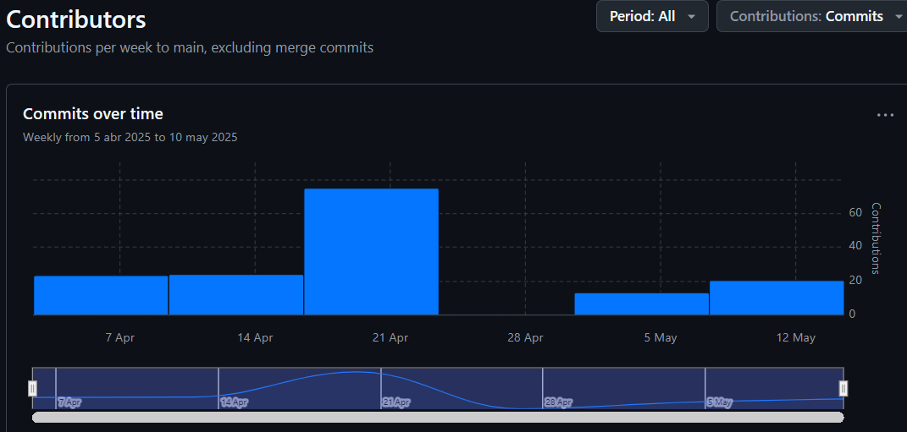
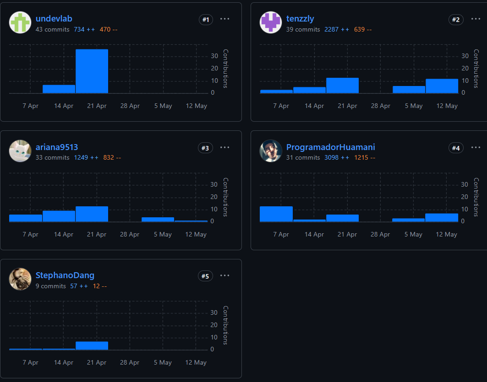

  <h1>Universidad Peruana de Ciencias Aplicadas</h1>
   
  
  

     
    <strong>Carrera:</strong> Ingeniería de Software
      
    <strong>Ciclo:</strong> 5° Ciclo
      
    <strong>Nombre del curso:</strong> Aplicaciones Web
      
    <strong>Sección:</strong> 4370
      
    <strong>Nombre del profesor:</strong> Alberto Wilmer Sanchez Seña
  

  <h3>"Informe de Trabajo Final"</h3>
  

     
    <strong>Nombre del Startup:</strong> VSC-Visionaries
      
    <strong>Nombre del Producto:</strong> Flota365
      
    <strong>Integrantes:</strong>
      
    Huamani Sánchez, José Diego - U202110458
      
    Calvo Yalan, Renato Guillermo - U202217053
      
    Moscoso Bejar, Angelo Stephano - U20211G499
      
    Ramirez Carrasco, Ariana Lizeth - U202312932
      
    Sanchez Cruz, Raul Roberto - U201518942
      
    Tantaleán Mesta, Guillermo Fabián - U202311958
      
  

  <h3>Mayo, 2025</h3>

 

## Registro de Versiones del Informe

<table border="1" cellpadding="5" cellspacing="0">
    <thead>
        <tr>
            <th>Versión</th>
            <th>Fecha</th>
            <th>Autor</th>
            <th>Descripción</th>
        </tr>
    </thead>
    <tbody>
        <tr>
            <td rowspan="14">TB1</td>
            <td>10/04/2025</td>
            <td>José Diego Huamani Sánchez</td>
            <td>Desarrollo de la descripción del Statup, Antecedentes y problemáticas - Solution Profile y Segmentos Objetivos (Capítulo 1)</td>
        </tr>
        <tr>
            <td>12/04/2025</td>
            <td>Ariana Ramirez Carrasco</td>
            <td>Desarrollo el Lean-UX Canvas, Lean-UX Assumptions (pertenicientes cal Cap. 1) y los User Profiles.</td>
        </tr>
        <tr>
            <td>12/04/2025</td>
            <td>Renato Calvo Yalan</td>
            <td>Desarrollo el Hyphosis Statement and Problem Statement del Cap. 1</td>
        </tr>
        <tr>
            <td>15/04/2025</td>
            <td>José Diego Huamani Sánchez</td>
            <td>Mejoras en la redacción de los Lean UX Problem Statement y Lean UX Hypothesis Statements (Capítulo 1)</td>
        </tr>
        <tr>
            <td>23/04/2025</td>
            <td>Raul Cruz Sanchez</td>
            <td>Desarrollo del Product Backlog con los User Stories y el Impact Mapping pertenicientes al Capitulo 3.</td>
        </tr>
        <tr>
            <td>23/04/2025</td>
            <td>Stephano Moscoso</td>
            <td>Desarrollo el To-Be Scenario Mapping para el segmento de gestores de flota y segmento de conductores.</td>
        </tr>
        <tr>
            <td>24/04/2025</td>
            <td>Raul Cruz Sanchez</td>
            <td>Actualizo el Product Backlog algunas User Stories.</td>
        </tr>
        <tr>
            <td>25/04/2025</td>
            <td>Raul Cruz Sanchez</td>
            <td>Desarollo el Cap. 4 (Diseño de estilos, Wireframes y MockUps del Landing Page y Web App)</td>
        </tr>
        <tr>
            <td>25/04/2025</td>
            <td>Jose Diego Huamani S.</td>
            <td>Agrego los puntos de gestion y herramientas a utilizar en el equipo por cada iteracion de los Sprints; Cap. 5</td>
        </tr>
        <tr>
            <td>25/04/2025</td>
            <td>Renato Calvo Yalan</td>
            <td>Desarrollo el Diagrama de Clases de la Aplicacion así como el Diccinario de Clases (Cap. 4). Adicional, desarrollo las entrevistas a los segmentos objetivos.</td>
        </tr>
        <tr>
            <td>26/04/2025</td>
            <td>Stephano Moscoso</td>
            <td>Desarrollo los puntos restantes del Cap. 2 y el Jouney Mapping</td>
        </tr>
        <tr>
            <td>26/04/2025</td>
            <td>Jose Diego Huamani S.</td>
            <td>Desarrollo del diagrama C4 para el Cap. 4</td>
        </tr>
    </tbody>
    <tbody>
        <tr>
            <td rowspan="14">TP1</td>
            <td>09/05/2025</td>
            <td>José Diego Huamani Sánchez</td>
            <td>Desarrollo del Sprint Planning, descripción del Team Collaboration Insights</td>
        </tr>
        <tr>
            <td>11/05/2025</td>
            <td>Ariana Ramirez Carrasco</td>
            <td>Desarrollo del Sprint Backlog 2 & Development Evidence for Sprint Review </td>
        </tr>
        <tr>
            <td>11/05/2025</td>
            <td>Renato Calvo Yalan</td>
            <td>Desarrollo del Testing Evidence for Sprint Review & Execution Evidence</td>
        </tr>
        <tr>
            <td>13/05/2025</td>
            <td>Raul Cruz Sanchez</td>
            <td>Desarrollo del Deployment Evidence for Sprint Review.</td>
        </tr>
        <tr>
            <td>23/04/2025</td>
            <td>Stephano Moscoso</td>
            <td>Colocar las imagenes de las métricas el Team Collaboration Insights.</td>
        </tr> 
    </tbody>
      <tbody>
        <tr>
            <td rowspan="14">TB2</td>
            <td>04/06/2025</td>
            <td>José Diego Huamani Sánchez</td>
            <td>Desarrollo del Sprint Planning, descripción del Team Collaboration Insights</td>
        </tr>
        <tr>
            <td>06/06/2025</td>
            <td>Ariana Ramirez Carrasco</td>
            <td>Desarrollo del subcapítulo: 5.3 Validation Interviews - Diseño de Entrevistas. </td>
        </tr>
        <tr>
            <td>10/06/2025</td>
            <td>Renato Calvo Yalan</td>
            <td>Mejora continua en el capítulo IV, actualización Backlog y actualización de Diagrama de clases.</td>
        </tr>
        <tr>
            <td>12/06/2025</td>
            <td>Raul Cruz Sanchez</td>
            <td>Mejora continua en las historias de usuario y sprint planning.</td>
        </tr>
        <tr>
            <td>15/06/2025</td>
            <td>Stephano Moscoso</td>
            <td>Redacción del análisis de heurísticas de la aplicación.</td>
        </tr> 
    </tbody>
    <tbody>
        <tr>
            <td rowspan="14">TF</td>
            <td>/07/2025</td>
            <td>José Diego Huamani Sánchez</td>
            <td>Desarrollo del Sprint Planning, descripción del Team Collaboration Insights</td>
        </tr>
        <tr>
            <td>/07/2025</td>
            <td>Ariana Ramirez Carrasco</td>
            <td>Desarrollo del subcapítulo: 5.3 Validation Interviews - Diseño de Entrevistas. </td>
        </tr>
        <tr>
            <td>/07/2025</td>
            <td>Renato Calvo Yalan</td>
            <td>Mejora continua en el capítulo IV, actualización Backlog y actualización de Diagrama de clases.</td>
        </tr>
        <tr>
            <td>/07/2025</td>
            <td>Raul Cruz Sanchez</td>
            <td>Mejora continua en las historias de usuario y sprint planning.</td>
        </tr>
        <tr>
            <td>/07/2025</td>
            <td>Stephano Moscoso</td>
            <td>Redacción del análisis de heurísticas de la aplicación.</td>
        </tr> 
        <tr>
            <td>04/07/2025</td>
            <td>Guillermo Tantaleán</td>
            <td>Correcciones del informe y agregados del sprint 4.</td>
        </tr> 
    </tbody>
</table>

## Project Report Collaboration Insights

**Link del repositorio-Informe**: https://github.com/1ASI0730-2510-4370-G3-Flota365/VSC-Visionaries-Document-Report

**Link de los repositorios de la organización**: https://github.com/1ASI0730-2510-4370-G3-Flota365

 

**Reporte de colaboración de la entrega del TB1:**

En esta primera entrega (TB1), nuestro objetivo principal fue la creación de nuestra startup. Todos los miembros del equipo VSC-Visionaries participaron activamente en la elaboración del informe, utilizando herramientas colaborativas como GitHub, Figma, Trello, UXPressia, Miro, entre otros. A continuación, vamos a presentar los diagramas de flujo que representan los *commits* realizados por cada miembro del equipo VSC:

  
    

 

**Reporte de colaboración de la entrega del TP:**

Para esta segunda entrega (TP), nuestro objetivo principal fue el desarrollo e implementación de nuestra primera versión de nuestro **Web Application**. Todos los miembros del equipo VSC-Visionaries participaron activamente en la elaboración del informe; lo cual, mediante el siguiente organigrama, veremos el progreso obtenido hasta la fecha del día de hoy:

    

 

    

**Reporte de colaboración de la entrega del TP:**

Para esta tercera entrega (TB2), nuestro objetivo principal fue el desarrollo e implementación de nuestra primera versión del **RESTFul API**. Todos los miembros del equipo VSC-Visionaries participaron activamente en la elaboración del informe; lo cual, mediante el siguiente organigrama, veremos el progreso obtenido hasta la fecha del día de hoy:

Este gráfico muestra la cantidad de *commits* realizados por cada integrante durante la elaboración del TB2.

Estas evidencias demuestran una colaboración equilibrada y efectiva, con cada miembro aportando significativamente al desarrollo del informe.

## Contenido

<a href="#introduction">CAPÍTULO 1: INTRODUCCIÓN</a>

<a href="#startupProfile">1.1. Startup Profile</a>

&nbsp; &nbsp;<a href="#descriptionStartup">1.1.1. Descripción de la Startup</a>

&nbsp; &nbsp;<a href="#teamProfile">1.1.2. Perfiles de Integrantes del equipo</a>

<a href="#solutionProfile">1.2. Solution Profile</a>

&nbsp; &nbsp;<a href="#Antecedents">1.2.1. Antecedentes y problemática</a>

&nbsp; &nbsp;<a href="#leanUXProcess">1.2.2. Lean UX Process</a>

&nbsp; &nbsp; &nbsp; &nbsp;<a href="#problemStatement">1.2.2.1. Lean UX Problem Statement</a>

&nbsp; &nbsp; &nbsp; &nbsp;<a href="#assumptions">1.2.2.2. Lean UX Assumptions</a>

&nbsp; &nbsp; &nbsp; &nbsp;<a href="#hypohesisStatements">1.2.2.3. Lean UX Hypothesis Statements</a>

&nbsp; &nbsp; &nbsp; &nbsp;<a href="UXCanvas">1.2.2.4. Lean UX Canvas</a>

<a href="objectiveSegment">1.3. Segmentos objetivos</a>

<a href="#requirementsElicitation">CAPÍTULO 2: REQUIREMENTS ELICITATION & ANALYSIS</a>

<a href="#competitors">2.1. Competidores</a>

&nbsp; &nbsp;<a href="#competitiveAnalysis">2.1.1. Análisis Competitivo</a>

&nbsp; &nbsp;<a href="#competitiveStrategies">2.1.2. Estrategias y tácticas frente a competidores</a>

<a href="#interviews">2.2. Entrevistas</a>

&nbsp; &nbsp;<a href="#interviewDesign">2.2.1. Diseño de enetrevistas</a>

&nbsp; &nbsp;<a href="#registerInterview">2.2.2. Registro de entrevistas</a>

&nbsp; &nbsp;<a href="#analysisInterview">2.2.3. Análisis de entrevistas</a>

<a href="#needfinding">2.3. Needfinding</a>

&nbsp; &nbsp;<a href="#userPersonas">2.3.1. User Personas</a>

&nbsp; &nbsp;<a href="#userTaskMatrix">2.3.2. User Task Matrix</a>

&nbsp; &nbsp;<a href="#userJourneyMapping">2.3.3. User Journey Mapping</a>

&nbsp; &nbsp;<a href="#empathyMap">2.3.4. Empathy Mapping</a>

&nbsp; &nbsp;<a href="asIsScenario">2.3.5. As-is Scenario Mapping</a>

<a href="#requirementsSpecification">CAPÍTULO 3: REQUIREMENTS SPECIFICATION</a>

<a href="#toBeScenario">3.1. To-Be Scenario Mapping</a>

<a href="#userStories">3.2. User Stories</a>

<a href="#impactMapping">3.3. Impact Mapping</a>

<a href="#productBacklog">3.4. Product Backlog</a>

<a href="#productDesign">CAPÍTULO 4: PRODUCT DESIGN</a>

<a href="#styleGuidelines">4.1. Style Guidelines</a>

&nbsp; &nbsp;<a href="#generalStyleGuidelines">4.1.1. General Style Guidelines</a>

&nbsp; &nbsp;<a href="#webStyleGuidelines">4.1.2. Web Style Guidelines</a>

<a href="#infoArchitecture">4.2. Information Architecture</a>

&nbsp; &nbsp;<a href="#orgSystem">4.2.1. Organization Systems</a>

&nbsp; &nbsp;<a href="#labelSystem">4.2.2. Labeling Systems</a>

&nbsp; &nbsp;<a href="#seoTags">4.2.3. SEO Tags and Meta Tags</a>

&nbsp; &nbsp;<a href="#searchSystem">4.2.4. Searching Systems</a>

&nbsp; &nbsp;<a href="#navigationSystem">4.2.5. Navigation System</a>

<a href="#landingDesign">4.3. Landing Page UI Design</a>

&nbsp; &nbsp;<a href="#landingWireframe">4.3.1. Landing Page Wireframe</a>

&nbsp; &nbsp;<a href="#landingMockUp">4.3.2. Landing Page Mock-up</a>

<a href="#webAppDesign">4.4. Web Applications UX/UI Design</a>

&nbsp; &nbsp;<a href="#webAppWireframes">4.4.1. Web Applications Wireframes</a>

&nbsp; &nbsp;<a href="#webAppWireflow">4.4.2. Web Applications Wireflow Diagrams</a>

&nbsp; &nbsp;<a href="#webAppMockups">4.4.3. Web Applications Mock-ups</a>

&nbsp; &nbsp;<a href="#webAppUserFlow">4.4.4. Web Applications User Flow Diagrams</a>

<a href="#webAppPrototyping">4.5. Web Applications Prototyping</a>

<a href="#DDD">4.6. Domain-Driven Software Architecture</a>

&nbsp; &nbsp;<a href="#contextDiagram">4.6.1. Software Architecture Context Diagrams</a>

&nbsp; &nbsp;<a href="#containerDiagram">4.6.2. Software Architecture Container Diagrams</a>

&nbsp; &nbsp;<a href="#componentDiagram">4.6.3. Software Architecture Components Diagrams</a>

<a href="#softwareObjectOrientedDesign">4.7. Software Object-Oriented Design</a>

&nbsp; &nbsp;<a href="#classDiagram">4.7.1. Class Diagrams</a>

&nbsp; &nbsp;<a href="">4.7.2. Class Dictionary</a>

<a href="#dbDesign">4.8. Database Design</a>

&nbsp; &nbsp;<a href="#dbDiagram">4.8.1. Database Diagram</a>

<a href="#productImplementation">CAPÍTULO 5: PRODUCT IMPLEMENTATION, VALIDATION & DEPLOYMENT</a>

<a href="#softwareConfig">5.1. Software Configuration Management</a>

&nbsp; &nbsp;<a href="#softwareDevelopment">5.1.1. Software Development Environment Configuration</a>

&nbsp; &nbsp;<a href="#sourceCodeManagement">5.1.2. Source Code Management</a>

&nbsp; &nbsp;<a href="#sourceCodeStyleGuide">5.1.3. Source Code Style Guide & Conventions</a>

&nbsp; &nbsp;<a href="#softwareDeploymentConfig">5.1.4. Software Deployment Configuration</a>

<a href="#landingPageImplementation">5.2. Landing Page, Services & Applications Implementation</a>

&nbsp; &nbsp;<a href="#sprint1">5.2.1. Sprint 2</a>

&nbsp; &nbsp; &nbsp; &nbsp;<a href="#sprintPlanning1">5.2.1.1. Sprint Planning 2</a>

&nbsp; &nbsp; &nbsp; &nbsp;<a href="#sprintBacklog1">5.2.1.2. Sprint Backlog 2</a>

&nbsp; &nbsp; &nbsp; &nbsp;<a href="#developmentEvidenceSprint1">5.2.1.3. Development Evidence for Sprint Review</a>

&nbsp; &nbsp; &nbsp; &nbsp;<a href="#testSuiteEvidenceSprint1">5.2.1.4. Testing Suite Evidence for Sprint Review</a>

&nbsp; &nbsp; &nbsp; &nbsp;<a href="#executionEvidenceSprint1">5.2.1.5. Execution Evidence for Sprint Review</a>

&nbsp; &nbsp; &nbsp; &nbsp;<a href="#servicesDocumentationSprint1">5.2.1.6. Services Documentation Evidence for Sprint Review</a>

&nbsp; &nbsp; &nbsp; &nbsp;<a href="#softwareDeploymentEvidenceSprint1">5.2.1.7. Software Deployment Evidence for Sprint Review</a>

&nbsp; &nbsp; &nbsp; &nbsp;<a href="#teamCollaborationInsights">5.2.1.8. Team Collaboration Insights during Sprint</a>

&nbsp; &nbsp;<a href="#sprint2">5.2.1. Sprint 2</a>

&nbsp; &nbsp; &nbsp; &nbsp;<a href="#sprintPlanning2">5.2.2.1. Sprint Planning 2</a>

&nbsp; &nbsp; &nbsp; &nbsp;<a href="#sprintBacklog2">5.2.2.2. Sprint Backlog 2</a>

&nbsp; &nbsp; &nbsp; &nbsp;<a href="#developmentEvidenceSprint2">5.2.2.3. Development Evidence for Sprint Review</a>

&nbsp; &nbsp; &nbsp; &nbsp;<a href="#testSuiteEvidenceSprint2">5.2.2.4. Testing Suite Evidence for Sprint Review</a>

&nbsp; &nbsp; &nbsp; &nbsp;<a href="#executionEvidenceSprint2">5.2.2.5. Execution Evidence for Sprint Review</a>

&nbsp; &nbsp; &nbsp; &nbsp;<a href="#servicesDocumentationSprint2">5.2.2.6. Services Documentation Evidence for Sprint Review</a>

&nbsp; &nbsp; &nbsp; &nbsp;<a href="#softwareDeploymentEvidenceSprint2">5.2.2.7. Software Deployment Evidence for Sprint Review</a>

&nbsp; &nbsp; &nbsp; &nbsp;<a href="#teamCollaborationInsights2">5.2.2.8. Team Collaboration Insights during Sprint</a>

&nbsp; &nbsp;<a href="#sprint3">5.2.3. Sprint 3</a>

&nbsp; &nbsp; &nbsp; &nbsp;<a href="#sprintPlanning3">5.2.3.1. Sprint Planning 3</a>

&nbsp; &nbsp; &nbsp; &nbsp;<a href="#sprintBacklog3">5.2.3.2. Sprint Backlog 3</a>

&nbsp; &nbsp; &nbsp; &nbsp;<a href="#developmentEvidenceSprint3">5.2.3.3. Development Evidence for Sprint Review</a>

&nbsp; &nbsp; &nbsp; &nbsp;<a href="#testSuiteEvidenceSprint3">5.2.3.4. Testing Suite Evidence for Sprint Review</a>

&nbsp; &nbsp; &nbsp; &nbsp;<a href="#executionEvidenceSprint3">5.2.3.5. Execution Evidence for Sprint Review</a>

&nbsp; &nbsp; &nbsp; &nbsp;<a href="#servicesDocumentationSprint3">5.2.3.6. Services Documentation Evidence for Sprint Review</a>

&nbsp; &nbsp; &nbsp; &nbsp;<a href="#softwareDeploymentEvidenceSprint3">5.2.3.7. Software Deployment Evidence for Sprint Review</a>

&nbsp; &nbsp; &nbsp; &nbsp;<a href="#teamCollaborationInsights3">5.2.3.8. Team Collaboration Insights during Sprint</a>

&nbsp; &nbsp;<a href="#sprint3">5.2.4. Sprint 4</a>

&nbsp; &nbsp; &nbsp; &nbsp;<a href="#sprintPlanning3">5.2.4.1. Sprint Planning 4</a>

&nbsp; &nbsp; &nbsp; &nbsp;<a href="#sprintBacklog3">5.2.4.2. Sprint Backlog 4</a>

&nbsp; &nbsp; &nbsp; &nbsp;<a href="#developmentEvidenceSprint3">5.2.4.3. Development Evidence for Sprint Review</a>

&nbsp; &nbsp; &nbsp; &nbsp;<a href="#testSuiteEvidenceSprint3">5.2.4.4. Testing Suite Evidence for Sprint Review</a>

&nbsp; &nbsp; &nbsp; &nbsp;<a href="#executionEvidenceSprint3">5.2.4.5. Execution Evidence for Sprint Review</a>

&nbsp; &nbsp; &nbsp; &nbsp;<a href="#servicesDocumentationSprint3">5.2.4.6. Services Documentation Evidence for Sprint Review</a>

&nbsp; &nbsp; &nbsp; &nbsp;<a href="#softwareDeploymentEvidenceSprint3">5.2.347. Software Deployment Evidence for Sprint Review</a>

&nbsp; &nbsp; &nbsp; &nbsp;<a href="#teamCollaborationInsights3">5.2.4.8. Team Collaboration Insights during Sprint</a>

<a href="#validationInterviews">5.3. Validations Interviews</a>

&nbsp; &nbsp;<a href="#validationDesign">5.3.1. Diseño de Entrevistas</a>

&nbsp; &nbsp;<a href="#validationInterviews">5.3.2. Registro de entrevistas</a>

&nbsp; &nbsp;<a href="#heuristicsEvaluation">5.3.3. Evaluaciones según Heurísticas</a>

<a href="#videoAboutProduct">5.4. Video About The Product</a>

<a href="conclution">Conclusiones</a>

<a href="#conclutionAndRecomendation">Conclusiones y recomendaciones</a>

<a href="#teamVideo">Video About-the-Team</a>

<a href="#bibliography">Bibliografía</a>

<a href="#anexos">Anexos</a>

## ABET – EAC - Student Outcome 5

**Criterio:** *La capacidad de funcionar efectivamente en un equipo cuyos miembros juntos proporcionan liderazgo, crean un entorno de colaboración e inclusivo, establecen objetivos, planifican tareas y cumplen objetivos.*

En el siguiente cuadro se describen las acciones realizadas y enunciados de conclusiones por parte del grupo, que permiten sustentar el haber alcanzado el logro del ABET – EAC – Student Outcome 5.

<table style="border-collapse: collapse; width: 100%; font-family: Arial, sans-serif; font-size: 14px;">
  <thead>
    <tr style="background-color: #0073e6; color: white;">
      <th style="padding: 10px; border: 1px solid #ccc; width: 25%;">Criterio específico</th>
      <th style="padding: 10px; border: 1px solid #ccc; width: 37.5%;">Acciones realizadas</th>
      <th style="padding: 10px; border: 1px solid #ccc; width: 37.5%;">Conclusiones</th>
    </tr>
  </thead>
  <tbody>
    <tr>
      <td style="padding: 10px; border: 1px solid #ccc;">
        Trabaja en equipo para proporcionar liderazgo en forma conjunta
      </td>
      <td style="padding: 10px; border: 1px solid #ccc;">
        <strong>TB1:</strong> 
        <strong>Huamani Sánchez, José Diego</strong> 
        Lideró con enfoque Agile y TSP, aportando en la definición de la arquitectura del sistema y mejorando el Product Backlog. Su liderazgo permitió segmentar mejor los insights del usuario y coordinar acciones clave del proyecto.  
        <strong>Calvo Yalan, Renato Guillermo</strong> 
        Participó activamente en la planificación de tareas, entrevistas y elaboración de diagramas. Asumió roles de liderazgo colaborativo, proponiendo ideas que fortalecieron el rumbo del proyecto.  
        <strong>Moscoso Bejar, Angelo Stephano</strong> 
        Impulsó el liderazgo desde la perspectiva de experiencia del usuario con la elaboración del To-Be y Journey Mapping. Promovió decisiones estratégicas en conjunto para mejorar el enfoque del equipo.  
        <strong>Ramírez Carrasco, Ariana Lizeth</strong> 
        Lideró el análisis del usuario a través del user persona, empathy mapping y Lean UX. Su enfoque organizativo ayudó a consolidar estrategias claras en conjunto con el equipo.  
        <strong>Sánchez Cruz, Raúl Roberto</strong> 
        Aportó liderazgo visual y técnico mediante el diseño del wireframe y parte del landing page, orientando al equipo en la estructura visual del proyecto.  
        <strong>TP1:</strong> 
<strong>Huamani Sánchez, José Diego</strong> 
Realizó correcciones en el documento del proyecto y apoyó en la integración del frontend, asegurando la coherencia visual y funcional del landing page.  
<strong>Calvo Yalan, Renato Guillermo</strong> 
Colaboró en la revisión y mejora del código frontend, además de corregir detalles en el contenido del documento para mantener la precisión y claridad.  
<strong>Moscoso Bejar, Angelo Stephano</strong> 
Apoyó en las correcciones del landing page, optimizando la experiencia del usuario y verificando la correcta implementación visual del frontend.  
<strong>Ramírez Carrasco, Ariana Lizeth</strong> 
Se encargó de revisar y corregir el contenido del documento, además de participar en ajustes del frontend para mejorar la usabilidad del landing page.  
<strong>Sánchez Cruz, Raúl Roberto</strong> 
Contribuyó en las correcciones técnicas del frontend, asegurando que el diseño visual y funcional del landing page estuviera alineado con los objetivos del proyecto.  
        <strong>TB2:</strong> 
        <strong>Huamani Sánchez, José Diego</strong> 
        Desarrolló el sprint planning 3 junto al sprint backlog y administró el tablero de los tasks en Trello.  
        <strong>Calvo Yalan, Renato Guillermo</strong> 
        Para el desarrollo de la TB2, desarrolló la mejora continua sobre el proceso de Lean UX y los diagramas de base de datos y UML para que estén más alineados a nuevas necesidades que han surgido para implementar los servicios de backend.  
        <strong>Moscoso Bejar, Angelo Stephano</strong> 
        Durante esta entrega se comunicó con todos los compañeros para mejorar los componentes existentes y entender mejor lo nuevo que se debe presentar.  
        <strong>Ramírez Carrasco, Ariana Lizeth</strong> 
        En esta entrega, contribuyó con una entrevista a un nuevo usuario para perteneciente al sector de gerentes considerando opiniones y críticas constructivas a nuestro landing page y aplicación web.  
        <strong>Sánchez Cruz, Raúl Roberto</strong> 
        Participó en el trabajo colaborativo del backend y frontend haciendo uso correcto de la herramienta Trello y la comunicación con el equipo al hacer merge en el repositorio con los últimos cambios (en la rama developer).  
      </td>
      <td style="padding: 10px; border: 1px solid #ccc;">
        <strong>TB1:</strong> 
        La capacidad de trabajar de manera efectiva en un equipo que fomenta el liderazgo compartido es esencial para alcanzar objetivos comunes. A través del enfoque TSP, se logró una autogestión sólida, planificación colaborativa y ejecución eficiente, lo que permitió a cada miembro asumir liderazgo según sus fortalezas, fortaleciendo tanto el desempeño grupal como individual.  
        <strong>TP1:</strong> 
        La colaboración conjunta en la creación de la landing page y la dedicación a las correcciones posteriores demostraron la capacidad del equipo para integrar habilidades y conocimientos, reforzando la cohesión y el compromiso con los objetivos del proyecto.  
        <strong>TB2:</strong> 
        En una entrevista acerca de nuestra aplicación, es fundamental estar abiertos a críticas y opiniones sinceras. Al escuchar activamente a los usuarios y permitirles expresar sus puntos de vista, podemos identificar áreas de mejora y realizar ajustes para satisfacer mejor sus necesidades. La retroalimentación constructiva es una oportunidad valiosa para fortalecer nuestra aplicación y brindar una experiencia de usuario excepcional.  
      </td>
    </tr>
    <tr>
      <td style="padding: 10px; border: 1px solid #ccc;">
        Crea un entorno colaborativo e inclusivo, establece metas, planifica tareas y cumple objetivos
      </td>
      <td style="padding: 10px; border: 1px solid #ccc;">
        <strong>TB1:</strong> 
        <strong>Huamani Sánchez, José Diego</strong> 
        Su liderazgo en la planificación base del proyecto y en el manejo del backlog permitió segmentar tareas con claridad, impulsando la colaboración estructurada del equipo.  
        <strong>Calvo Yalan, Renato Guillermo</strong> 
        Facilitó la colaboración mediante herramientas visuales y entrevistas que ayudaron a todos los integrantes a comprender mejor sus responsabilidades y establecer prioridades comunes.  
        <strong>Moscoso Bejar, Angelo Stephano</strong> 
        Mediante el journey mapping y to-be, ayudó a identificar oportunidades de mejora y a organizar metas centradas en la experiencia del usuario.  
        <strong>Ramírez Carrasco, Ariana Lizeth</strong> 
        Estableció un entorno inclusivo con herramientas como el Empathy mapping, Lean UX, Needfinding, User Task Matrix, aportando a la claridad en las metas y promoviendo una toma de decisiones colectiva.  
        <strong>Sánchez Cruz, Raúl Roberto</strong> 
        Su diseño del wireframe facilitó la planificación visual del proyecto, guiando al equipo en la estructuración de objetivos y favoreciendo la organización.  
        <strong>TP1:</strong> 
<strong>Huamani Sánchez, José Diego</strong> 
Coordinó la asignación de tareas y promovió un entorno de colaboración, facilitando la ejecución de las correcciones en el documento y la mejora visual del landing page.  
<strong>Calvo Yalan, Renato Guillermo</strong> 
Aportó activamente en la planificación y distribución del trabajo, asegurando que se cumplieran los tiempos y que cada integrante tuviera claridad sobre sus responsabilidades.  
<strong>Moscoso Bejar, Angelo Stephano</strong> 
Colaboró en las sesiones de revisión y ajustes, impulsando decisiones conjuntas que permitieron organizar mejor las correcciones del proyecto.  
<strong>Ramírez Carrasco, Ariana Lizeth</strong> 
Se encargó de coordinar parte de las revisiones de contenido y aportar en los ajustes del frontend, contribuyendo al cumplimiento de objetivos definidos en el equipo.  
<strong>Sánchez Cruz, Raúl Roberto</strong> 
Participó en la organización y ejecución de las tareas de frontend y en la revisión conjunta del entregable, fortaleciendo la colaboración y la planificación del equipo.  
        <strong>TB2:</strong> 
        <strong>Huamani Sánchez, José Diego</strong> 
        Realizó mejoras continuas en las historias de usuario, el Video about the product, el C4 y el Sprint planning.  
        <strong>Calvo Yalan, Renato Guillermo</strong> 
        Para el desarrollo de la TB2, desarrolló la mejora continua sobre el proceso de Lean UX y los diagramas de base de datos y UML para que estén más alineados a nuevas necesidades que han surgido para implementar los servicios de backend.  
        <strong>Moscoso Bejar, Angelo Stephano</strong> 
        Gracias al despliegue de la versión actual de la aplicación y las entrevistas con nuestros clientes redactó importantes secciones de esta entrega y pudo conocer mejor el avance de nuestro proyecto.  
        <strong>Ramírez Carrasco, Ariana Lizeth</strong> 
        Desarrolló el diseño de entrevistas y registro de las mismas para los entrevistados, por lo que adquirió un mejor conocimiento del sector de reclutamiento en el área de recursos humanos de una empresa.  
        <strong>Sánchez Cruz, Raúl Roberto</strong> 
        Se encargó de agregar sus partes al frontend y el desarrollo del backend de manera colaborativa.  
      </td>
      <td style="padding: 10px; border: 1px solid #ccc;">
        <strong>TB1:</strong> 
        Gracias a una planificación compartida, al uso de metodologías centradas en el usuario y a la participación activa de todos los miembros, se logró construir un entorno colaborativo e inclusivo. Esto facilitó una comunicación fluida, una organización eficiente y el cumplimiento exitoso de los objetivos establecidos.  
        <strong>TP1:</strong> 
        El trabajo conjunto en la landing page, sumado a la mejora continua mediante correcciones colaborativas, fortaleció el ambiente inclusivo y colaborativo, facilitando la consecución de metas y tareas planificadas.  
        <strong>TB2:</strong> 
        La retroalimentación de los usuarios en la entrevista ha sido valiosa para mejorar nuestra aplicación y cumplir con
sus necesidades. La comunicación interna y la priorización de tareas son clave para un desarrollo exitoso. El video about the product nos permitirá presentar un demo de nuestro producto a nuestros clientes potenciales, por lo que resulta indispensable al ser una primera vista de la aplicación.          
      </td>
    </tr>
  </tbody>
</table>
