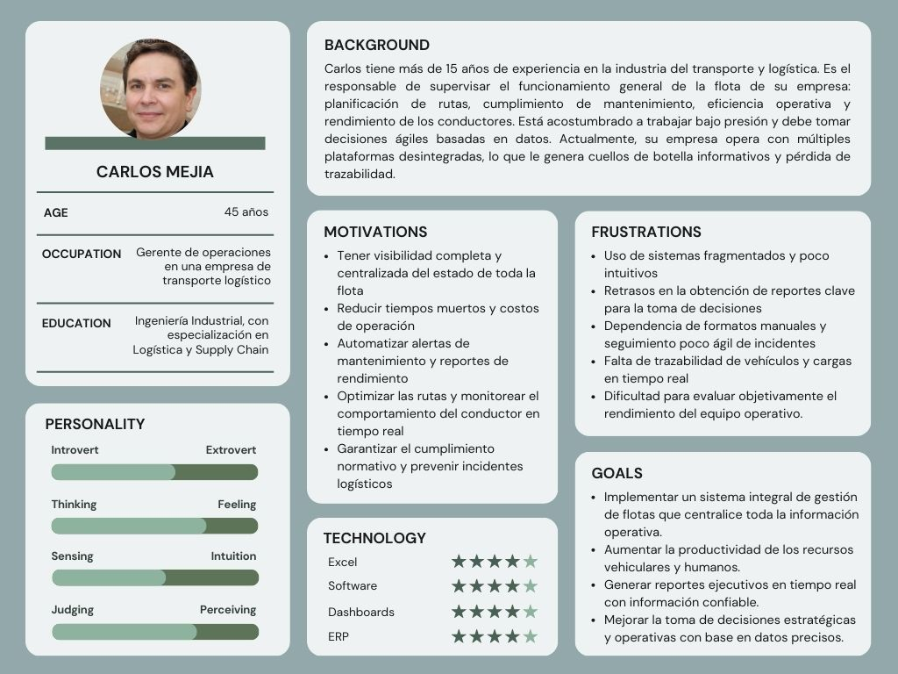
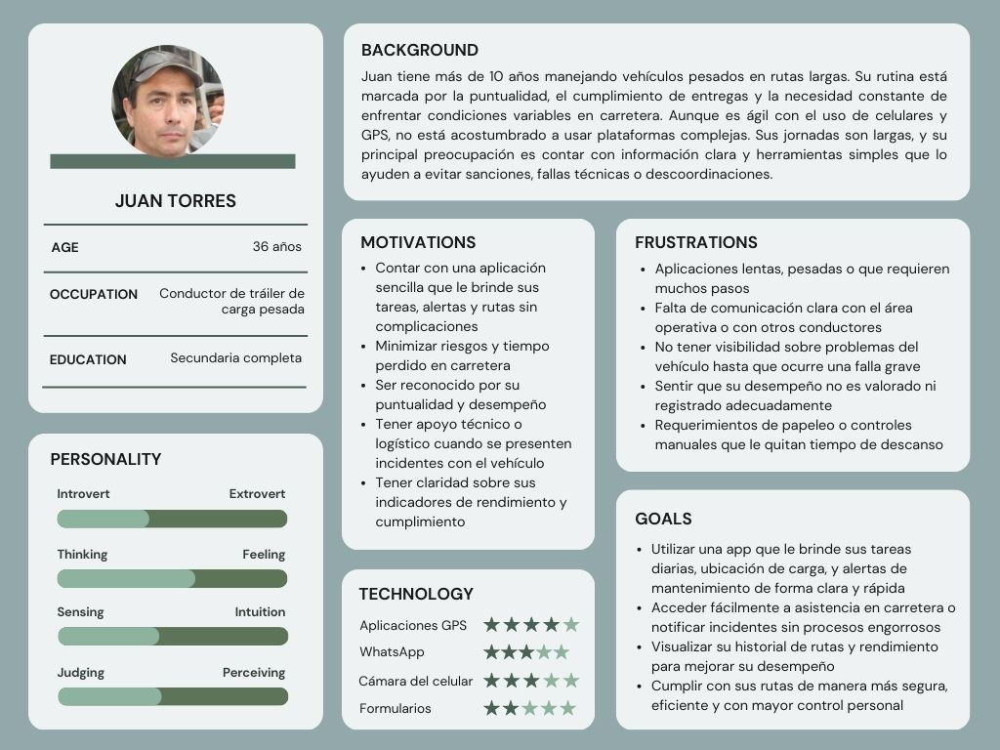
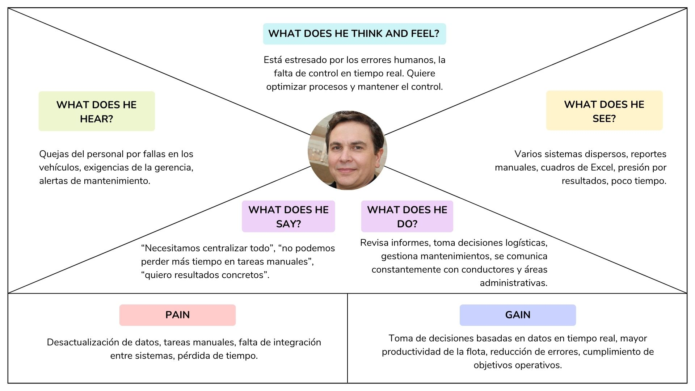
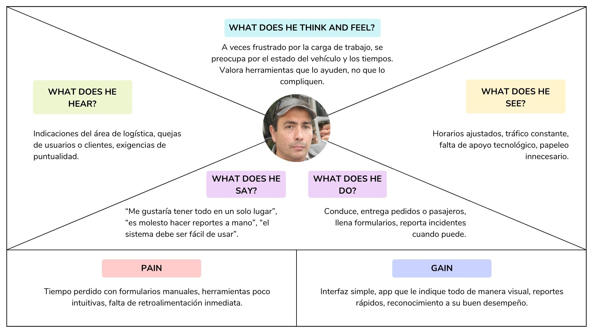

<h2 id="requirementsElicitation">CAPÍTULO 2: REQUIREMENTS ELICITATION & ANALYSIS</h2>

<h3 id="competitors">2.1. Competidores</h3>

En esta sección se presenta la identificación y descripción de los principales competidores de Flota365, tanto directos como indirectos. Estos actores del mercado cuentan con propuestas basadas en productos digitales similares o con enfoques que abordan parcialmente el mismo problema que nuestra solución. La comparación busca evidenciar las características esenciales de cada alternativa y contextualizar el entorno competitivo en el que se desarrollará Flota365.

Se han identificado los siguientes competidores directos de Flota 365, todos con presencia en el mercado latinoamericano y con soluciones digitales para la gestión de flotas:

**- AFE Logistics**

Empresa peruana que ofrece servicios de transporte de carga, almacenaje, courier y comercio exterior.

**- RDA Mobility**

Empresa con presencia en Argentina, Colombia y Uruguay, que ofrece soluciones de renting corporativo, gestión de flotas y telemetría vehicular.

**- Geotab**

Multinacional canadiense especializada en soluciones de telemática y software de gestión de flotas, con presencia en América Latina.

**- iLab Perú**

Empresa peruana que ofrece un sistema web de gestión de flotas, con funcionalidades orientadas al monitoreo y control de vehículos.

<h4 id="competitiveAnalysis">2.1.1. Análisis Competitivo</h4>

El análisis competitivo tiene como finalidad profundizar en el conocimiento que tiene Flota365 sobre el resto de sus competidores. Para ello, se ha elaborado un *Competitive Analysis Landscape*, el cual organiza de manera estructurada los aspectos clave de cada actor analizado, incluyendo perfil general, estrategia de marketing, características del producto, precios y canales de distribución. Finalmente, se incorpora un análisis FODA que permite visualizar de forma clara las fortalezas, debilidades, oportunidades y amenazas, tanto propias como de los competidores. 
 
 

<table border="1" cellpadding="8" cellspacing="0" style="border-collapse:collapse; width:100%; font-family:Arial, sans-serif;">
    <tr>
        <th colspan="7" style="background-color:#d9ead3;">Competitive Analysis Landscape</th>
    </tr>
    <tr>
        <td colspan="2" rowspan="2" style="background-color:#f4cccc;"><strong>¿Por qué llevar a cabo este análisis?</strong></td>
        <td colspan="5">¿Cómo se posiciona Flota 365 frente a sus competidores en cuanto a propuesta de valor, marketing, producto y estrategia?</td>
    </tr>
    <tr>
        <td colspan="5">
            Es un análisis comparativo que permite identificar fortalezas, debilidades, oportunidades y amenazas, así como entender mejor la posición del producto frente a otros actores relevantes del mercado.
        </td>
    </tr>
    <tr>
        <td colspan="3"></td>
        <td><strong>Flota 365</strong></td>
        <td><strong>RDA Mobility</strong></td>
        <td><strong>Geotab</strong></td>
        <td><strong>iLab Perú</strong></td>
    </tr>
    <tr>
        <td rowspan="2">Perfil</td>
        <td colspan="2">Overview</td>
        <td>Plataforma de gestión de flotas orientada a pymes del Perú, con interfaz moderna, fácil de usar, y soporte técnico local.</td>
        <td>Ofrece renting vehicular corporativo, acompañado de soluciones tecnológicas para gestión de flotas.</td>
        <td>Multinacional con soluciones avanzadas de telemetría y big data para flotas.</td>
        <td>Plataforma local con enfoque básico en control y seguimiento vehicular.</td>
    </tr>
    <tr>
        <td colspan="2">Ventaja competitiva ¿Qué valor ofrece a los clientes?</td>
        <td>Simplicidad + Personalización + Costo accesible + Soporte local.</td>
        <td>Integración con renting y oferta de movilidad.</td>
        <td>Tecnología robusta, alta precisión y escalabilidad.</td>
        <td>Precio bajo y atención directa al cliente local.</td>
    </tr>
    <tr>
        <td rowspan="2">Perfil de Marketing</td>
        <td colspan="2">Mercado objetivo</td>
        <td>PYMEs de transporte, distribución y logística en Perú y LATAM.</td>
        <td>Empresas grandes y medianas con flotas corporativas.</td>
        <td>Grandes flotas, operadores logísticos y gobiernos.</td>
        <td>Pequeñas empresas con bajo presupuesto.</td>
    </tr>
    <tr>
        <td colspan="2">Estrategias de marketing</td>
        <td>Marketing digital, redes sociales, ferias del sector, alianzas con operadores.</td>
        <td>Estrategias B2B con foco en acuerdos corporativos.</td>
        <td>Alianzas internacionales y promoción en eventos tech.</td>
        <td>Venta directa, recomendaciones boca a boca.</td>
    </tr>
    <tr>
        <td rowspan="3">Perfil de Producto</td>
        <td colspan="2">Productos & Servicios</td>
        <td>Software de gestión de flotas (web/móvil), alertas, reportes, mantenimiento, rastreo.</td>
        <td>Renting + software básico de gestión.</td>
        <td>Gestión de flotas con inteligencia artificial, reportes avanzados, APIs.</td>
        <td>Plataforma de rastreo y control simple.</td>
    </tr>
    <tr>
        <td colspan="2">Precios & Costos</td>
        <td>Planes mensuales escalables según funcionalidades.</td>
        <td>Costos integrados al renting vehicular.</td>
        <td>Alto costo de entrada y por dispositivos.</td>
        <td>Muy bajo costo.</td>
    </tr>
    <tr>
        <td colspan="2">Canales de distribución (Web y/o Móvil)</td>
        <td>Web y App móvil, venta directa y distribuidores locales.</td>
        <td>Venta corporativa (B2B) con equipo comercial.</td>
        <td>Venta en línea y red global de distribuidores.</td>
        <td>Sitio web básico y atención personalizada.</td>
    </tr>
    <tr>
        <td rowspan="5">Análisis SWOT</td>
    <tr>
        <td colspan="2">Fortalezas</td>
        <td>Facilidad de uso, atención local, buen soporte, precios competitivos.</td>
        <td>Modelo integrado (renting + software), movilidad sostenible.</td>
        <td>Tecnología de punta, experiencia internacional.</td>
        <td>Costos bajos, cercanía con el cliente.</td>
    </tr>
    <tr>
        <td colspan="2">Debilidades</td>
        <td>Menor reconocimiento de marca, falta de presencia internacional.</td>
        <td>Dependencia del renting como modelo de entrada.</td>
        <td>Requiere conocimientos técnicos y gran inversión.</td>
        <td>Tecnología limitada, poca innovación.</td>
    </tr>
    <tr>
        <td colspan="2">Oportunidades</td>
        <td>Digitalización del transporte en LATAM, alianzas estratégicas.</td>
        <td>Aumento de flotas corporativas sostenibles.</td>
        <td>Expansión a nuevos mercados LATAM.</td>
        <td>Demanda de soluciones económicas en provincias.</td>
    </tr>
    <tr>
        <td colspan="2">Amenazas</td>
        <td>Ingreso de competidores internacionales, barreras regulatorias.</td>
        <td>Nuevos modelos de propiedad compartida.</td>
        <td>Startups locales con soluciones más adaptadas.</td>
        <td>Baja escalabilidad frente a otras plataformas.</td>
    </tr>
</table>

<h4 id="competitiveStrategies">2.1.2. Estrategias y tácticas frente a competidores</h4>

Tras un análisis detallado de los principales competidores de Flota365 —AFE Logistics, RDA Mobility, Geotab e iLab Perú— se han identificado oportunidades estratégicas clave para fortalecer nuestra propuesta de valor, diferenciarnos y consolidar nuestra posición en el mercado. Las siguientes estrategias se fundamentan en las fortalezas, debilidades y amenazas encontradas, con tácticas específicas orientadas a maximizar la eficiencia y satisfacción del cliente.

**1) Estrategias basadas en fortalezas**

**- Enfoque especializado en el sector agrícola y de transporte rural**

**Estrategia:** Diferenciar a Flota365 como una plataforma desarrollada especialmente para la gestión de flotas en el sector agrícola, a diferencia de competidores más generalistas como Geotab o AFE Logistics.

**Táctica:**

Comunicar de forma clara nuestro enfoque en soluciones adaptadas al campo y a las condiciones rurales: vehículos agrícolas, motocicletas, camionetas de campo, etc.

Crear contenido segmentado por tipo de cliente (cooperativas agrarias, productores independientes, etc.) que demuestre cómo Flota365 se adapta a sus necesidades reales.

Participar en ferias y eventos del sector agroindustrial para reforzar la identidad de marca especializada.

 

**- Ventaja competitiva por simplicidad y personalización**

**Estrategia:** Resaltar la facilidad de uso de Flota365 frente a soluciones robustas pero más complejas como Geotab o RDA Mobility.

**Táctica:**

Desarrollar una experiencia de usuario (UX) simple e intuitiva que permita la adopción rápida por parte de conductores y personal no técnico.

Ofrecer configuraciones personalizadas y planes modulares según el tamaño y necesidades de la empresa.

Brindar soporte técnico y capacitación remota como parte del onboarding, para facilitar el uso desde el primer día.

 

**- Generación de alertas inteligentes y mantenimiento preventivo**

**Estrategia:** Capitalizar la funcionalidad de alertas automáticas por mantenimiento y uso del vehículo, la cual no está priorizada en soluciones como iLab Perú.

**Táctica:**

Mostrar casos de éxito donde el mantenimiento preventivo ha evitado fallas y costos adicionales.

Generar reportes automatizados que alerten sobre mantenimientos próximos y condiciones críticas de la unidad.

Integrar dashboards con indicadores clave de salud vehicular, rutas y uso.
 
 

**2) Estrategias basadas en debilidades**

**- Fortalecimiento de la cobertura de datos y actualización**

**Estrategia:** Superar la posible debilidad en la actualización de datos e información en tiempo real al integrar mejores fuentes y automatización.

**Táctica:**

Integrar sensores IoT, GPS y otros dispositivos de rastreo con compatibilidad directa con Flota365.

Implementar procesos automáticos de sincronización de datos para eliminar el error humano.

Ofrecer herramientas que permitan a los usuarios reportar incidencias o inconsistencias fácilmente.
 
 

**- Ampliación de funcionalidades para transporte urbano e híbrido**

**Estrategia:** Reducir la limitación actual del enfoque agrícola expandiendo Flota365 a flotas urbanas, logísticas y mixtas.

**Táctica:**

Iniciar un piloto con empresas de transporte urbano o de última milla que también manejen vehículos ligeros.

Incorporar nuevas funciones como optimización de rutas en zonas urbanas, integración con apps de reparto, y reportes de consumo por trayecto.

Desarrollar una versión adaptable del sistema para flotas mixtas que combinen lo rural y lo urbano.

Estrategias basadas en amenazas
 
 

**- Competencia con soluciones de alto presupuesto (Geotab, AFE Logistics)**

**Estrategia:** Enfocar la estrategia comercial de Flota365 como una alternativa accesible y eficiente frente a plataformas de alto costo.

**Táctica:**

Resaltar la relación costo-beneficio de Flota365 frente a sistemas de gran escala que suelen tener costos elevados de implementación.

Ofrecer modelos de suscripción flexibles y precios competitivos por unidad o por usuario.

Aplicar campañas publicitarias dirigidas a empresas medianas que requieren soluciones funcionales sin sobredimensionar el gasto.
 
 

**- Diferenciación frente a soluciones más tecnológicas pero menos personalizadas**

**Estrategia:** Aprovechar la cercanía con el cliente como ventaja frente a competidores como RDA Mobility o iLab Perú, que tienden a soluciones más automatizadas pero poco adaptables.

**Táctica:**

Ofrecer soporte humano en todo momento (asesoría técnica y de negocio) como parte del servicio.

Diseñar funcionalidades a medida según el giro del cliente (agrícola, carga ligera, escolar, etc.).

Mantener comunicación constante con los usuarios para evolucionar el producto según sus comentarios.
 
 

**3) Estrategias basadas en oportunidades**

**- Crecimiento del mercado de gestión de flotas en zonas rurales e interprovinciales**

**Estrategia:** Aprovechar la baja presencia de competidores en zonas rurales del Perú para posicionar a Flota365 como la opción ideal en regiones con alto crecimiento agrícola y de transporte interprovincial.

**Táctica:**

Realizar campañas de marketing regionalizadas enfocadas en cooperativas agrarias, municipalidades y empresas de transporte rural.

Establecer alianzas con asociaciones locales para impulsar la adopción del sistema.

Desarrollar funcionalidades offline o de bajo consumo de datos para operatividad en zonas con baja conectividad.
 
 

**- Tendencia creciente hacia la digitalización y control de costos en PYMEs**

**Estrategia:** Posicionar a Flota365 como una herramienta accesible y poderosa para pequeñas y medianas empresas que buscan digitalizar sus operaciones logísticas sin grandes inversiones.

**Táctica:**

Crear planes de suscripción adaptados al tamaño de la empresa, con escalabilidad garantizada.

Implementar un sistema de prueba gratuita o demos interactivos para facilitar la conversión de nuevos clientes.

Generar contenido educativo que muestre los beneficios concretos del control de flotas con ejemplos sencillos (reducción de combustible, control de mantenimiento, prevención de robos, etc.).
 
 

**- Creciente conciencia sobre sostenibilidad y eficiencia operativa**

**Estrategia:** Incorporar a Flota365 dentro del discurso de eficiencia energética y sostenibilidad que muchas empresas están adoptando.

**Táctica:**

Integrar métricas de consumo y emisiones en los reportes de uso de vehículos.

Promover prácticas como el mantenimiento preventivo y la optimización de rutas para reducir la huella de carbono.

Posicionar la plataforma como una aliada en los esfuerzos de RSE (Responsabilidad Social Empresarial) de las empresas.
 
 

**- Avance de tecnologías IoT y accesibilidad de dispositivos GPS**

**Estrategia:** Integrar nuevas tecnologías para robustecer la propuesta de valor de Flota365 con bajo costo operativo.

**Táctica:**

Facilitar la integración con diversos modelos de GPS o sensores IoT del mercado.

Establecer alianzas con proveedores de hardware para ofrecer paquetes completos a los clientes (software + GPS).

Investigar y desarrollar integraciones con dispositivos móviles para ofrecer funciones como escaneo QR o control desde smartphones.
 
 

**4) Estrategias basadas en amenazas**

**- Competencia con soluciones de alto presupuesto (Geotab, AFE Logistics)**

**Estrategia:** Enfocar la estrategia comercial de Flota365 como una alternativa accesible y eficiente frente a plataformas de alto costo.

**Táctica:**

Resaltar la relación costo-beneficio de Flota365 frente a sistemas de gran escala que suelen tener costos elevados de implementación.

Ofrecer modelos de suscripción flexibles y precios competitivos por unidad o por usuario.

Aplicar campañas publicitarias dirigidas a empresas medianas que requieren soluciones funcionales sin sobredimensionar el gasto.
 
 

**- Diferenciación frente a soluciones más tecnológicas pero menos personalizadas**

**Estrategia:** Aprovechar la cercanía con el cliente como ventaja frente a competidores como RDA Mobility o iLab Perú, que tienden a soluciones más automatizadas pero poco adaptables.

**Táctica:**

Ofrecer soporte humano en todo momento (asesoría técnica y de negocio) como parte del servicio.

Diseñar funcionalidades a medida según el giro del cliente (agrícola, carga ligera, escolar, etc.).

Mantener comunicación constante con los usuarios para evolucionar el producto según sus comentarios.

<h3 id="interviews">2.2. Entrevistas</h4>

En esta sección se aborda la investigación tomando como base la recolección de información en base a entrevistas a representantes de los segmentos objetivo. Es decir, entrevistaremos a nuestro público objetivo para asi tener más de cerca algunos testimonios y poder trabajar en base a ellos.

<h4 id="interviewDesign">2.2.1. Diseño de entrevistas</h4>

<h4 id="interviewDesing">Preguntas para segmento 1:</h4>

1: ¿Cuál es tu rol actual y qué responsabilidades tienes en la gestión de la flota?

2: ¿Con cuántos vehículos y conductores trabajas actualmente?

3: ¿Qué herramientas utilizas hoy para gestionar tu flota?

4: ¿Cómo haces seguimiento a los mantenimientos y registros de cada vehículo?

5: ¿Te ha pasado que no pudiste tomar decisiones a tiempo por falta de datos?

6: ¿Qué problemas enfrentas más seguido en la gestión diaria de tus unidades?

7: ¿Has probado algún sistema de gestión de flotas antes? ¿Cuál fue tu experiencia?

8: ¿Qué funcionalidades consideras indispensables en una solución como esta?

9: ¿Qué tan importante es para ti tener reportes automáticos ?¿Pagarías por una plataforma que te de toda la información de tu flota y con ello evitar perdidas monetarias innecesarias?

<h4 id="interviewDesing">Preguntas para segmento 2:</h4>

1: ¿Qué tan fácil o difícil es para ti completar estos registros manualmente? ¿Qué parte del proceso te resulta más tediosa o complicada?

2: ¿Cuánto tiempo pierdes, aproximadamente, al tratar de contactar a tu jefe o al equipo para informar un problema técnico?

3: ¿Alguna vez has experimentado retrasos o problemas en tus rutas debido a la falta de información sobre el estado del vehículo?

4: ¿Te gustaría contar con una plataforma  que te permita registrar todos los detalles de manera más rápida y eficiente?

5: Si tuvieras una herramienta que te diga en qué estado está el automóvil, cuánto falta para el mantenimiento, o si hubo un problema mecánico ¿la usarías?
¿Qué herramientas usas actualmente para registrar cualquier problema o inconveniente?

6: ¿Cuál es tu mayor preocupación cuando presentas  problemas mecánicos durante el viaje? ¿Cómo una app podría ayudarte a prevenir estos problemas?

<h4 id="registerInterview">2.2.2. Registro de entrevistas</h4>

Entrevista: 1 - Segmento Objetivo: Conductores 

Fecha Entrevista: 23/04/2025

Entrevistador: Renato Guillermo Calvo Yalan

Entrevistado: Manuel Molina Vasquez

Datos del Entrevistado:

- Edad: 27
- Distrito: San Martin de Porres (SMP)
  
Link del Video de la Entrevista:

- Minuto de Inicio: 
- Duración:  minutos 6 minutos con 18 segundos

Resumen de la Entrevista:
Nos indica que se le hace tedioso y complicado dibido a que es todo manual al momento de registrar problemas o tratar de comunicar con sus superiores. Además nos indica que tiene miedo a que le pase 
algo  a el y tambien a los que van con el en el carro debido a que no sabe mucha información con respecto al carro.Tambien se sentiria muy sastifacho si tuviera una aplicacion que le ayude a ver toda la informacio del carro y le agilise contactar con sus superiores.

Entrevista: 2 - Segmento Objetivo: Gestor de flota

Fecha Entrevista: 

Entrevistador: Renato Guillermo Calvo Yalan

Entrevistado: Andres Valverde

Datos del Entrevistado:

- Edad: 26
- Distrito: Chorrillos 
  
Link del Video de la Entrevista:

- Minuto de Inicio: 
- Duración:  minutos

Resumen de la Entrevista:
 El gestor nos comenta que gestiona 50 carros activos y trabajan con 40 conductores. La herramienta que usa actualmente es excel para registros basicos y whatsapp para comunicación rapida.
 Nos comenta que varias veces por falta de datos no puede tomar desiciones a tiempo.Nos comenta que tambien tuvo problemas por fallos en comunicación con los conductores. Tambien nos indica
 que si probaron una aplicacion parecida a la nuestra pero lo dejaron por el precio que pedian.

Entrevista: 3 - Segmento Objetivo: 

Fecha Entrevista: 

Entrevistador: 

Entrevistado: 

Datos del Entrevistado:

- Edad: 
- Distrito:
  
Link del Video de la Entrevista:

- Minuto de Inicio: 
- Duración:  minutos
  

Resumen de la Entrevista:

Entrevista: 4 - Segmento Objetivo: 

Fecha Entrevista: 

Entrevistador: 

Entrevistado: 

Datos del Entrevistado:

- Edad: 
- Distrito:
  
Link del Video de la Entrevista:

- Minuto de Inicio: 
- Duración:  minutos
  

Resumen de la Entrevista:

Entrevista: 5 - Segmento Objetivo: 

Fecha Entrevista: 

Entrevistador: 

Entrevistado: 

Datos del Entrevistado:

- Edad: 
- Distrito:
  
Link del Video de la Entrevista:

- Minuto de Inicio: 
- Duración:  minutos

Resumen de la Entrevista:

<h4 id="analysisInterview">2.2.3. Análisis de entrevistas</h4>

<h3 id="needfinding">2.3. Needfinding</h3>

En esta sección el equipo explica y presenta los artefactos resultantes del proceso de análisis de la información recolectada. Aquí se incluye secciones internas para User Personas, User Task Matrix, User Journey Maps, Empathy Mapping y As-Is Scenario Mapping:

<h4 id="userPersonas">2.3.1. User Personas</h4>

A partir del análisis de entrevistas y del estudio de la competencia, se identificaron los principales perfiles de usuarios que interactúan directamente con la solución Flota365. Estos perfiles representan los segmentos objetivo clave para el sistema, ya que concentran las necesidades operativas más **críticas** dentro de la gestión de flotas. La construcción de los *User Persona* permite al equipo de desarrollo entender mejor sus motivaciones, frustraciones y hábitos, lo que resulta fundamental para diseñar funcionalidades adecuadas y experiencias de usuario efectivas.

**1) Segmento 1: Gerentes de flotas** 

Para los gerentes de flotas se elaboró el User Persona **Carlos Mejia**. Se tomaron en cuenta factores clave como su edad, rol profesional, experiencia en gestión logística y toma de decisiones operativas, así como sus principales frustraciones en torno al control y monitoreo de los vehículos. También se evaluó su familiaridad con herramientas tecnológicas como hojas de cálculo, software de gestión y plataformas de análisis de datos, lo cual permitió definir un perfil completo y representativo del segmento.

 

**2) Segmento 2: Conductores de vehículos pesados**

Para los conductores de vehículos de transporte pesado se elaboró el User Persona **Juan Torres**. La construcción de este perfil consideró aspectos como su rutina diaria, contexto laboral, grado de exposición a herramientas digitales, y las principales dificultades que enfrenta durante sus recorridos. Asimismo, se identificó su nivel de uso de tecnologías básicas como GPS, aplicaciones móviles y comunicación digital, lo cual fue determinante para ajustar la propuesta de valor de Flota365 a sus necesidades reales.

<h4 id="userTaskMatrix">2.3.2. User Task Matrix</h4>

<table border="1" cellspacing="0" cellpadding="5" style="border-collapse: collapse; text-align: center;">
    <thead>
        <tr>
            <th rowspan="2">User Task Matrix</th>
            <th colspan="2">Carlos Mejía</th>
            <th colspan="2">Juan Torres</th>
        </tr>
        <tr>
            <th>Frecuencia</th>
            <th>Importancia</th>
            <th>Frecuencia</th>
            <th>Importancia</th>
        </tr>
    </thead>
    <tbody>
        <tr>
            <td>Supervisar el estado y ubicación de los vehículos</td>
            <td>3</td>
            <td>3</td>
            <td>1</td>
            <td>2</td>
        </tr>
        <tr>
            <td>Organizar rutas y asignar unidades</td>
            <td>3</td>
            <td>3</td>
            <td>2</td>
            <td>2</td>
        </tr>
        <tr>
            <td>Reportar incidentes o eventos en ruta</td>
            <td>2</td>
            <td>2</td>
            <td>3</td>
            <td>3</td>
        </tr>
        <tr>
            <td>Realizar seguimiento de mantenimiento preventivo</td>
            <td>2</td>
            <td>3</td>
            <td>1</td>
            <td>2</td>
        </tr>
        <tr>
            <td>Comunicar novedades al personal de conducción</td>
            <td>2</td>
            <td>2</td>
            <td>1</td>
            <td>1</td>
        </tr>
        <tr>
            <td>Conducir y cumplir con itinerarios asignados</td>
            <td>1</td>
            <td>2</td>
            <td>3</td>
            <td>3</td>
        </tr>
        <tr>
            <td>Completar registros manuales de entregas o rutas</td>
            <td>1</td>
            <td>1</td>
            <td>3</td>
            <td>2</td>
        </tr>
        <tr>
            <td>Revisar reportes de desempeño o consumo de combustible</td>
            <td>3</td>
            <td>3</td>
            <td>1</td>
            <td>2</td>
        </tr>
    </tbody>
</table>

En este cuadro se utilizan los números del uno al tres para representar cuánta importancia y frecuencia posee una actividad frente al usuario que la realiza. En el caso de la frecuencia, el uno equivale a una actividad poco frecuente; el dos, más o menos frecuente y; el tres, muy frecuente. Por otro lado, en el caso de la importancia, el uno significa que la actividad no tiene mucha importancia para el usuario; el dos, que no es tan importante y; el tres, que es una actividad de suma importancia.
 

<h4 id="userJourneyMapping">2.3.3. User Journey Mapping</h4>

<h4 id="empathyMap">2.3.4. Empathy Mapping</h4>

Para la elaboración de los Empathy Maps, el equipo partió del conocimiento y observaciones recolectadas durante el análisis de los User Persona. Se colocó al centro de cada mapa al usuario correspondiente (Carlos Mejía y Juan Torres) y se respondieron las preguntas claves sobre su entorno, emociones, comportamientos y necesidades. 

**1) Segmento 1: Gerentes de flotas** 

En este mapa, se analizó a Carlos Mejía, un gerente enfocado en optimizar los procesos operativos de la flota. Del cuadro, se concluye que Carlos es muy consciente de los problemas actuales en la gestión logística, especialmente por la falta de integración entre sistemas y la dependencia de tareas manuales. Le preocupa que los errores humanos y la información desactualizada estén afectando su rendimiento y el de su equipo. Busca una solución que le permita tomar decisiones más rápidas y acertadas basadas en datos en tiempo real. Finalmente, Carlos aspira a lograr una operación más eficiente, con menos margen de error, y a consolidar su rol como líder estratégico dentro de la empresa.

 

**2) Segmento 2: Conductores de vehículos pesados**

En este mapa, se abordó la experiencia de Juan Torres, un conductor con mucha experiencia pero que enfrenta obstáculos operativos en su día a día. Del cuadro, se concluye que Juan siente frustración al lidiar con herramientas poco intuitivas y tareas administrativas que le quitan tiempo. Le preocupa no contar con un sistema práctico que le permita enfocarse en lo más importante: conducir con seguridad y eficiencia. Busca una app o sistema que simplifique sus tareas, le dé claridad sobre su ruta y le permita reportar cualquier problema de forma rápida. Finalmente, Juan aspira a sentirse valorado, respaldado tecnológicamente y a trabajar en un entorno que respete su tiempo y esfuerzo.

<h4 id="asIsScenario">2.3.5. As-is Scenario Mapping</h4>
<h4 id="asIsScenario">Segmento 1: Gerentes o administradores.</h4>
    

<h4 id="asIsScenario">Segmento 2: Conductores.</h4>
    

