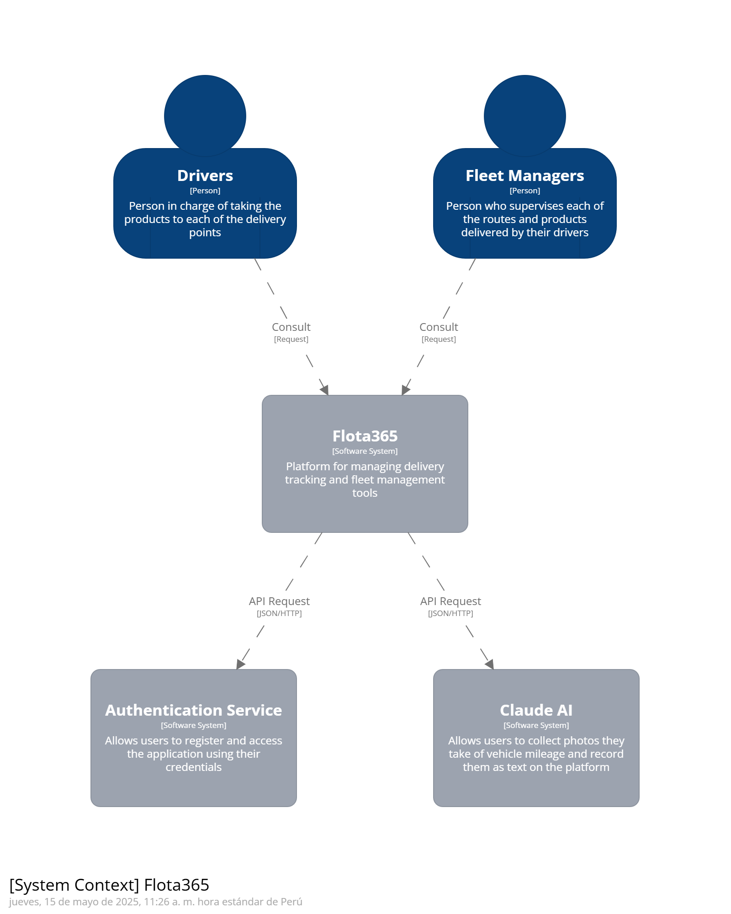
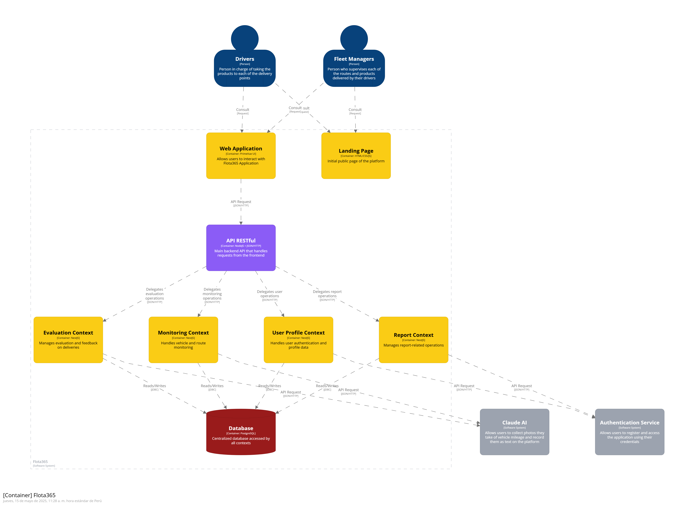
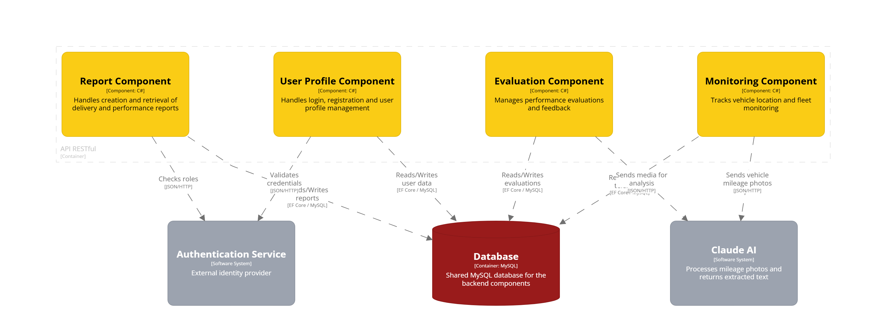
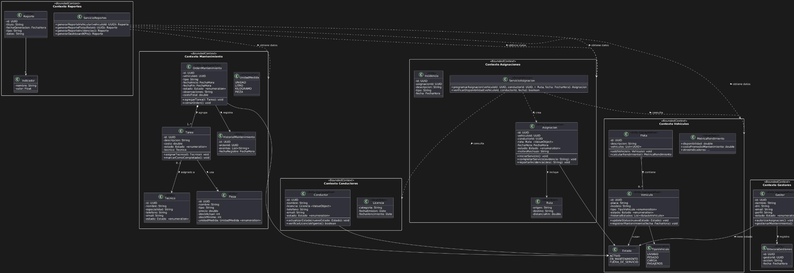

<h2 id="productDesign">CAPÍTULO 4: PRODUCT DESIGN</h2>

<h3 id="styleGuidelines">4.1. Style Guidelines</h3>

<h4 id="generalStyleGuidelines">4.1.1. General Style Guidelines</h4>

El diseño visual de la aplicación *Flota365*, sigue una estética entre lo moderno y lo minimalista, esto porque va relacioanado a la identidad que tiene el startup **VSC-Visionaries** y el compromiso que tenemos por ofrecer soluciones de calidad hacia el sector de transportistas.

Es por esto que, este capitulo, describriremos cada uno de los detalles y estilos que estaremos utilizando al momento de desarrollar la aplicación (siguiendo los principios UX y UI).

**Branding**

El logo principal cuenta con el nombre de la aplicación, el cual viene a ser Flota365. De ahi va el propósito de lo que nosotros estaramos ofreciendo en nuestra aplicación, una ayuda a los gestores de flota. Adicional a ello, estamos incluyendo un *icon* representativo de un automovil que complementa la información visual de lo que nos referimos en nuestro propósito - resaltando la innovación, soporte y confiabilidad que ofrece dicho vehiculo solo que asociandolo que a lo que estaremos desarrollando -.

 

  

 

**Typography**

La tipografía empleada será **Arial** con sus respectivas variantes como los son Regular, Bold y SemiBold. La principal razon de su elección es por su excelente legibilidad en diferentes tipos de pantallas y su disponibilidad universal en los dispositivos tecnológicos que usamos hoy en día (celulares, ordenadores, tabletas, etc)

El tamaño de letra que se utilizará para cada parte del contenido web será mediante la siguiente distribución:

1. **Títulos principales**: segmentado en el tipo de tamaño de 2.25rem (36px).
2. **Subtítulos**: segmentado entre 1.5 rem (25px) a 1.75 rem (28px).
3. **Cuerpo del texto**: segmentado en 1 rem (16px) con un interlineado de 1.6px.

Con estos detalle, se logrará un alto contrates entre el texto y el fondo, dando mayor accesbilidad en un ratio mínimo de 4.5:1 según WCAG 2.1 AA.

 

**Colors**

Hemos distribuido nuestra paleta de colores en 3 categorías (desde la más prioritaria hasta las complementarias).

* **Paleta principal**: Fondos blancos (#fff) como base para maximizar la legibilidad, turquesaclaro (#6CDAE7) como color primario, gris oscuro (#333) para textos principales.

 

  

 

* **Paleta secundaria**: Gris claro (#f9f9f9) para secciones alternas, gris medio (#ddd) para los bordes y separadores, negro (#121212) para la sección del *footer* de nuestro landing page y para dar contraste a los elementos.

 

  

 

* **Colores funcionales**: Se reserva el uso de verde (#4CAF50) para indicadores de éxito, rojo(#F44336) para errores y amarillo (#FFC107) para advertencias. 

 

  

 

Esta combinación cromática reflejará cada uno de valores que tiene la marca del cual queremos transmitir al público.

 

**Spacing**

El spacing mantiene:

* Spacing de 0.5 rem (8px) para mantener consistencia y ritmo visual en toda la aplicación.

* Margin interno generoso **(padding)** de 3.75 rem (60px) en secciones principales y 1.875 rem (30px) para contenedores secundarios.

* Line height entre secciones de 3.75 rem (60px) para mejorar la legibilidad y crear pausas visuales. 

* Spacing entre elementos relacionados entre 0.938 rem a 1.875 rem (15px-30px), manteniendo una densidad de información adecuadasin generar sobrecarga visual.

 

**Tono de Comunicación**

* **Equilibrio**: Formal pero accesible (70% formal, 30% casual) para proyectar profesionalismo sin resultar distante.

* **Actitud**: Respetuoso y sereno (90%) con toques entusiastas (10%) en llamados a la acción.

* **Lenguaje**: Directo y orientado a beneficios, evitando jerga técnica innecesaria.

* **Voz**: Experta y confiable, posicionando FLOTA365 como solución autorizada en gestión de flotas

Este enfoque comunicacional busca conectar con profesionales de logística y gestión de flotas que valoran la eficiencia y resultados concretos.

<h4 id="webStyleGuidelines">4.1.2. Web Style Guidelines</h4>

Se utilizó la tendencia web *functional minimalism* con el color blanco como predominante en el fondo en la mayoría de las secciones para así brindar una experiencia visual más limpia y consistenete de los elementos.

 

  

 

No obstante, se emplearon ciertos iconos coloridos acordes al propósito que tiene cada una de las secciones para complementar la paleta de colores y darle un más minimalismo.

 

  

 

Para el caso de las versiones móviles, la sección de *feaetures* se ha reemplazado por un scroll horizontal para así garantizar una mejor experiancia para el usuario que utlicen estos tipos de dispositivos.

<h3 id="infoArchitecture">4.2. Information Architecture</h3>

<h4 id="orgSystem">4.2.1. Organization Systems</h4>

Flota365 implementa sistemas de organización cuidadosamente seleccionados para diferentes contextos de la plataforma:

**Organización Jerárquica (Visual Hierarchy)**:

  Se aplica en la estructura general del sitio y aplicación, estableciendo niveles claros de importancia:
   
  • Nivel 1: Navegación principal (Home, About, Features, Pricing, Contact) - Siempre visible en el header.
   
  • Nivel 2: Categorías de funcionalidades en la sección Features (Mantenimiento, Combustible, Documentos, etc.).
   
  • Nivel 3: Elementos específicos dentro de cada módulo funcional. 
  Esta jerarquía se refuerza visualmente mediante tamaños tipográficos, colores y espaciado para crear un recorrido visual intuitivo.

**Organización Secuencial (Step-by-Step)**:

  Implementada en procesos que requieren completar varios pasos en orden específico:
   
  • Proceso de registro y onboarding de nuevos usuarios.
   
  • Configuración inicial de la flota de vehículos.
   
  • Wizards para creación de reportes personalizados.
   
  • Procedimientos de mantenimiento preventivo.
   
  Cada secuencia presenta indicadores visuales del progreso actual y pasos restantes.

**Organización Matricial**:

  Utilizada en las vistas de dashboard y reportes, donde:
   
  • El eje vertical representa categorías de datos (vehículos, conductores, rutas).
   
  • El eje horizontal representa dimensiones temporales o métricas comparativas.
   
  • La intersección permite análisis multidimensional de la información.
   
  Esta organización facilita el descubrimiento de patrones y correlaciones en grandes volúmenes de datos.

**Esquemas de Categorización**:

  <b>Categorización Alfabética:</b> Aplicada en listados de recursos numerosos como:
   
  • Directorios de conductores.
   
  • Catálogos de repuestos y servicios. 
  • Listados de proveedores. 
  
  <b>Categorización Cronológica:</b> Implementada en:
   
  • Historial de mantenimientos realizados.
   
  • Registro de recargas de combustible.  
  • Timelines de actividad de vehículos.
   
  • Calendarios de servicios programados.
   
  
  <b>Categorización por Tópicos:</b> Utilizada en:
   
  • Agrupación de funcionalidades por módulos temáticos (Tracking, Mantenimiento, Combustible, etc.)
   
  • Organización de la documentación de ayuda.
   
  • Clasificación de reportes y analíticas.
   
  
  <b>Categorización por Audiencia:</b> Implementada para personalizar vistas según roles:
   
  • Administradores: Acceso completo con enfoque en KPIs y administración global.
   
  • Gestores de flota: Enfoque en planificación y optimización de recursos.
   
  • Mecánicos: Acceso prioritario a información técnica y calendarios de mantenimiento.
   
  • Conductores: Vista simplificada orientada a rutas, checklists y reportes diarios.

Esta combinación de sistemas organizativos permite a usuarios con diferentes necesidades navegar eficientemente por la plataforma, encontrando rápidamente la información relevante para sus tareas específicas.

<h4 id="labelSystem">4.2.2. Labeling Systems</h4>

El sistema de etiquetado de Flota365 está diseñado para maximizar la claridad y minimizar la carga cognitiva, siguiendo estos principios:

**Principios de Etiquetado**:

  • <b>Concisión:</b> Etiquetas con máximo 1-3 palabras para facilitar escaneo visual y comprensión inmediata.  
  • <b>Consistencia:</b> Mismo término para el mismo concepto en toda la plataforma (ej: siempre "Vehículos", nunca alternar con "Flotilla" o "Autos").  
  • <b>Familiaridad:</b> Uso de terminología estándar en la industria logística y de transporte.  
  • <b>Claridad:</b> Evitar ambigüedades y tecnicismos innecesarios que puedan confundir a usuarios no especializados.

**Categorías de Etiquetas**:

  <b>Etiquetas de Navegación:</b>  
  • Menú principal: "Inicio", "Nosotros", "Características", "Precios", "Contacto".  
  • Navegación contextual: "Volver", "Continuar", "Ver todos", "Más detalles".  
  
  <b>Etiquetas para Módulos Funcionales:</b>  
  • "Seguimiento GPS" (en lugar de "Tracking" o "Monitoreo de Posición").  
  • "Mantenimiento" (en lugar de "Reparaciones y Servicios").  
  • "Combustible" (en lugar de "Gestión de Carburante").  
  • "Documentos" (en lugar de "Gestión Documental").  
  • "Neumáticos" (directamente, en lugar de "Gestión de Neumáticos").  
  • "Inventario" (en lugar de "Gestión de Stock y Repuestos").  
  • "Viajes" (en lugar de "Programación de Desplazamientos").  
  
  <b>Etiquetas de Acción (Call-to-Action):</b> 
  • "INICIAR PRUEBA" (en lugar de "Comenzar Periodo de Evaluación Gratuito").  
  • "ELEGIR PLAN" (en lugar de "Seleccionar Opción de Suscripción").  
  • "ENVIAR" (en lugar de "Procesar Formulario"). 
  • "AÑADIR VEHÍCULO" (en lugar de "Crear Nuevo Registro de Unidad").  
  
  <b>Etiquetas para Datos y Métricas:</b>  
  • "Rendimiento" (para eficiencia de combustible).  
  • "Próximo servicio" (para mantenimiento programado).  
  • "Disponibilidad" (para estado operativo).  
  • "Retraso" (para desviaciones en tiempos de entrega).

**Asociaciones entre Etiquetas**:

  Se establecen relaciones semánticas claras mediante:  
  • Agrupación visual de etiquetas relacionadas en la interfaz.  
  • Uso de iconografía complementaria que refuerza el significado.  
  • Implementación de migas de pan (breadcrumbs) que muestran jerarquías de navegación.  
  • Codificación por colores para reforzar categorías (ej: mantenimiento en naranja, combustible en verde).

  Este sistema de etiquetado permite a los usuarios identificar rápidamente contenidos y funcionalidades, reduciendo la curva de aprendizaje y mejorando la eficiencia en el uso diario de la plataforma.

<h4 id="seoTags">4.2.3. SEO Tags and Meta Tags</h4>

Flota365 implementa una estrategia SEO comprensiva para maximizar visibilidad en motores de búsqueda, diferenciada por secciones:

**Landing Page (Sitio Web Estático)**:

  <b>Tags principales:</b> 
  <code>&lt;title&gt;Flota365 - Gestión Integral de Flotas | VSC-Visionaries&lt;/title&gt;</code> 
  <code>&lt;meta name="description" content="Optimiza tus operaciones y reduce costos con nuestra potente solución de gestión de flotas con seguimiento en tiempo real, mantenimiento y control de combustible."&gt;</code> 
  <code>&lt;meta name="keywords" content="gestión de flotas, software logístico, seguimiento GPS, mantenimiento de vehículos, control de combustible, VSC-Visionaries"&gt;</code> 
  <code>&lt;meta name="author" content="VSC-Visionaries"&gt;</code> 
  
  <b>Tags de viewport y responsividad:</b> 
  <code>&lt;meta name="viewport" content="width=device-width, initial-scale=1, maximum-scale=5"&gt;</code> 
  <code>&lt;meta http-equiv="X-UA-Compatible" content="IE=edge"&gt;</code> 

**Open Graph y Social Media Tags**:

  Implementación para mejorar compartición en redes sociales: 
  <code>&lt;meta property="og:title" content="Flota365 - Gestión Integral de Flotas"&gt;</code> 
  <code>&lt;meta property="og:description" content="Optimiza tus operaciones y reduce costos con nuestra potente solución de gestión de flotas."&gt;</code> 
  <code>&lt;meta property="og:image" content="https://flota365.com/assets/img/og-cover.jpg"&gt;</code> 
  <code>&lt;meta property="og:url" content="https://flota365.com"&gt;</code> 
  <code>&lt;meta property="og:type" content="website"&gt;</code> 
  <code>&lt;meta name="twitter:card" content="summary_large_image"&gt;</code> 

**Optimización para Secciones del Landing**:

  Al tratarse de un landing page con múltiples secciones (Home, About, Features, Pricing, Contact), se optimiza mediante: 
  • Uso correcto de encabezados jerárquicos (h1, h2, h3) para cada sección. 
  • IDs semánticos en cada sección para navegación por anclas (ej: <code>id="features"</code>, <code>id="pricing"</code>). 
  • Atributos alt descriptivos en todas las imágenes (ej: <code>alt="Dashboard de gestión de flota con indicadores de rendimiento"</code>). 
  • Texto optimizado con palabras clave relevantes distribuidas naturalmente a lo largo del contenido. 
  • Microdata (schema.org) para servicios y productos, mejorando la representación en resultados de búsqueda:

Esta implementación SEO garantiza que el landing page sea correctamente indexado y representado en los resultados de búsqueda, maximizando la visibilidad y atrayendo tráfico cualificado a la página.

<h4 id="searchSystem">4.2.4. Searching Systems</h4>

FLOTA365 implementa sistemas de búsqueda avanzados para facilitar el acceso rápido a la información en un entorno con grandes volúmenes de datos:

**Componentes del Sistema de Búsqueda**:

  <b>Barra de Búsqueda Global:</b> 
  • Ubicada prominentemente en el header de la aplicación, siempre accesible.  
  • Campo de texto con placeholder descriptivo: "Buscar vehículos, conductores, documentos..."  
  • Icono de lupa como identificador visual universal.  
  • Activación rápida mediante atajo de teclado (Ctrl+K o Cmd+K).  
  
  <b>Búsquedas Contextuales:</b>  
  • Campos de búsqueda específicos dentro de cada módulo (ej: solo conductores, solo documentos).  
  • Adaptados para filtrar automáticamente según el contexto actual del usuario.  
  
  <b>Filtros Avanzados:</b>  
  • Expansibles desde la barra de búsqueda principal mediante botón "Filtros".  
  • Interfaz de filtros con diseño de acordeón para categorías principales.

**Opciones de Filtrado por Módulo**:

  <b>Módulo de Vehículos:</b>  
  • Por estado: Activo, En mantenimiento, Inactivo.  
  • Por tipo: Camión, Furgoneta, Turismo, Maquinaria.  
  • Por asignación: Conductor específico, Sin asignar . 
  • Por ubicación: Radio geográfico, Región, Ruta específica.  
  
  <b>Módulo de Mantenimiento:</b>  
  • Por tipo: Preventivo, Correctivo, Revisión.  
  • Por estado: Programado, En proceso, Completado, Cancelado.  
  • Por período: Día actual, Semana, Mes, Personalizado.  
  • Por responsable: Taller interno, Proveedor externo.  
  
  <b>Módulo de Combustible:</b>  
  • Por tipo: Diesel, Gasolina, Eléctrico, Gas.  
  • Por período de repostaje: Últimas 24h, Semana, Mes.  
  • Por consumo: Alto, Medio, Bajo (percentiles).  
  • Por proveedor: Estaciones específicas, Tarjetas de combustible.

**Funcionalidades Avanzadas**:

  <b>Autocompletado:</b> 
  • Sugerencias dinámicas mientras el usuario escribe. 
  • Priorización de resultados basada en relevancia y uso frecuente. 
  • Corrección automática de errores tipográficos comunes. 
  
  <b>Búsqueda Semántica:</b> 
  • Comprensión de consultas en lenguaje natural (ej: "camiones con mantenimiento pendiente"). 
  • Reconocimiento de sinónimos y términos relacionados dentro del contexto logístico. 
  
  <b>Búsqueda por Voz:</b> 
  • Activación mediante icono de micrófono en la barra de búsqueda. 
  • Procesamiento de comandos verbales simples para la navegación.

**Presentación de Resultados**:

  <b>Interfaz de Resultados:</b> 
  • Diseño en formato de lista con elementos seleccionables. 
  • Cada resultado muestra información crítica (título, categoría, fecha relevante) sin sobrecarga visual. 
  • Paginación para conjuntos grandes de resultados (20 elementos por página). 
  
  <b>Agrupación y Ordenamiento:</b> 
  • Resultados agrupados por categoría (Vehículos, Conductores, Documentos, etc.). 
  • Opciones para ordenar por relevancia, fecha, estado o alfabéticamente. 
  • Toggle para cambiar entre vista de lista y vista de tarjetas. 
  
  <b>Acciones Rápidas:</b> 
  • Menú contextual en cada resultado para acciones frecuentes sin necesidad de abrir el elemento. 
  • Previsualización al pasar el cursor (hover) con datos adicionales relevantes.

  El sistema está implementado con Vue.js en el frontend para garantizar reactividad inmediata y experiencia fluida, mientras que el backend en C# proporciona indexación eficiente y tiempos de respuesta optimizados incluso para grandes volúmenes de datos.

<h4 id="navigationSystem">4.2.5. Navigation System</h4>

Flota365 implementa un sistema de navegación multicapa que guía intuitivamente a los usuarios a través de la plataforma:

**Navegación Global**:

  <b>Barra de Navegación Principal:</b> 
  • Ubicada en la parte superior de todas las páginas, siempre visible. 
  • Contiene enlaces a secciones principales: Inicio, Nosotros, Características, Precios y Contacto. 
  • Incluye acceso prominente a "Iniciar Sesión" y "Registrarse" en el extremo derecho. 
  • En dispositivos móviles se colapsa en un menú hamburguesa con animación suave al expandirse. 
  
  <b>Navegación de Footer:</b> 
  • Repite enlaces principales para acceso rápido al final de la página. 
  • Incluye enlaces adicionales a términos legales, política de privacidad y recursos de ayuda. 
  • Incorpora iconos de redes sociales y datos de contacto.

**Navegación Contextual**:

  <b>Menús Secundarios:</b> 
  • En la sección de Características, navegación por pestañas para explorar diferentes módulos. 
  • Dentro de la aplicación, menú lateral izquierdo para acceder a diferentes secciones del módulo actual. 
  • Menús desplegables para opciones relacionadas con funciones específicas. 
  
  <b>Breadcrumbs:</b> 
  • Implementados en todas las páginas internas de la aplicación. 
  • Muestran la ruta completa desde la página principal hasta la ubicación actual. 
  • Cada nivel es clickeable para facilitar la navegación hacia atrás.

**Navegación de Utilidad**:

  <b>Botones Call-to-Action:</b> 
  • Estratégicamente ubicados para guiar al usuario hacia acciones principales (ej: "INICIAR PRUEBA GRATIS"). 
  • Visualmente destacados con color turquesa (#6CDAE7) y tamaño prominente. 
  • Posicionados en puntos clave del recorrido del usuario (hero section, final de características, etc.). 
  
  <b>Enlaces Contextuales:</b> 
  • Integrados en el contenido para facilitar el flujo natural entre páginas relacionadas. 
  • Diferenciados visualmente con subrayado o color distinto al texto normal. 
  
  <b>Botón "Volver Arriba":</b> 
  • Aparece al desplazarse hacia abajo en páginas largas. 
  • Permite regresar al inicio de la página con un solo clic.

**Navegación de Usuario (En Aplicación)**:

  <b>Dashboard personalizado:</b> 
  • Página inicial tras el login que presenta accesos directos a las funciones más utilizadas. 
  • Widgets configurables según preferencias y rol del usuario. 
  
  <b>Menú de Perfil:</b> 
  • Accesible desde el avatar del usuario en la esquina superior derecha. 
  • Permite acceder a configuración de cuenta, preferencias y cierre de sesión. 
  
  <b>Navegación por Pestañas:</b> 
  • Implementada en módulos complejos para organizar funcionalidades relacionadas. 
  • Permite cambiar entre vistas sin perder el contexto actual.

Esta arquitectura de navegación garantiza que los usuarios puedan moverse eficientemente por la plataforma, manteniendo siempre clara su ubicación actual y las opciones disponibles, reduciendo así la frustración y mejorando la experiencia general.

<h3 id="landingDesign">4.3. Landing Page UI Design</h3>

<h4 id="landingWireframe">4.3.1. Landing Page Wireframe</h4>

<h4 id="landingMockUp">4.3.2. Landing Page Mock-up</h4>

<h3 id="webAppDesign">4.4. Web Applications UX/UI Design</h3>

<h4 id="webAppWireframes">4.4.1. Web Applications Wireframes</h4>
  
 
 
 
 
 
 
 

<h4 id="webAppUserFlow">4.4.4. Web Applications User Flow Diagrams</h4>

Esta sección presenta los diagramas de flujo de usuario (User Flows) desarrollados para la aplicación web Flota365. Cada diagrama corresponde a un objetivo específico de usuario (User Goal) identificado a partir de los perfiles de usuario definidos (User Persona). Los flujos ilustran tanto las rutas principales (happy paths) como las alternativas (unhappy paths), y están alineados con los wireframes previamente diseñados.

**- User Persona 1: Conductores de vehículos pesados**

**User Goal 1: Reportar una incidencia durante el turno.**

<ul><li>Happy Path – Reporte exitoso</li></ul>
 

  
<ul><li>Unhappy Path – Falla al enviar reporte</li></ul>
 

  
**Explicación del flujo:**

El flujo inicia con el conductor ingresando a la aplicación mediante la pantalla de login. Si las credenciales son válidas, accede a su dashboard principal. Desde allí, selecciona la opción de "Reportar Incidencia", lo cual lo redirige a un formulario donde debe ingresar los detalles del incidente y subir una imagen como evidencia. Si todo está correcto, el reporte se envía. En caso contrario, el sistema bloquea el proceso hasta completarlo correctamente.

  
**Condiciones y validaciones:**

- Credenciales válidas.
- Formulario con campos obligatorios llenos.
- Subida obligatoria de imagen.

**User Goal 2: Ver el estado de su vehículo asignado.**

<ul><li>Happy Path – Consulta exitosa</li></ul>
 

  
<ul><li>Unhappy Path – Vehículo no asignado o error</li></ul>
 

  
**Explicación del flujo:**

El flujo inicia con el conductor ingresando a la aplicación mediante la pantalla de login. Si las credenciales son válidas, accede a su dashboard principal. El conductor consulta los datos de su vehículo asignado. Si no tiene uno asignado, el sistema lo notifica.

  
**Condiciones y validaciones:**

- Usuario debe estar logueado correctamente.
- El conductor debe tener un vehículo asignado.
- Verificación de carga de datos desde base de datos.

 
 

**- User Persona 2: Gestores de flota**

**User Goal 1: Asignar un vehículo a un conductor disponible.**

<ul><li>Happy Path – Asignación exitosa</li></ul>
 

  
Unhappy Path – Error en la asignación
 

  
**Explicación del flujo:**

El flujo inicia con el gestor de flota ingresando a la aplicación mediante la pantalla de login. El gestor de flota accede al sistema y asigna vehículos a conductores disponibles. Si alguno ya tiene asignación o no hay disponibilidad, se detiene el proceso.

  
**Condiciones y validaciones:**

- Validación de credenciales.
- Verificación de asignación previa del conductor.
- Estado del vehículo (activo, en mantenimiento, ya asignado).

**User Goal 2: Consultar reportes de incidencias enviadas por conductores.**

<ul><li>Happy Path – Revisión exitosa</li></ul>
 

  
<ul><li>Unhappy Path – Reporte inaccesible</li></ul>
 

  
**Explicación del flujo:**

El flujo inicia con el gestor de flota ingresando a la aplicación mediante la pantalla de login. El gestor revisa los reportes de incidencias enviados por los conductores. Si hay problemas como falta de evidencia o ningún reporte cargado, el sistema lo indica.

**Condiciones y validaciones:**

- Usuario autenticado como gestor.
- Existencia de reportes en el sistema.
- Validación de integridad de cada reporte.
</ul>

<h3 id="webAppPrototyping">4.5. Web Applications Prototyping</h3>
Video de la aplicación web: https://drive.google.com/file/d/1_MWoiid6MOtvUOxqcHGoC-sVwGr-2juM/view?usp=sharing

<h3 id="DDD">4.6. Domain-Driven Software Architecture</h3>

<h4 id="contextDiagram">4.6.1. Software Architecture Context Diagrams</h4>

  

<h4 id="containerDiagram">4.6.2. Software Architecture Container Diagrams</h4>

  

<h4 id="componentDiagram">4.6.3. Software Architecture Components Diagrams</h4>

  

<h3 id="softwareObjectOrientedDesign">4.7. Software Object-Oriented Design</h3>

<h4 id="classDiagram">4.7.1. Class Diagrams</h4>
Diagrama de clases:

* Link del diagrama de clases en plantmul:https://editor.plantuml.com/uml/jLbVSnet47zdXk-WuIKqjJt9wmt3v0B4kOa13s3Fz2aZxcHGVITHIKT3cdwnllQBTQNJ7U9EOEouVQWFQNUrsZ-_tLK-I8M5ohEqtPAFb6smm1dQuFWHhyXSxLA218aLPgkKk1HnYgL4VxLR2FuBbH9qcIiInPnzuamDUCe5MgOWnaCnfzy9UjTk_TrkjLjlq8Zb6H5OKSuaqj9HBZcAUVRlFwpT8h2BvWght1uN3XRH_KX_HPFzzzraE9fz7OVHP36QX9E1MPpUBRvEFtsTZsRtKR4IpkVHzMGqDD_tONGJVhmn6uFf-FPcj2XsRaUJOJIvjXeQ3Ux9ciOfMUmsf53Z9hh-lD0VdqVX_Mz6H3YxdXfsE6KqkHxDvgw4EqRLz65CiCo5bN4tYHQ5hCLefZ--H3VJwrauDbAYaTRP2B3-G1sh1Xg0aSatrK6ztaUUiuGaTgNVBvrIUAXawFL6J56rkq3XQYN82YiouzmXH-WIqIH0TtVHSB-oIO4m0FiBobRxvOmd96qkAx1Eu9fgloMD1mFhoVhwPoeL5xi0tS17pmeeIFiLxMNvzIlADmdeLH1q6VbpVY3zbm1jEKtsv71Va4l465Cm4iCi9jt4N6m8_r_GZ1om69CtJ6XZiDUxnsbEfilV8IqEpNViZl4QqeSaeTgVrzZyk2jCZzwCCGDN2mG9DD-1rjaRhrQVKaBKIzsQ41aBkj4fr_JYjhYlFFI6rmyuIUnsTrivtcF-Z6z9HLZyZQnI3UeOft6km-wMY0SkCkCje79-ZWce77lDqg0wxZ1GVujfYfSq1Gi6AE7vCYNkxie9c06Ngad3rPg8Y2KqnX30OB8ntlGAWrvOudvDpp8ZE-yxOCi-whpjr48iG9qrbcXT94MdO2lyhPduvQNBfCa1L1MeAZjrl70kS3vcE4nJaK0elZ3AQfwkuqGzxamX6XwavNwJiEJOrh6qOrmHwG4fhd3gysOji1TOFdQ1IFzj1cdAPM6Sxl40NfGdQHhth5hCwXCg6_zKwiQ-Qnqra2Bncj6OOjPmaMiAAUcABIfQOvFgL-Fs6HQFeHpmR9CIHPBkAMJTYtbfY36S-I9fGq1egfEwlhLPS-RX81aWWJSaVPPph4DbM818Qa1goNbACFD34uJtwzxJdqSRG3tIZ88u5u8mDLSyVWmGPBXJpYdpBUVGiGI7VOlF188aUKoCW2xE05cKaUCf0_8aJSrS3WhPzk3i7E4wCPkmGxPm_xAi5LRRLpNTvWAV3sGgnHh0gE7uhORZzrTNWCWcaG6EAOlJ71BLGhTPreXTmhs91A3BPOtctTMLhGfEQW1XaOCa0V3g7555CxbXwjLL4tdi2YSKjsyMaA6WMs0-ktPO-bSDynJYcKcY7MS-_hziVcPV6Qz9_6YLWYQ39d3Zfr30af_g8w6N82lJ3jTlGANCoJv4dHj_sr2ny-mSG9NHyRY2rdSwI2fB7qP3QE8mWpGwFo8SdjVk8nAZS7DTy5mROgR_EDGsgP_JGmYYtGErTWRuvwcuZdbD-p8dOakBVhKMAhOWbWHaInF2uYfuFMYvuK95BDPqgglBlfUs5bxcpgU2YmkwefxM0GvGb65_Nv40K6Z0-9ATR6HARSy6Qbp5XiUvfneTV-LBJe5tFHgj9q3N8GUyOFRtuOGW8SMJF2LxjlhySb6BmWiaREHTeCQCkHTJ0v7GcKIUFg4Xrv_FJkRfd7RIeRRZHhspvKuebMkXLcHuPyEpqpogDElLLT-L5Q1O452uSOfBNt_U20Axq07-Ft8Yw1FyXzKg28hV1zo7W3OprpWVp2pz2u4CM59FsAu8i-zVnqQSe-6EJo4I337LQDgb0Qf-d0AGYkWKYFZhz5QJ1p2fSgpyu6IiTrRYMPkKhmO5f-VjeDXeyfbnsN8zwEypUCeOjsmdA8TOhfSSY-JBRIJhXDMbRR3iKyXQzd3_x0GG-Zq3UbXf77zKX6Va3u9wD_WCUSsQ7mJxjPyKL9hS9wR-ab4yYptZ5QDWUDLMb2QJF5iISNRFkH7yWVgI_kbc5ETg3TNwkrjyFEEslgNxi7bwfjBKMj8DNvrTfOipF7qMZe-q2wU7gC8lpO6bM7Uhpg6-K7fIlgfcb3S8y8Cooj583tPSegwaq6NH1qYpXCjVsYtF0-wWU6-jqCVmbXRmzfhGCwN9lE4k297wW62fOpDg9rFcsi2ex7zV6-Z7fACQDORPo-BroIU_X8_BonzzxxNRBS_W-AD_H2KjyWDXYVdNeVy0
<h4 id="classDictionary">4.7.2. Class Dictionary</h4>

## Class `Vehicle`

### Attributes

| Name | Type | Description |
|------|------|-------------|
| id | UUID | Vehicle ID |
| plate | String | Vehicle plate |
| model | String | Vehicle model |
| type | VehicleType | Type of vehicle |
| status | Status | Current status |
| statusHistory | List<VehicleStatus> | Status history |

### Methods

| Name | Return Type | Description |
|------|--------------|-------------|
| updateStatus(newStatus) | void | Updates the vehicle status |
| registerMaintenance(date) | void | Registers a maintenance event |

## Class `Fleet`

### Attributes

| Name | Type | Description |
|------|------|-------------|
| id | UUID | Fleet ID |
| description | String | Description of the fleet |
| vehicles | List<UUID> | Vehicle IDs in the fleet |

### Methods

| Name | Return Type | Description |
|------|--------------|-------------|
| addVehicle(v) | void | Adds a vehicle to the fleet |
| calculatePerformance() | PerformanceMetric | Calculates fleet performance |

## Class `PerformanceMetric`

### Attributes

| Name | Type | Description |
|------|------|-------------|
| availability | double | Vehicle availability |
| avgMaintenanceCost | double | Average maintenance cost |
| otherIndicators | ... | Other performance indicators |

## Class `MaintenanceOrder`

### Attributes

| Name | Type | Description |
|------|------|-------------|
| id | UUID | Order ID |
| vehicleId | UUID | Vehicle related to the order |
| type | String | Maintenance type |
| startDate | DateTime | Start date |
| endDate | DateTime | End date |
| status | Status | Current status |
| notes | String | Observations |
| totalCost | double | Total cost |

### Methods

| Name | Return Type | Description |
|------|--------------|-------------|
| addTask(t) | void | Adds a task to the order |
| closeOrder() | void | Closes the maintenance order |

## Class `Task`

### Attributes

| Name | Type | Description |
|------|------|-------------|
| id | UUID | Task ID |
| description | String | Description of the task |
| cost | double | Cost of the task |
| status | Status | Task status |
| technician | Technician | Assigned technician |

### Methods

| Name | Return Type | Description |
|------|--------------|-------------|
| assignTechnician(t) | void | Assigns technician to task |
| markAsCompleted() | void | Marks task as completed |

## Class `Technician`

### Attributes

| Name | Type | Description |
|------|------|-------------|
| id | UUID | Technician ID |
| name | String | Technician name |
| specialty | String | Specialty |
| phone | String | Phone number |
| email | String | Email address |
| status | Status | Technician status |

## Class `Part`

### Attributes

| Name | Type | Description |
|------|------|-------------|
| id | UUID | Part ID |
| name | String | Part name |
| type | String | Part type |
| price | double | Price of the part |
| currentStock | int | Current stock |
| minStock | int | Minimum stock |
| unit | UnitOfMeasure | Unit of measure |

## Class `MaintenanceHistory`

### Attributes

| Name | Type | Description |
|------|------|-------------|
| id | UUID | History ID |
| orderId | UUID | Related order |
| events | List<String> | Events list |
| recordDate | DateTime | Date of registration |

## Class `Driver`

### Attributes

| Name | Type | Description |
|------|------|-------------|
| id | UUID | Driver ID |
| name | String | Driver name |
| license | License | Driver license |
| phone | String | Phone number |
| email | String | Email address |
| status | Status | Driver status |

### Methods

| Name | Return Type | Description |
|------|--------------|-------------|
| updateStatus(newStatus) | void | Updates driver status |
| checkLicenseValidity() | boolean | Checks license expiration |

## Class `License`

### Attributes

| Name | Type | Description |
|------|------|-------------|
| category | String | License category |
| issueDate | Date | Issue date |
| expiryDate | Date | Expiration date |

## Class `Assignment`

### Attributes

| Name | Type | Description |
|------|------|-------------|
| id | UUID | Assignment ID |
| vehicleId | UUID | Assigned vehicle |
| driverId | UUID | Assigned driver |
| route | Route | Route information |
| dateTime | DateTime | Assignment time |
| status | Status | Assignment status |
| rejectionReason | String | Rejection reason |

### Methods

| Name | Return Type | Description |
|------|--------------|-------------|
| startService() | void | Starts the assignment |
| completeService(evidence) | void | Completes the assignment |
| reportIncident(desc) | void | Reports an incident |

## Class `Route`

### Attributes

| Name | Type | Description |
|------|------|-------------|
| origin | String | Route origin |
| destination | String | Route destination |
| distanceKm | double | Route distance in km |

## Class `Incident`

### Attributes

| Name | Type | Description |
|------|------|-------------|
| id | UUID | Incident ID |
| assignmentId | UUID | Related assignment |
| description | String | Incident description |
| type | String | Incident type |
| date | DateTime | Incident date |

## Class `AssignmentService`

### Attributes

| Name | Type | Description |
|------|------|-------------|

### Methods

| Name | Return Type | Description |
|------|--------------|-------------|
| scheduleAssignment(vehicleId, driverId, r, date) | Assignment | Schedules an assignment |
| checkAvailability(vehicleId, driverId, date) | boolean | Checks availability |

## Class `Report`

### Attributes

| Name | Type | Description |
|------|------|-------------|
| id | UUID | Report ID |
| title | String | Report title |
| generationDate | DateTime | Date of generation |
| type | String | Report type |
| data | String | Report content |

## Class `Indicator`

### Attributes

| Name | Type | Description |
|------|------|-------------|
| name | String | Indicator name |
| value | Float | Indicator value |

## Class `ReportService`

### Attributes

| Name | Type | Description |
|------|------|-------------|

### Methods

| Name | Return Type | Description |
|------|--------------|-------------|
| generateVehicleReport(vehicleId) | Report | Generates report for a vehicle |
| generateFleetReport(fleetId) | Report | Generates report for a fleet |
| generateIncidentReport() | Report | Generates incident report |
| generateDashboardKPIs() | Report | Generates KPI dashboard |

## Class `Manager`

### Attributes

| Name | Type | Description |
|------|------|-------------|
| id | UUID | Manager ID |
| name | String | Manager name |
| idNumber | String | National ID |
| email | String | Email address |
| profile | String | Profile/role |
| status | Status | Manager status |

### Methods

| Name | Return Type | Description |
|------|--------------|-------------|
| authorizeAssignment() | void | Authorizes an assignment |
| manageMaintenance() | void | Manages maintenance process |

## Class `ManagementLog`

### Attributes

| Name | Type | Description |
|------|------|-------------|
| id | UUID | Log ID |
| managerId | UUID | Related manager |
| action | String | Action description |
| date | DateTime | Date of action |

<h3 id="dbDesign">4.8. Database Design</h3>

<h4 id="dbDiagram">4.8.1. Database Diagram</h4>
Diagrama de base de datos:

  link del diagrama: https://editor.plantuml.com/uml/pLXDRziu4BqRy7_GRRDO5qYpo1wCegYgC8uGHp9a9rU2fcYR24MffEHDqFQ_xr2o8rccbJHsWRqayioG6hxvUjGNdHEL5udezrOyPWxbYWhMx_LxJEOyVtRMRCL1eftl_PxZ_CLZP-XmcJkVFarkFtysiaoGd85qJHHT4NLsSVwd4SyLaN53V5c9apHcObzCKv6gXlZlIipaaak6DLCSNDXVLIW5VkA42qQMnecOKPuGSVRnV71HcWYYGK_0PIQ9f0p7bRVcdz5BzhIhVqnisomA9d3-d9cbJ1R9sOZeL81l0-SAN6DYu8mdeu7Z1QFI7c3D2xqr3YSeScT-6BZZWHE40TuHtBc1Eq9tA9ZLhw8a8zJWR_65AWREnvZaeCrvmk1bIMOqHHPRDJyR0MsSjIEe5CAq7rDBg67DzMPD4qK35MxikxKfqwqP0-Db5UdO9ixJd00QgSvjIEoYFFLkqDNz65qD73_0aoWSHMWwXPY4TvCncXcvvmOU0ejoTJg7l5gJdAVIx9539fGWWjJc-ibWBy7fm5wIf0don_CA_9XfgdXct6ruUpgl5ACCjkzmh6bj0MYpmKwP-C53w7jeu7prnv3g4VAGFvaDd71sWw8gXktQljXs1AXjo3U-Plk5huii4zmU9rtCowon9SoQMFFeeFrnw6wzx81qNcXe8bhZLj0lBYyhpyXJTSOMEYIE5Inh94AsIgKjRHX4JLZaD9KveJdEmByoeze6pJ1E9sw4CFoPGJrDKVG0COMdhn16Io6wtin_GAOAgwVJTYsS4_tu_YpD6Lr9JZcHDgszo7QFDq71bH-C3dMP3RhsZdKS2hNl7UTV54BifzC_LPmoS8Y8Sgwqu_sh2VJROsuQyJlFASkk3fF3LZig5I-9JUA4IwvpHV9K3HoYDVmWCXz06acW522B5RGWLK44-dzJ5LiAzRYZbZDVfCkEuswdOcj0jWRrvLi6jKXfcgIcisvxTNsQce80_1RmNcSdhtCojbX04ZD9hHiKaaDNKfnQrnvirLqZGR455xlyBOpyaQdVq0zW75tVep6Eq7KvfEhPT80X71Vh3QF6SKgB16I_HgsRdQpPe4CNZZ53tatWU-uO-y5qWZp3CA4p-P5tFoxf9lRS26YGqVbW1Ipqpf-PeftUHuOQDG-_zG_3_dEcB1s0Qrti4Mhsb75LGjRM67CkbtY3mtuDGP1iC_2tHA4v9OXWwZHXc4Je0NWyz3zyvq9ceM23gZ_6teqRZ0mJYjnR1B-GTmiHyoCpIAz2x_xb0j1HEQMdRLmFJASWdFdNlc6zy8fm_B37VuyaDnbH36U6plz_-6pjrAdyQHtJrbsw6zQs7-eyfO_LsYh8aYT5qXQNUwKBd32Y2sLpyvI4_rl15Nkb1xr2fnhuMBJV2h8jzkO13uBLnTsFp0owOd7H-I5ZQzAkh_VSXMj-lfTc9PsmyQaLppAh1YvMF8DvcLkprc0FgO8tvA3bfccTd1xIrgljdps80c-1HjcrQmvDcMhxc8Pv2wE0ISsi1YADbp0CRAhJzli_dAYyHi9c0B3kzrw-QFtuyU53-dttWyYmkXTnQJ7S7zn3PqKiXZMR6vRFtI_TZfzXrTqjndNk3kldVc_7SSk-BnVwZPklsLVtgg6pwGjlUaEZWmmToLYyksep6WuWBGpTNd3pfkRDfiCrg8z5gX9OK5qEx1ilcMH0GSo-zHMy6w2IojZicx7SA8rPU_Xj8zMOF-27Iejin_ejA1hUZUVF_TuN9kCY4Vy1

Link del diagrama de base de datos: https://editor.plantuml.com/uml/pLXDRziu4BqRy7_GRRDO5qYpo1wCegYgC8uGHp9a9rU2fcYRY4IgfEHDqFQ_xr2o8rccbJHsWRqayioG6hxvUjGNdHEL5sdIxwrup1pA5KrOlzVlCP7p_DbPinK7YNQ-ztkEynUFdQ73HUvy-ZIv_VpPoBA4v0oaQwBeYgYpY_C_ZNYkY8WRuijAdCgO9VjYAXEf6kA_Ap4JIouOrannS65_LQ4K-8bJdZ2oD4x4ZFAK96SVpmSNfKb2DEW9kCm44PJXkFBM_3DwmPvszO-fRPj5mHASFsTcAHD5UZOYMYRWsy2v0jTOCd36az70yO9HQG-mveNU6eSJ5BapFmpSyS09mW3l2ExSm1sXEnJCwbTHaX5gyBVuGXK3vsDCSj3cF6NmiZGpcYABhPgVZO0spjeHL0fXse-f9TImvdgpfecYWGetzjtQbEdMZ87niefqR1FdCYU0XjIv3ObTbAVU3Rgw7wEhWUC7U1A5emXDfn2Jy6uoHZCZzzp0Gs1HhfPpoAiroRaKPeySCg444QGsrqy6UmbE1_Q2f4sGFvvNuCTCKyKpusx3szDvfHXbi7s7Oqrh2q2R3NRAn0yUGjz30-UhFuPKZv27_Cbiu8Ip6nHLCMpNziMs8q1jGxxnDTilV5raMSBjSTB5lCmQMyAiYJMF3jeVX-xMomv8vuM69g8rRWNzulAoyemyLMTieKFYMC6oHY9aAobiQSCWQeb5JgN82Srn1lwL6TKsQ8PnEd4ZXE7F3EffYg87Y2ayVOKmMWhHzMR-0p9LM3sTjclXdEZ7zsTfpkXASCg9i6djHRPxl0aAhlnWTAZBRD2rTwpZKAXzxpZ_eaYI_NJwfufJ1WwHf9mhxNZ_QWBzzfYRHlpESugogyFaiDMEaibBOfCuvOBhN95Sge53j8OVHEG3I2C1b09aiO8Mf2g8GF-lLB6bK8yxQZdp4xdiEEvsAhO6P6jGNxvbK2UIobIQphhjrVLfQWe2y5l0UvsTlCx9s681ISm4jMvG20vTIN5gNNkmLNUD1CKMFDdbRs7aZqpzXdu0u-Zw7ernXAxB8LNFfWCCuRXORnWrZYKjKf3z6hLkTh9cWmvTECOCUJU1xxbZx0VJ2V8CmuJEv4VU_RYaczXp8w11HkU35R3GEtzcYdPw7nbgr3pyrZyC-y-PidG0hdMnHwZPKyPL2LbROyovME8D3lir146opS3V4eNcb209KwS9moH23y3ZeV_XEnSo2mKRLFqnzcxSO6IOKEJU8lY5l5k8c1-PGNeLUlSl5u2EoYazRUDwO3e5uSo_zWthXLU4uuSz_diakSc8OZWpTFx_msThfqxbJ-kOjkxItR2s_L3daZvMQwiW2vuMQLjSxYKNE6L45yhcvYa9_xU2A_PA3tg5JZNmiMY_5MHRxCq37WIhYxiVcHbqnUAYyqF6rgHTN--v2zVyV2_DIZfXurChdcLM3LoiU0RpChTchS4UKWLlo47BJTCwEJsahLVRFtiG1Tu2ZR9hrnoQCjNsCGtp5aO14vfP3H8PBs4Os5IdxVT_E55vZOJD063TxxryqVhnuyC7-NttWyYmkXTnOJ7S7zn3PqKiXZMR6vRFtI_TZfzXrTqjndNk3kldVc_7SSk-BnVwZPklsLVtgg6pwGjlUaEZWmmTmLYyksep6WuWdHYwlU3cJSsRJOThK1yBgL9OK5qEx1ilcM10GSo-zHMy6w2IojZicx7SA8rPU_Xj8zMOF-27aaMsO_qM50tlnlFdVkyB4t7vPVO_
