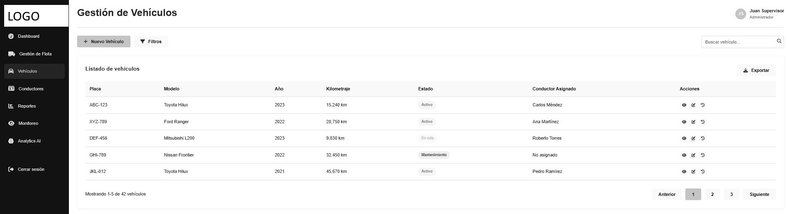
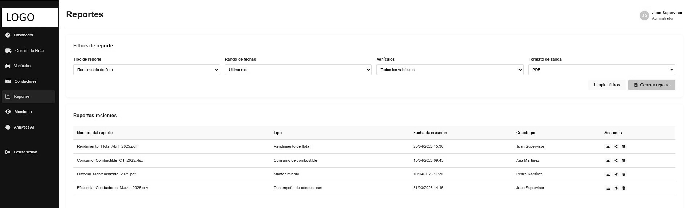

<h2 id="productDesign">CAPÍTULO 4: PRODUCT DESIGN</h2>

<h3 id="styleGuidelines">4.1. Style Guidelines</h3>

<h4 id="generalStyleGuidelines">4.1.1. General Style Guidelines</h4>

El diseño visual de la aplicación *Flota365*, sigue una estética entre lo moderno y lo minimalista, esto porque va relacioanado a la identidad que tiene el startup **VSC-Visionaries** y el compromiso que tenemos por ofrecer soluciones de calidad hacia el sector de transportistas.

Es por esto que, este capitulo, describriremos cada uno de los detalles y estilos que estaremos utilizando al momento de desarrollar la aplicación (siguiendo los principios UX y UI).

**Branding**

El logo principal cuenta con el nombre de la aplicación, el cual viene a ser Flota365. De ahi va el propósito de lo que nosotros estaramos ofreciendo en nuestra aplicación, una ayuda a los gestores de flota. Adicional a ello, estamos incluyendo un *icon* representativo de un automovil que complementa la información visual de lo que nos referimos en nuestro propósito - resaltando la innovación, soporte y confiabilidad que ofrece dicho vehiculo solo que asociandolo que a lo que estaremos desarrollando -.

 

  

 

**Typography**

La tipografía empleada será **Arial** con sus respectivas variantes como los son Regular, Bold y SemiBold. La principal razon de su elección es por su excelente legibilidad en diferentes tipos de pantallas y su disponibilidad universal en los dispositivos tecnológicos que usamos hoy en día (celulares, ordenadores, tabletas, etc)

El tamaño de letra que se utilizará para cada parte del contenido web será mediante la siguiente distribución:

1. **Títulos principales**: segmentado en el tipo de tamaño de 2.25rem (36px).
2. **Subtítulos**: segmentado entre 1.5 rem (25px) a 1.75 rem (28px).
3. **Cuerpo del texto**: segmentado en 1 rem (16px) con un interlineado de 1.6px.

Con estos detalle, se logrará un alto contrates entre el texto y el fondo, dando mayor accesbilidad en un ratio mínimo de 4.5:1 según WCAG 2.1 AA.

 

**Colors**

Hemos distribuido nuestra paleta de colores en 3 categorías (desde la más prioritaria hasta las complementarias).

* **Paleta principal**: Fondos blancos (#fff) como base para maximizar la legibilidad, turquesaclaro (#6CDAE7) como color primario, gris oscuro (#333) para textos principales.

 

  

 

* **Paleta secundaria**: Gris claro (#f9f9f9) para secciones alternas, gris medio (#ddd) para los bordes y separadores, negro (#121212) para la sección del *footer* de nuestro landing page y para dar contraste a los elementos.

 

  

 

* **Colores funcionales**: Se reserva el uso de verde (#4CAF50) para indicadores de éxito, rojo(#F44336) para errores y amarillo (#FFC107) para advertencias. 

 

  

 

Esta combinación cromática reflejará cada uno de valores que tiene la marca del cual queremos transmitir al público.

 

**Spacing**

El spacing mantiene:

* Spacing de 0.5 rem (8px) para mantener consistencia y ritmo visual en toda la aplicación.

* Margin interno generoso **(padding)** de 3.75 rem (60px) en secciones principales y 1.875 rem (30px) para contenedores secundarios.

* Line height entre secciones de 3.75 rem (60px) para mejorar la legibilidad y crear pausas visuales. 

* Spacing entre elementos relacionados entre 0.938 rem a 1.875 rem (15px-30px), manteniendo una densidad de información adecuadasin generar sobrecarga visual.

 

**Tono de Comunicación**

* **Equilibrio**: Formal pero accesible (70% formal, 30% casual) para proyectar profesionalismo sin resultar distante.

* **Actitud**: Respetuoso y sereno (90%) con toques entusiastas (10%) en llamados a la acción.

* **Lenguaje**: Directo y orientado a beneficios, evitando jerga técnica innecesaria.

* **Voz**: Experta y confiable, posicionando FLOTA365 como solución autorizada en gestión de flotas

Este enfoque comunicacional busca conectar con profesionales de logística y gestión de flotas que valoran la eficiencia y resultados concretos.

<h4 id="webStyleGuidelines">4.1.2. Web Style Guidelines</h4>

Se utilizó la tendencia web *functional minimalism* con el color blanco como predominante en el fondo en la mayoría de las secciones para así brindar una experiencia visual más limpia y consistenete de los elementos.

 

  

 

No obstante, se emplearon ciertos iconos coloridos acordes al propósito que tiene cada una de las secciones para complementar la paleta de colores y darle un más minimalismo.

 

  

 

Para el caso de las versiones móviles, la sección de *feaetures* se ha reemplazado por un scroll horizontal para así garantizar una mejor experiancia para el usuario que utlicen estos tipos de dispositivos.

<h3 id="infoArchitecture">4.2. Information Architecture</h3>

<h4 id="orgSystem">4.2.1. Organization Systems</h4>

Flota365 implementa sistemas de organización cuidadosamente seleccionados para diferentes contextos de la plataforma:

**Organización Jerárquica (Visual Hierarchy)**:

  Se aplica en la estructura general del sitio y aplicación, estableciendo niveles claros de importancia:
   
  • Nivel 1: Navegación principal (Home, About, Features, Pricing, Contact) - Siempre visible en el header.
   
  • Nivel 2: Categorías de funcionalidades en la sección Features (Mantenimiento, Combustible, Documentos, etc.).
   
  • Nivel 3: Elementos específicos dentro de cada módulo funcional. 
  Esta jerarquía se refuerza visualmente mediante tamaños tipográficos, colores y espaciado para crear un recorrido visual intuitivo.

**Organización Secuencial (Step-by-Step)**:

  Implementada en procesos que requieren completar varios pasos en orden específico:
   
  • Proceso de registro y onboarding de nuevos usuarios.
   
  • Configuración inicial de la flota de vehículos.
   
  • Wizards para creación de reportes personalizados.
   
  • Procedimientos de mantenimiento preventivo.
   
  Cada secuencia presenta indicadores visuales del progreso actual y pasos restantes.

**Organización Matricial**:

  Utilizada en las vistas de dashboard y reportes, donde:
   
  • El eje vertical representa categorías de datos (vehículos, conductores, rutas).
   
  • El eje horizontal representa dimensiones temporales o métricas comparativas.
   
  • La intersección permite análisis multidimensional de la información.
   
  Esta organización facilita el descubrimiento de patrones y correlaciones en grandes volúmenes de datos.

**Esquemas de Categorización**:

  <b>Categorización Alfabética:</b> Aplicada en listados de recursos numerosos como:
   
  • Directorios de conductores.
   
  • Catálogos de repuestos y servicios. 
  • Listados de proveedores. 
  
  <b>Categorización Cronológica:</b> Implementada en:
   
  • Historial de mantenimientos realizados.
   
  • Registro de recargas de combustible.  
  • Timelines de actividad de vehículos.
   
  • Calendarios de servicios programados.
   
  
  <b>Categorización por Tópicos:</b> Utilizada en:
   
  • Agrupación de funcionalidades por módulos temáticos (Tracking, Mantenimiento, Combustible, etc.)
   
  • Organización de la documentación de ayuda.
   
  • Clasificación de reportes y analíticas.
   
  
  <b>Categorización por Audiencia:</b> Implementada para personalizar vistas según roles:
   
  • Administradores: Acceso completo con enfoque en KPIs y administración global.
   
  • Gestores de flota: Enfoque en planificación y optimización de recursos.
   
  • Mecánicos: Acceso prioritario a información técnica y calendarios de mantenimiento.
   
  • Conductores: Vista simplificada orientada a rutas, checklists y reportes diarios.

Esta combinación de sistemas organizativos permite a usuarios con diferentes necesidades navegar eficientemente por la plataforma, encontrando rápidamente la información relevante para sus tareas específicas.

<h4 id="labelSystem">4.2.2. Labeling Systems</h4>

El sistema de etiquetado de Flota365 está diseñado para maximizar la claridad y minimizar la carga cognitiva, siguiendo estos principios:

**Principios de Etiquetado**:

  • <b>Concisión:</b> Etiquetas con máximo 1-3 palabras para facilitar escaneo visual y comprensión inmediata.  
  • <b>Consistencia:</b> Mismo término para el mismo concepto en toda la plataforma (ej: siempre "Vehículos", nunca alternar con "Flotilla" o "Autos").  
  • <b>Familiaridad:</b> Uso de terminología estándar en la industria logística y de transporte.  
  • <b>Claridad:</b> Evitar ambigüedades y tecnicismos innecesarios que puedan confundir a usuarios no especializados.

**Categorías de Etiquetas**:

  <b>Etiquetas de Navegación:</b>  
  • Menú principal: "Inicio", "Nosotros", "Características", "Precios", "Contacto".  
  • Navegación contextual: "Volver", "Continuar", "Ver todos", "Más detalles".  
  
  <b>Etiquetas para Módulos Funcionales:</b>  
  • "Seguimiento GPS" (en lugar de "Tracking" o "Monitoreo de Posición").  
  • "Mantenimiento" (en lugar de "Reparaciones y Servicios").  
  • "Combustible" (en lugar de "Gestión de Carburante").  
  • "Documentos" (en lugar de "Gestión Documental").  
  • "Neumáticos" (directamente, en lugar de "Gestión de Neumáticos").  
  • "Inventario" (en lugar de "Gestión de Stock y Repuestos").  
  • "Viajes" (en lugar de "Programación de Desplazamientos").  
  
  <b>Etiquetas de Acción (Call-to-Action):</b> 
  • "INICIAR PRUEBA" (en lugar de "Comenzar Periodo de Evaluación Gratuito").  
  • "ELEGIR PLAN" (en lugar de "Seleccionar Opción de Suscripción").  
  • "ENVIAR" (en lugar de "Procesar Formulario"). 
  • "AÑADIR VEHÍCULO" (en lugar de "Crear Nuevo Registro de Unidad").  
  
  <b>Etiquetas para Datos y Métricas:</b>  
  • "Rendimiento" (para eficiencia de combustible).  
  • "Próximo servicio" (para mantenimiento programado).  
  • "Disponibilidad" (para estado operativo).  
  • "Retraso" (para desviaciones en tiempos de entrega).

**Asociaciones entre Etiquetas**:

  Se establecen relaciones semánticas claras mediante:  
  • Agrupación visual de etiquetas relacionadas en la interfaz.  
  • Uso de iconografía complementaria que refuerza el significado.  
  • Implementación de migas de pan (breadcrumbs) que muestran jerarquías de navegación.  
  • Codificación por colores para reforzar categorías (ej: mantenimiento en naranja, combustible en verde).

  Este sistema de etiquetado permite a los usuarios identificar rápidamente contenidos y funcionalidades, reduciendo la curva de aprendizaje y mejorando la eficiencia en el uso diario de la plataforma.

<h4 id="seoTags">4.2.3. SEO Tags and Meta Tags</h4>

Flota365 implementa una estrategia SEO comprensiva para maximizar visibilidad en motores de búsqueda, diferenciada por secciones:

**Landing Page (Sitio Web Estático)**:

  <b>Tags principales:</b> 
  <code>&lt;title&gt;Flota365 - Gestión Integral de Flotas | VSC-Visionaries&lt;/title&gt;</code> 
  <code>&lt;meta name="description" content="Optimiza tus operaciones y reduce costos con nuestra potente solución de gestión de flotas con seguimiento en tiempo real, mantenimiento y control de combustible."&gt;</code> 
  <code>&lt;meta name="keywords" content="gestión de flotas, software logístico, seguimiento GPS, mantenimiento de vehículos, control de combustible, VSC-Visionaries"&gt;</code> 
  <code>&lt;meta name="author" content="VSC-Visionaries"&gt;</code> 
  
  <b>Tags de viewport y responsividad:</b> 
  <code>&lt;meta name="viewport" content="width=device-width, initial-scale=1, maximum-scale=5"&gt;</code> 
  <code>&lt;meta http-equiv="X-UA-Compatible" content="IE=edge"&gt;</code> 

**Open Graph y Social Media Tags**:

  Implementación para mejorar compartición en redes sociales: 
  <code>&lt;meta property="og:title" content="Flota365 - Gestión Integral de Flotas"&gt;</code> 
  <code>&lt;meta property="og:description" content="Optimiza tus operaciones y reduce costos con nuestra potente solución de gestión de flotas."&gt;</code> 
  <code>&lt;meta property="og:image" content="https://flota365.com/assets/img/og-cover.jpg"&gt;</code> 
  <code>&lt;meta property="og:url" content="https://flota365.com"&gt;</code> 
  <code>&lt;meta property="og:type" content="website"&gt;</code> 
  <code>&lt;meta name="twitter:card" content="summary_large_image"&gt;</code> 

**Optimización para Secciones del Landing**:

  Al tratarse de un landing page con múltiples secciones (Home, About, Features, Pricing, Contact), se optimiza mediante: 
  • Uso correcto de encabezados jerárquicos (h1, h2, h3) para cada sección. 
  • IDs semánticos en cada sección para navegación por anclas (ej: <code>id="features"</code>, <code>id="pricing"</code>). 
  • Atributos alt descriptivos en todas las imágenes (ej: <code>alt="Dashboard de gestión de flota con indicadores de rendimiento"</code>). 
  • Texto optimizado con palabras clave relevantes distribuidas naturalmente a lo largo del contenido. 
  • Microdata (schema.org) para servicios y productos, mejorando la representación en resultados de búsqueda:

Esta implementación SEO garantiza que el landing page sea correctamente indexado y representado en los resultados de búsqueda, maximizando la visibilidad y atrayendo tráfico cualificado a la página.

<h4 id="searchSystem">4.2.4. Searching Systems</h4>

FLOTA365 implementa sistemas de búsqueda avanzados para facilitar el acceso rápido a la información en un entorno con grandes volúmenes de datos:

**Componentes del Sistema de Búsqueda**:

  <b>Barra de Búsqueda Global:</b> 
  • Ubicada prominentemente en el header de la aplicación, siempre accesible.  
  • Campo de texto con placeholder descriptivo: "Buscar vehículos, conductores, documentos..."  
  • Icono de lupa como identificador visual universal.  
  • Activación rápida mediante atajo de teclado (Ctrl+K o Cmd+K).  
  
  <b>Búsquedas Contextuales:</b>  
  • Campos de búsqueda específicos dentro de cada módulo (ej: solo conductores, solo documentos).  
  • Adaptados para filtrar automáticamente según el contexto actual del usuario.  
  
  <b>Filtros Avanzados:</b>  
  • Expansibles desde la barra de búsqueda principal mediante botón "Filtros".  
  • Interfaz de filtros con diseño de acordeón para categorías principales.

**Opciones de Filtrado por Módulo**:

  <b>Módulo de Vehículos:</b>  
  • Por estado: Activo, En mantenimiento, Inactivo.  
  • Por tipo: Camión, Furgoneta, Turismo, Maquinaria.  
  • Por asignación: Conductor específico, Sin asignar . 
  • Por ubicación: Radio geográfico, Región, Ruta específica.  
  
  <b>Módulo de Mantenimiento:</b>  
  • Por tipo: Preventivo, Correctivo, Revisión.  
  • Por estado: Programado, En proceso, Completado, Cancelado.  
  • Por período: Día actual, Semana, Mes, Personalizado.  
  • Por responsable: Taller interno, Proveedor externo.  
  
  <b>Módulo de Combustible:</b>  
  • Por tipo: Diesel, Gasolina, Eléctrico, Gas.  
  • Por período de repostaje: Últimas 24h, Semana, Mes.  
  • Por consumo: Alto, Medio, Bajo (percentiles).  
  • Por proveedor: Estaciones específicas, Tarjetas de combustible.

**Funcionalidades Avanzadas**:

  <b>Autocompletado:</b> 
  • Sugerencias dinámicas mientras el usuario escribe. 
  • Priorización de resultados basada en relevancia y uso frecuente. 
  • Corrección automática de errores tipográficos comunes. 
  
  <b>Búsqueda Semántica:</b> 
  • Comprensión de consultas en lenguaje natural (ej: "camiones con mantenimiento pendiente"). 
  • Reconocimiento de sinónimos y términos relacionados dentro del contexto logístico. 
  
  <b>Búsqueda por Voz:</b> 
  • Activación mediante icono de micrófono en la barra de búsqueda. 
  • Procesamiento de comandos verbales simples para la navegación.

**Presentación de Resultados**:

  <b>Interfaz de Resultados:</b> 
  • Diseño en formato de lista con elementos seleccionables. 
  • Cada resultado muestra información crítica (título, categoría, fecha relevante) sin sobrecarga visual. 
  • Paginación para conjuntos grandes de resultados (20 elementos por página). 
  
  <b>Agrupación y Ordenamiento:</b> 
  • Resultados agrupados por categoría (Vehículos, Conductores, Documentos, etc.). 
  • Opciones para ordenar por relevancia, fecha, estado o alfabéticamente. 
  • Toggle para cambiar entre vista de lista y vista de tarjetas. 
  
  <b>Acciones Rápidas:</b> 
  • Menú contextual en cada resultado para acciones frecuentes sin necesidad de abrir el elemento. 
  • Previsualización al pasar el cursor (hover) con datos adicionales relevantes.

  El sistema está implementado con Vue.js en el frontend para garantizar reactividad inmediata y experiencia fluida, mientras que el backend en C# proporciona indexación eficiente y tiempos de respuesta optimizados incluso para grandes volúmenes de datos.

<h4 id="navigationSystem">4.2.5. Navigation System</h4>

Flota365 implementa un sistema de navegación multicapa que guía intuitivamente a los usuarios a través de la plataforma:

**Navegación Global**:

  <b>Barra de Navegación Principal:</b> 
  • Ubicada en la parte superior de todas las páginas, siempre visible. 
  • Contiene enlaces a secciones principales: Inicio, Nosotros, Características, Precios y Contacto. 
  • Incluye acceso prominente a "Iniciar Sesión" y "Registrarse" en el extremo derecho. 
  • En dispositivos móviles se colapsa en un menú hamburguesa con animación suave al expandirse. 
  
  <b>Navegación de Footer:</b> 
  • Repite enlaces principales para acceso rápido al final de la página. 
  • Incluye enlaces adicionales a términos legales, política de privacidad y recursos de ayuda. 
  • Incorpora iconos de redes sociales y datos de contacto.

**Navegación Contextual**:

  <b>Menús Secundarios:</b> 
  • En la sección de Características, navegación por pestañas para explorar diferentes módulos. 
  • Dentro de la aplicación, menú lateral izquierdo para acceder a diferentes secciones del módulo actual. 
  • Menús desplegables para opciones relacionadas con funciones específicas. 
  
  <b>Breadcrumbs:</b> 
  • Implementados en todas las páginas internas de la aplicación. 
  • Muestran la ruta completa desde la página principal hasta la ubicación actual. 
  • Cada nivel es clickeable para facilitar la navegación hacia atrás.

**Navegación de Utilidad**:

  <b>Botones Call-to-Action:</b> 
  • Estratégicamente ubicados para guiar al usuario hacia acciones principales (ej: "INICIAR PRUEBA GRATIS"). 
  • Visualmente destacados con color turquesa (#6CDAE7) y tamaño prominente. 
  • Posicionados en puntos clave del recorrido del usuario (hero section, final de características, etc.). 
  
  <b>Enlaces Contextuales:</b> 
  • Integrados en el contenido para facilitar el flujo natural entre páginas relacionadas. 
  • Diferenciados visualmente con subrayado o color distinto al texto normal. 
  
  <b>Botón "Volver Arriba":</b> 
  • Aparece al desplazarse hacia abajo en páginas largas. 
  • Permite regresar al inicio de la página con un solo clic.

**Navegación de Usuario (En Aplicación)**:

  <b>Dashboard personalizado:</b> 
  • Página inicial tras el login que presenta accesos directos a las funciones más utilizadas. 
  • Widgets configurables según preferencias y rol del usuario. 
  
  <b>Menú de Perfil:</b> 
  • Accesible desde el avatar del usuario en la esquina superior derecha. 
  • Permite acceder a configuración de cuenta, preferencias y cierre de sesión. 
  
  <b>Navegación por Pestañas:</b> 
  • Implementada en módulos complejos para organizar funcionalidades relacionadas. 
  • Permite cambiar entre vistas sin perder el contexto actual.

Esta arquitectura de navegación garantiza que los usuarios puedan moverse eficientemente por la plataforma, manteniendo siempre clara su ubicación actual y las opciones disponibles, reduciendo así la frustración y mejorando la experiencia general.

<h3 id="landingDesign">4.3. Landing Page UI Design</h3>

<h4 id="landingWireframe">4.3.1. Landing Page Wireframe</h4>

<h4 id="landingMockUp">4.3.2. Landing Page Mock-up</h4>

<h3 id="webAppDesign">4.4. Web Applications UX/UI Design</h3>

<h4 id="webAppWireframes">4.4.1. Web Applications Wireframes</h4>
  
 
 
 
 
 
 
 

<h4 id="webAppUserFlow">4.4.4. Web Applications User Flow Diagrams</h4>
<section>
  
  

    Esta sección presenta los <strong>User Flows</strong> desarrollados para la aplicación web <strong>Flota365</strong>. Cada flujo corresponde a un objetivo específico (<strong>User Goal</strong>) identificado a partir de los perfiles de usuario definidos (<strong>User Personas</strong>).
      
    Los diagramas ilustran tanto los <strong>"Happy Paths"</strong> (rutas ideales donde todo ocurre como se espera sin errores) como los <strong>"Unhappy Paths"</strong> (rutas alternativas donde ocurren fallos o errores del sistema). Ambos casos fueron diseñados para anticipar el comportamiento de la aplicación frente a escenarios reales de uso, y se alinean con los <strong>wireframes</strong> previamente diseñados.
  

  <!-- User Persona 1 -->
  <h3>User Persona 1: Conductores de vehículos pesados</h3>

  <h4>User Goal 1: Reportar una incidencia durante el turno</h4>
  <ul>
    <li><strong>Happy Path:</strong> El conductor accede a la aplicación, ingresa al formulario de reporte, llena los campos correctamente y sube una imagen como evidencia. El sistema valida la información y envía el reporte sin inconvenientes.</li>
    <li><strong>Unhappy Path:</strong> Durante el proceso, el conductor omite algún campo obligatorio o no adjunta la imagen requerida. El sistema detecta el error y bloquea el envío hasta que se corrijan los problemas.</li>
  </ul>

  <h4>User Goal 2: Ver el estado de su vehículo asignado</h4>
  <ul>
    <li><strong>Happy Path:</strong> El conductor inicia sesión correctamente, accede a su panel principal y consulta la información del vehículo asignado, visualizando su estado actual sin inconvenientes.</li>
    <li><strong>Unhappy Path:</strong> El conductor no tiene un vehículo asignado o el sistema arroja un error al consultar los datos. En ese caso, se notifica la situación en pantalla.</li>
  </ul>

  <!-- User Persona 2 -->
  <h3>User Persona 2: Gestores de flota</h3>

  <h4>User Goal 1: Asignar un vehículo a un conductor disponible</h4>
  <ul>
    <li><strong>Happy Path:</strong> El gestor de flota accede correctamente a la aplicación, visualiza la lista de conductores disponibles y selecciona uno sin asignación previa. Luego elige un vehículo activo y no asignado, y completa exitosamente la operación de asignación.</li>
    <li><strong>Unhappy Path:</strong> El gestor intenta asignar un vehículo pero el conductor ya tiene uno asignado, el vehículo está en mantenimiento o ya fue asignado a otro conductor. En cualquiera de estos casos, el sistema emite un mensaje de error y la operación no se completa.</li>
  </ul>

  <h4>User Goal 2: Consultar reportes de incidencias enviadas por conductores</h4>
  <ul>
    <li><strong>Happy Path:</strong> El gestor inicia sesión correctamente y accede al módulo de reportes. El sistema muestra los registros de incidencias enviados por los conductores, junto con su evidencia correspondiente. El gestor puede visualizarlos sin problemas.</li>
    <li><strong>Unhappy Path:</strong> El gestor accede al módulo, pero no hay reportes disponibles en el sistema o alguno presenta errores como falta de evidencia o campos incompletos. En este caso, el sistema notifica la situación al usuario.</li>
  </ul>
</section>

<h3 id="webAppPrototyping">4.5. Web Applications Prototyping</h3>
Video de la aplicación web: https://drive.google.com/file/d/1_MWoiid6MOtvUOxqcHGoC-sVwGr-2juM/view?usp=sharing

<h3 id="DDD">4.6. Domain-Driven Software Architecture</h3>

<h4 id="contextDiagram">4.6.1. Software Architecture Context Diagrams</h4>

  

  <a href="https://drive.google.com/file/d/1auCN7geobg1CRTzkaGVo6XMGt1JyS0YD/view?usp=sharing">Ver Diagrama de Contexto - C4</a>

<h4 id="containerDiagram">4.6.2. Software Architecture Container Diagrams</h4>

  

  <a href="https://drive.google.com/file/d/1_Dvs68Z97v07_vYm85N1PQE9dCWQ7zf2/view?usp=sharing">Ver Diagrama de Contenedores - C4</a>

<h4 id="componentDiagram">4.6.3. Software Architecture Components Diagrams</h4>

**Authentication Context**:

  

  <a href="https://drive.google.com/file/d/1_Cy9G3qEdmt2dCC_iFc_UmZtwCVElcU5/view?usp=sharing">Ver Diagrama de Componentes - Auth Context</a>

**Analytics Context**:

  

  <a href="https://drive.google.com/file/d/1ELqVIEQfWePpe0PYqeErQJZmedSRPB56/view?usp=sharing">Ver Diagrama de Componentes - Analytics Context</a>

**Dashboard Context**:

  

  <a href="https://drive.google.com/file/d/1uAB7ipjnfy8ErGsMytbzseolMMBqMJ6W/view?usp=sharing">Ver Diagrama de Componentes - Dashboard Context</a>

**Driver Context**:

  

  <a href="https://drive.google.com/file/d/1FYCGkgbVYJObxsGfenGSZVAYWo0kcVSZ/view?usp=sharing">Ver Diagrama de Componentes - Driver Context</a>

**Fleet Context**:

  

  <a href="https://drive.google.com/file/d/14wNO2taqEbmpjvp3mnI5G9EmmFN0GQv6/view?usp=sharing">Ver Diagrama de Componentes - Fleet Context</a>

**Maintenance Context**:

  

  <a href="https://drive.google.com/file/d/1qWWCZcmnJymR32ocphyejS0SQPCmRVsV/view?usp=sharing">Ver Diagrama de Componentes - Maintenance Context</a>

**Vehicle Context**:

  

  <a href="https://drive.google.com/file/d/1CoJWwKOyQEobL_niTVLO8VRutMjTNgBk/view?usp=sharing">Ver Diagrama de Componentes - Vehicle Context</a>

<h3 id="softwareObjectOrientedDesign">4.7. Software Object-Oriented Design</h3>

<h4 id="classDiagram">4.7.1. Class Diagrams</h4>

diagrama de paquetes:

diagrama de la clase del bounded context IAM

diagrama de clases del bounded context FleetManagment

diagrama de clases del bounded context Personnel

 

* Diagrama de paquetes: <a href="https://editor.plantuml.com/uml/jLXBRnit4Bu7o7zWTMa2E7ABeZaOmYAoh1eBr94ZIouA512eNLfUXoA5vIgeslXNzTPh_bZvsYMNBwi7wMBlpFVDaCDvSFS3Qs3TxBVuzQllIlHG4GIc7nVvulSt16xH6IWHAzw20aF6W900oC1WjCv61SMqlbXZM7pEX69qBYNPw7oT_K56hFeBNVpuGoRuetFnb0sCY_lP2So3qUWUuZsQhPzGqMIPSJU-lfvFhyUBwMcyZZUR6crWW-QKzlnEPZStuuzNf_4weTij9ANjxzDoEZ_5mN5ld_QeFjY-vjExsN8-EL58vuZHVLqWuV7rgnqdmmq20qmR-DFxduUt63OFjDuEnxVvGBZIYbMhM745-5jm0Vzr_Bj7MADICjI_0WFqhqDTqIsioF26bWXRs9MIhwJS9efVHHfKFy02WLmVJ5GlGzdNjgwdNn1fc6jR_5HarGeagWzvDe_FyHtDqOwogg5rXLXWOxOwiRzBo507FKHXIr8riuVVQFtPMzkpTp3v-0PSqZqf-P5CA3VoPoCNoEMhoucz65FBIuRgCp0GVq1NWeEt1jgMtrsr8SkTmEcZuImX0yiT4D8O9oS1JauyZYgxQzG8nUKXB-K9Sm8NIJ1O7q1UsXGxJXmG2gSwyPUrJCIhfXYZsgYxwbHxRyl9sdWhibVLO-N4PV6j9rbghHr7xjmc68fK3OSPy8x6O9p0IBWGzQtq05-pU3YTK85tx_udsDvT76asTJpMHDgEaHSQlK4lK5wgne1kXcgSqu_yk0jGhEW3X-HLlb_kls24cXj8-CEMzx9WwJkOQ1kGk3DjCzm83FWUFLO55jcf_qjtZacDk4PQDcr02TNwuYHjtwDfUOWuPemVfGOigEDMQLi-QAY_WguHZJ6MIcPt8YvK51RZQDiUgvNRF7w5-xKg4658p5mHKVq8v3EGLp6Wxc8EJovYSTYXxjJ4GvHXzKg93gMXXT6BZJVDg16bFeuVxBez0-c-R6MMrJBjr4htsbwI-HRQB4dQSBqVuTPt6F9aYCgaw0f-ALaveMqONBzwmaWx_SA8H46vInGTlijBUmTkpad3KcPXl9oHA2rrN7cjDPgF8Qk24CXGnuStwA8-FBXpLluK2p8YMByKr78IDHQWU6bnb2Fh14BZrS_7sDWCPMGCcyYun5Jkj-lmM0vqw3umcRAf4HxCtXGXL171wtwuB7fGjmv78Z_Q6hu01JzF_ch2OXU9MtwZeeJmzx7G5QBJHYyFLtNrHRv5g7_Iju4vsbICpnc5DPEvbGEbY4rNfVM6gnOxCr99TOipwsjdR6AwYW30eic9U0-6JKM960jA22pfCVDMUOsFmkFqwKdOZwerMPomfWUJnmwG34qhHJO63pM8x1r94E67lbUMRhGigwuvhnRzIBiKhyd63ySd-97mUsoOvQAjimb5Djq5xHA9ThT8X6BTAXZr-3lAztpT61Ryx103_BsZHcvhOU0DUaBR7QPd03xjMGC1Gvjl_nA0eIeUM1JLjty8u8C3wsGDlCs8TVGwr4LxoJTtI77DRnj4qf3-K29Cx9j7hgWAtiNq5mB0yr7tLyFKzdehECwIQRezQu7ubGWmzPqD0aoP5qb5qHxbwx3_fUq5ZFtHAXcXgEcZyBuRBt1H1oyW-wPv8dv0fDnlyNy0">Ver Diagrama de paquetes</a>

Diagrama de clases del boundend context IAM: 
  <a href="https://editor.plantuml.com/uml/dLVBRjim4BmRy3_erbDqATfJOCH9d5Q7eAuTeqU3bMXR24KA99N2QFtl5VKo9N59oW628EJCBhdQn_11ICHbaP7vB4VnEphYW329Fd_z4gu9aWV6it2vZW8aslLzkxvNwt_diw3yQRdHyhLTqfUNUKxI6CcKqJ2Y4dEAY39PmlVQthxRqspeTfvObY6QR37_I6CiXZ3r4nCaHB1DZtINxmJc3ULx-Kimj-4Zwe_VvGcIME7Nd1rIWlreJoT4ZpMj_FSFuuaVxncZMAOVZKiRvs8EtCy2yxCxRD-mL0uUpr5ICHp7wk2h3AN4ax4aH964BrnT73iOsgqlu-nxPkNnQFZA4jnbNRsshzU0R5iUZnmVow1R8gOE5jpVTz0DOtAnyFecpMUSaiNUwJirRoSdxAHCzKxHT4foJiXAttISa8St9E06vqoaafckcQhETq1nsKALZmvwjXgEw84Z8NaHouBZS5qUBXKIqnY7gvSdgyDh-dhxQauemirg-mQtQ2ev8sM9Egf6N95U-R71WXNSshxgszGmUwdue7Qv2rLNKrD9Bd1TIcqPkT3BGfumbMemuWI-5n2hDuweK3FQBrOld6MhqfayBuN0sM_7eDpbJLqhNcl3YndHMvYzCDzYe1zwVmlZgYx_z0NFzeGuJiBUYD5YhfNrg1TgUrf7kTZiGmMjcNf40figMcymD9K_3hyOV-zSLlVwLCctsbLGNsM3IQNCn2dDnNnMJRimN9WcKszlC8owFNZ-T13BoEamm9IPpmRDi_Ofr7STRVnRZ5jj6mDDamQT9Xt40fAOK7n0_DsTuIIG88KY3EADrXtorVMf76oZIvVqTNrx9z_erIQSRPbavHazpMU0UAxSZBKBX3OQXuLstxgkU2mSo8T9chSE1Ze9GeEcpJA-ipvILnOE4F-sU3kX4bGwnT32DEbH6ODVYn3Q_5OqePqlHHF9_KuqiUolH1C3VEzPmORN7e0tl_KWCFJI6pEkBVOgYo2CBlPC6434cQ2GX3EQxMas4y8YyTffOPCgzZdZoRowTCip--ZnP6eXyLLrNjDecftHr_PNY7vpQg8bSqfPv3cGOZuCUptPnJ5SOzDv4rIzknPlSEzw_wXnKgllW3kKNwCcOJ4s143PFCI1UJO46bl_43GM7Gq2LWmZGA-ZZtS7BRmFCCbpjJryiXWqVE_DCfyzO9eK6VaF" target="_blank">
    Ver Diagrama del boundend context IAM
  </a>

Diagrama de clases del boundend context Personnel: 
  <a href="https://editor.plantuml.com/uml/fLXDZzCm4BrNwd_8ZHEv83YX5TqFeD8YbXROO-LDlLs3OrUsKwXW_pjEawPECkEFiX92gj-RiUCPpxnvfmrHfYhvTB8bnK-oeHcNXhnwypg_uyGyIbNcixjvHlJnzzNnzrNz-v_f9BD_H-uTLLeAGVbnmLsSRRUS5SGmAVAvC5G9mcl37Mdb85OTmh7aMhkIPKd4UadLZXLK3s7rNy69rjc2RfYsjguLsr7LqZxQVvmgZFDjkoQ6dijO6c8g7SUxfgGmR9VeRK45_TKGRktfXQO-tZFy1RzKLEt3t-y3DJFE6sVwm0bipX8QzEL-leuapEgFGCznKd_iD8Q-P-RfvlUMAIOsIob5-mazLfml-3mEx6jP4YRoJt9D1m7ThAoQ5IIGPvkDeXiR09uxQ3QUlNtRWHTIcekBg7jkGoCrHH9o8p6uCVWi1OmcN7BEO8HbfRTKh3sxyIGMIqkf-5oAG5xPS0jXnmdd0-y8u-I1n-9RsEM-kPX8U9UMTDtBoFzCw8GN9EP8razzkwAWjtH7ES13ek8xuHNz_F235YQOwUq1CD2L5CPcrbpKTVXGBZ7aOBT-htNSdF7kBUXMQcOa5FEihkAFfA3PlF7HWVTUq_PeYcYZgi9KYkRrYrg_KFOS-StxAwzBzqJHtjfTwdnni_oAjnp2ACbjTGXUe3vXeu9ZGRMibBSE7q_K0EEUyX3QVKHJi4rUX_TYNzmsb4FOtcCR0Zjv6mUzjTzaRcW9ev4x-Qg8q7M6nTx9UoNB6s6OsS-qfkM3ju43AcxDFzeAMW3AyDdyNlrCik9USJn__ApO__fAOlb4R1t8UwsLSmtEkpAgpCwQype_--nZxubZwfBKGJn-JXp8Dy7CvyTxgNvsBW_dUk7eeiPXrXneGVdXzTPFRAkdaxRBo_CBh2Dp460RvgoZlPU3GHeknCkWo-hj5csj71JSJxbRxjS-PmKgUCxogCgDZ3QbRJePLI47SwJr5lzUG9MhVwUERCqwsJguMvyAzTsub_Vo9RWxNBtYaUFXH7Y156yeVe9ynAzVCGTYtyz5F8RKTYW7Wdp4xtI2Qk-3IqX6u0p42QhMZov6-WDdu2vGVTyT1D0ZNbxeEAEvGFyyRjFluOIyHCqI-fv3QYNHDXexxWlLDRZPeRy5wuxJiXwC-kTcCCStDmipuBaPp0lDpR0pXUPcCCyp0qC9s0mCzu3Fm09EW1bOW14v0uFiZ8lLgQk6qR3A26E7AWFR2wGoO2oYCc1m2cgWHNpGiHP1gZpOI2Vt2h5MJjk9LHP9pKIS1NWJONboTg-HOksqkLZL4zKO9Db1ujoZG3sX7CUAVGNyyY-SxV_BZn6nuHVa77x45A0knutap5I4C6Y5Xo-XXX2a80vXeEJpkUjzrY4GZUqX4D9-GmpKlBOOjFD4rxiP-0WnBhDZ23JlHbprfzmO29jj1_5GUKP8fou0toeqlUwZOOrS0uOJ451AzuOWx-oLLoN_1m00" target="_blank">
    Ver Diagrama del Personnel
  </a>

Diagrama de clases del boundend context FleetManagment: 
  <a href="https://editor.plantuml.com/uml/fLbBRnit4BuBq7_OMq_PIz6U0Y7ognLG8wxi94U1MOtaRQXTWQGC2At_U_SjBdU672e631lBxniE7pCSVloaZL3cT93psL5aFyGU4baQyUlllwLFKfXTgGxfyccL2Dr_t_JVD_NtV-UpfFhfkGyIm3oAelh_08Nfcst8ydYKUIPCNXRfgZ2W2Y5hymvrO-4s0ywoPzkyBGy7KMoVGRtb6MWNLlzaKcYTt2eG1fgkEiwVrQy4HH6-7BTnX3kG44LeNVeAhtac8SQfACfIwtnVT9INCkZVEpxHVvz0dSFJ_0UOfPHD9xgX1Bohy0tuvhpQCl7BpEHlxJp7zV1oFWAt3ocx6UEEeeD7ZAFluERS-1VDMnMF8g_2en15nXrNpxqxmKEfkkMakTPUU9_6yrrvg1n87yije77Sjc_QTY9-b_kzWdsrfprxgh6RVFmuODTbQHOB2jwDCKGWzdaN6b6PX9z2-BaZ9cd4P0k_1poi9wKmANUg2c4Lu_vZBg5Q7vH2BENzMxKBFGlP3xQPqMs3PgV2F2e9HcGQbWTVXJp1v-__GEORtrzLR1SQwbCRlB5L9yR093qV8SjttQbCORirkYA7hE5OwjoKsBpMEKxjH0R9gl5sm9v9NESqXaHyM1Kx9RHHfyoS5AHFe7IkgxoQGNh_SElrpPf4ogtHDB8zweQYq_NzymjT_1H6bR9Asw7igI_Gm4AJI68hha6N9-Mj2RhfQN6Ch1g2Mcar11scdTCv4pnAIo7mAE_nB7THX8E9LNXHej1rQSvSXGTL7kuBavjpvI0SlWUhL3l7r-JUK90-FGEZwCxCHVizFj2kyFmd38pM_deFnYSVmy0qurP_nhUrvrUXO9kEAZXhvrYfT7BWMctMWVNkiqzbKClKZT1eShGWNuhSVDvzAzMFeSjcNBzq1Q9r-MpxJTfnhK4sfvP-pOzwFcl1QRf02xbBArQyNLgnWcq-wqlFYtMteB8HU7bc8_2Yp4PuIp4Fq2d0IBVSiii6ZkiBkmKl6cp4K2hq7pzyMDZ5o7pc7lODhVbMjKsEKxlRRfr6ZVyjaEe1ir83aSCQtMQMK94CGeMptKZTWTo2DAEUe-aeIA62tCOq0--1L3R8KA0PU0_zg55bmnDEFbRJ4xAK7Wt54vO-5jLJM7e9np33nazqJwq69UCq_YBN6nAFTq2fFZIS47s2zbtD9p1YJFInnkpSr3mSQarefOX1mQKY3f7KYZXaKYmYoMYs72urINEdmOvbw_BHsFQ8jYZUezcYU8zaY-9fTPE24-8cQPtIDWFsfz8cGd4EdCi50qMYjomKwM2m4mojMYDEG1R_uWBpqX5nGBBupZnvBYtOlF4vdDNrNnT2Atu5Eto_70ekFCo9Lms2utq98JYSfn22wdiJe2daeq2GGhqAX8cUPu4msVCkWD8dbTbbEnDeGZqXq8HyuhKzqKy8zCGgNaw6KW-d96NQS1COrmY_OcNQk3Z2rZ0YAzauK-x4C2IHy5Ns6bFKtWgbRMe7CtdSwFEdRKv4NcKXGkZYHEvL5ZX2OLsMjifKeaAtz4uAy9G4Bc9QJBe8RAtmVlmOJ1PoCPvG3417qf3NlV5wkL3aLjX1wElJ682AG7MxgnQYUX06n3IbaR282qiZo2SejgU3_1y0" target="_blank">
    Ver Diagrama del FleetManagment
  </a>

<h4 id="classDictionary">4.7.2. Class Dictionary</h4>

Para una mejor comprensión acerca del propósito de creación que cada una de las clases con sus 
respectivas propiedades, se detall

<h3>Documentación de Clases - Sistema de Gestión de Flotas</h3>

<tr><td>FleetId</td><td>int</td><td>ID de la flota a la que se asignará el vehículo.</td></tr>
  </tbody>
</table>

---

### Clase `AssignVehicleToDriverCommand` (Command)
<table border="1" cellspacing="0" cellpadding="5">
  <caption><strong>Atributos</strong></caption>
  <thead>
    <tr><th>Atributo</th><th>Tipo</th><th>Descripción</th></tr>
  </thead>
  <tbody>
    <tr><td>VehicleId</td><td>int</td><td>ID del vehículo a asignar.</td></tr>
    <tr><td>DriverId</td><td>int</td><td>ID del conductor al que se asignará el vehículo.</td></tr>
  </tbody>
</table>

---

### Clase `UpdateVehicleMileageCommand` (Command)
<table border="1" cellspacing="0" cellpadding="5">
  <caption><strong>Atributos</strong></caption>
  <thead>
    <tr><th>Atributo</th><th>Tipo</th><th>Descripción</th></tr>
  </thead>
  <tbody>
    <tr><td>VehicleId</td><td>int</td><td>ID del vehículo.</td></tr>
    <tr><td>NewMileageValue</td><td>double</td><td>Nuevo valor de kilometraje.</td></tr>
  </tbody>
</table>

---

### Clase `VehicleCreatedEvent` (Domain Event)
<table border="1" cellspacing="0" cellpadding="5">
  <caption><strong>Atributos</strong></caption>
  <thead>
    <tr><th>Atributo</th><th>Tipo</th><th>Descripción</th></tr>
  </thead>
  <tbody>
    <tr><td>VehicleId</td><td>int</td><td>ID del vehículo que fue creado.</td></tr>
    <tr><td>LicensePlate</td><td>string</td><td>Número de placa del vehículo creado.</td></tr>
    <tr><td>OccurredOn</td><td>DateTime</td><td>Fecha y hora en que ocurrió el evento.</td></tr>
  </tbody>
</table>

---

### Clase `GetAllFleetsQuery` (Query)
<table border="1" cellspacing="0" cellpadding="5">
  <caption><strong>Atributos</strong></caption>
  <thead>
    <tr><th>Atributo</th><th>Tipo</th><th>Descripción</th></tr>
  </thead>
  <tbody>
    <tr><td colspan="3"><i>(No tiene atributos específicos, es para obtener todas las flotas)</i></td></tr>
  </tbody>
</table>

---

### Clase `GetFleetByIdQuery` (Query)
<table border="1" cellspacing="0" cellpadding="5">
  <caption><strong>Atributos</strong></caption>
  <thead>
    <tr><th>Atributo</th><th>Tipo</th><th>Descripción</th></tr>
  </thead>
  <tbody>
    <tr><td>FleetId</td><td>int</td><td>ID de la flota a buscar.</td></tr>
  </tbody>
</table>

---

### Clase `GetActiveFleetQuery` (Query)
<table border="1" cellspacing="0" cellpadding="5">
  <caption><strong>Atributos</strong></caption>
  <thead>
    <tr><th>Atributo</th><th>Tipo</th><th>Descripción</th></tr>
  </thead>
  <tbody>
    <tr><td colspan="3"><i>(No tiene atributos específicos, es para obtener flotas activas)</i></td></tr>
  </tbody>
</table>

---

### Clase `GetFleetByTypeQuery` (Query)
<table border="1" cellspacing="0" cellpadding="5">
  <caption><strong>Atributos</strong></caption>
  <thead>
    <tr><th>Atributo</th><th>Tipo</th><th>Descripción</th></tr>
  </thead>
  <tbody>
    <tr><td>FleetType</td><td>string</td><td>Tipo de flota a buscar.</td></tr>
  </tbody>
</table>

---

### Clase `GetAllVehiclesQuery` (Query)
<table border="1" cellspacing="0" cellpadding="5">
  <caption><strong>Atributos</strong></caption>
  <thead>
    <tr><th>Atributo</th><th>Tipo</th><th>Descripción</th></tr>
  </thead>
  <tbody>
    <tr><td colspan="3"><i>(No tiene atributos específicos, es para obtener todos los vehículos)</i></td></tr>
  </tbody>
</table>

---

### Clase `GetVehicleByIdQuery` (Query)
<table border="1" cellspacing="0" cellpadding="5">
  <caption><strong>Atributos</strong></caption>
  <thead>
    <tr><th>Atributo</th><th>Tipo</th><th>Descripción</th></tr>
  </thead>
  <tbody>
    <tr><td>VehicleId</td><td>int</td><td>ID del vehículo a buscar.</td></tr>
  </tbody>
</table>

---

### Clase `GetVehiclesByFleetIdQuery` (Query)
<table border="1" cellspacing="0" cellpadding="5">
  <caption><strong>Atributos</strong></caption>
  <thead>
    <tr><th>Atributo</th><th>Tipo</th><th>Descripción</th></tr>
  </thead>
  <tbody>
    <tr><td>FleetId</td><td>int</td><td>ID de la flota de la cual obtener los vehículos.</td></tr>
  </tbody>
</table>

---

### Clase `GetVehiclesInMaintenanceQueryHandler` (Query)
<table border="1" cellspacing="0" cellpadding="5">
  <caption><strong>Atributos</strong></caption>
  <thead>
    <tr><th>Atributo</th><th>Tipo</th><th>Descripción</th></tr>
  </thead>
  <tbody>
    <tr><td colspan="3"><i>(No tiene atributos específicos, es para obtener vehículos en mantenimiento)</i></td></tr>
  </tbody>
</table>

---

### Clase `GetVehiclesDueForServiceQueryHandler` (Query)
<table border="1" cellspacing="0" cellpadding="5">
  <caption><strong>Atributos</strong></caption>
  <thead>
    <tr><th>Atributo</th><th>Tipo</th><th>Descripción</th></tr>
  </thead>
  <tbody>
    <tr><td colspan="3"><i>(No tiene atributos específicos, es para obtener vehículos que requieren servicio)</i></td></tr>
  </tbody>
</table>

---

### Clase `LicensePlate` (Value Object)
<table border="1" cellspacing="0" cellpadding="5">
  <caption><strong>Atributos</strong></caption>
  <thead>
    <tr><th>Atributo</th><th>Tipo</th><th>Descripción</th></tr>
  </thead>
  <tbody>
    <tr><td>Value</td><td>string</td><td>El valor alfanumérico de la placa.</td></tr>
  </tbody>
</table>
<table border="1" cellspacing="0" cellpadding="5">
  <caption><strong>Métodos</strong></caption>
  <thead>
    <tr><th>Método</th><th>Tipo de Retorno</th><th>Descripción</th></tr>
  </thead>
  <tbody>
    <tr><td>`IsValid()`</td><td>bool</td><td>Valida si el formato de la placa es correcto.</td></tr>
  </tbody>
</table>

---

### Clase `FleetType` (Value Object)
<table border="1" cellspacing="0" cellpadding="5">
  <caption><strong>Atributos</strong></caption>
  <thead>
    <tr><th>Atributo</th><th>Tipo</th><th>Descripción</th></tr>
  </thead>
  <tbody>
    <tr><td>Value</td><td>string</td><td>El tipo de flota (ej. "Pesado", "Ligero", "Especializado").</td></tr>
  </tbody>
</table>
<table border="1" cellspacing="0" cellpadding="5">
  <caption><strong>Métodos</strong></caption>
  <thead>
    <tr><th>Método</th><th>Tipo de Retorno</th><th>Descripción</th></tr>
  </thead>
  <tbody>
    <tr><td>`IsValid()`</td><td>bool</td><td>Valida si el tipo de flota es conocido o válido.</td></tr>
  </tbody>
</table>

---

### Clase `VehicleSpecification` (Value Object)
<table border="1" cellspacing="0" cellpadding="5">
  <caption><strong>Atributos</strong></caption>
  <thead>
    <tr><th>Atributo</th><th>Tipo</th><th>Descripción</th></tr>
  </thead>
  <tbody>
    <tr><td>Model</td><td>string</td><td>Modelo del vehículo.</td></tr>
    <tr><td>Make</td><td>string</td><td>Fabricante del vehículo.</td></tr>
    <tr><td>Year</td><td>int</td><td>Año de fabricación.</td></tr>
    <tr><td>EngineType</td><td>string</td><td>Tipo de motor (gasolina, diésel, eléctrico).</td></tr>
  </tbody>
</table>

---

### Clase `Mileage` (Value Object)
<table border="1" cellspacing="0" cellpadding="5">
  <caption><strong>Atributos</strong></caption>
  <thead>
    <tr><th>Atributo</th><th>Tipo</th><th>Descripción</th></tr>
  </thead>
  <tbody>
    <tr><td>Value</td><td>double</td><td>Valor numérico del kilometraje.</td></tr>
    <tr><td>Unit</td><td>string</td><td>Unidad de medida (ej. "km", "millas").</td></tr>
  </tbody>
</table>
<table border="1" cellspacing="0" cellpadding="5">
  <caption><strong>Métodos</strong></caption>
  <thead>
    <tr><th>Método</th><th>Tipo de Retorno</th><th>Descripción</th></tr>
  </thead>
  <tbody>
    <tr><td>`Add(Mileage other)`</td><td>Mileage</td><td>Suma otro valor de kilometraje.</td></tr>
  </tbody>
</table>

---

### Interfaz `IFleetRepository` (Repository)
<table border="1" cellspacing="0" cellpadding="5">
  <caption><strong>Métodos</strong></caption>
  <thead>
    <tr><th>Método</th><th>Tipo de Retorno</th><th>Descripción</th></tr>
  </thead>
  <tbody>
    <tr><td>`Task<Fleet> GetByIdAsync(int id)`</td><td>Task&lt;Fleet&gt;</td><td>Obtiene una flota por su ID de forma asíncrona.</td></tr>
    <tr><td>`Task<IEnumerable<Fleet>> GetAllAsync()`</td><td>Task&lt;IEnumerable&lt;Fleet&gt;&gt;</td><td>Obtiene todas las flotas de forma asíncrona.</td></tr>
    <tr><td>`Task AddAsync(Fleet fleet)`</td><td>Task</td><td>Agrega una nueva flota de forma asíncrona.</td></tr>
    <tr><td>`void Update(Fleet fleet)`</td><td>void</td><td>Actualiza una flota existente.</td></tr>
    <tr><td>`void Delete(Fleet fleet)`</td><td>void</td><td>Elimina una flota.</td></tr>
  </tbody>
</table>

---

### Interfaz `IVehicleRepository` (Repository)
<table border="1" cellspacing="0" cellpadding="5">
  <caption><strong>Métodos</strong></caption>
  <thead>
    <tr><th>Método</th><th>Tipo de Retorno</th><th>Descripción</th></tr>
  </thead>
  <tbody>
    <tr><td>`Task<Vehicle> GetByIdAsync(int id)`</td><td>Task&lt;Vehicle&gt;</td><td>Obtiene un vehículo por su ID de forma asíncrona.</td></tr>
    <tr><td>`Task<IEnumerable<Vehicle>> GetAllAsync()`</td><td>Task&lt;IEnumerable&lt;Vehicle&gt;&gt;</td><td>Obtiene todos los vehículos de forma asíncrona.</td></tr>
    <tr><td>`Task<IEnumerable<Vehicle>> GetByFleetIdAsync(int fleetId)`</td><td>Task&lt;IEnumerable&lt;Vehicle&gt;&gt;</td><td>Obtiene vehículos por ID de flota.</td></tr>
    <tr><td>`Task AddAsync(Vehicle vehicle)`</td><td>Task</td><td>Agrega un nuevo vehículo de forma asíncrona.</td></tr>
    <tr><td>`void Update(Vehicle vehicle)`</td><td>void</td><td>Actualiza un vehículo existente.</td></tr>
    <tr><td>`void Delete(Vehicle vehicle)`</td><td>void</td><td>Elimina un vehículo.</td></tr>
  </tbody>
</table>

---

### Clase `FleetRepository` (Infrastructure)
<table border="1" cellspacing="0" cellpadding="5">
  <caption><strong>Atributos</strong></caption>
  <thead>
    <tr><th>Atributo</th><th>Tipo</th><th>Descripción</th></tr>
  </thead>
  <tbody>
    <tr><td>_dbContext</td><td>ApplicationDbContext</td><td>Contexto de base de datos para interactuar con la persistencia.</td></tr>
  </tbody>
</table>
<table border="1" cellspacing="0" cellpadding="5">
  <caption><strong>Métodos</strong></caption>
  <thead>
    <tr><th>Método</th><th>Tipo de Retorno</th><th>Descripción</th></tr>
  </thead>
  <tbody>
    <tr><td>`GetByIdAsync(int id)`</td><td>Task&lt;Fleet&gt;</td><td>Implementa la obtención de flota por ID.</td></tr>
    <tr><td>`GetAllAsync()`</td><td>Task&lt;IEnumerable&lt;Fleet&gt;&gt;</td><td>Implementa la obtención de todas las flotas.</td></tr>
    <tr><td>`AddAsync(Fleet fleet)`</td><td>Task</td><td>Implementa la adición de una flota.</td></tr>
    <tr><td>`Update(Fleet fleet)`</td><td>void</td><td>Implementa la actualización de una flota.</td></tr>
    <tr><td>`Delete(Fleet fleet)`</td><td>void</td><td>Implementa la eliminación de una flota.</td></tr>
  </tbody>
</table>

---

### Clase `VehicleRepository` (Infrastructure)
<table border="1" cellspacing="0" cellpadding="5">
  <caption><strong>Atributos</strong></caption>
  <thead>
    <tr><th>Atributo</th><th>Tipo</th><th>Descripción</th></tr>
  </thead>
  <tbody>
    <tr><td>_dbContext</td><td>ApplicationDbContext</td><td>Contexto de base de datos para interactuar con la persistencia.</td></tr>
  </tbody>
</table>
<table border="1" cellspacing="0" cellpadding="5">
  <caption><strong>Métodos</strong></caption>
  <thead>
    <tr><th>Método</th><th>Tipo de Retorno</th><th>Descripción</th></tr>
  </thead>
  <tbody>
    <tr><td>`GetByIdAsync(int id)`</td><td>Task&lt;Vehicle&gt;</td><td>Implementa la obtención de vehículo por ID.</td></tr>
    <tr><td>`GetAllAsync()`</td><td>Task&lt;IEnumerable&lt;Vehicle&gt;&gt;</td><td>Implementa la obtención de todos los vehículos.</td></tr>
    <tr><td>`GetByFleetIdAsync(int fleetId)`</td><td>Task&lt;IEnumerable&lt;Vehicle&gt;&gt;</td><td>Implementa la obtención de vehículos por ID de flota.</td></tr>
    <tr><td>`AddAsync(Vehicle vehicle)`</td><td>Task</td><td>Implementa la adición de un vehículo.</td></tr>
    <tr><td>`Update(Vehicle vehicle)`</td><td>void</td><td>Implementa la actualización de un vehículo.</td></tr>
    <tr><td>`Delete(Vehicle vehicle)`</td><td>void</td><td>Implementa la eliminación de un vehículo.</td></tr>
  </tbody>
</table>

---

### Clase `CreateFleetCommandHandler` (Application Service)
<table border="1" cellspacing="0" cellpadding="5">
  <caption><strong>Atributos</strong></caption>
  <thead>
    <tr><th>Atributo</th><th>Tipo</th><th>Descripción</th></tr>
  </thead>
  <tbody>
    <tr><td>_fleetRepository</td><td>IFleetRepository</td><td>Repositorio para interactuar con los datos de flota.</td></tr>
    <tr><td>_unitOfWork</td><td>IUnitOfWork</td><td>Unidad de trabajo para manejar transacciones.</td></tr>
  </tbody>
</table>
<table border="1" cellspacing="0" cellpadding="5">
  <caption><strong>Métodos</strong></caption>
  <thead>
    <tr><th>Método</th><th>Tipo de Retorno</th><th>Descripción</th></tr>
  </thead>
  <tbody>
    <tr><td>`Handle(CreateFleetCommand command)`</td><td>Task</td><td>Maneja la lógica de creación de una nueva flota.</td></tr>
  </tbody>
</table>

---

### Clase `UpdateFleetCommandHandler` (Application Service)
<table border="1" cellspacing="0" cellpadding="5">
  <caption><strong>Atributos</strong></caption>
  <thead>
    <tr><th>Atributo</th><th>Tipo</th><th>Descripción</th></tr>
  </thead>
  <tbody>
    <tr><td>_fleetRepository</td><td>IFleetRepository</td><td>Repositorio para interactuar con los datos de flota.</td></tr>
    <tr><td>_unitOfWork</td><td>IUnitOfWork</td><td>Unidad de trabajo para manejar transacciones.</td></tr>
  </tbody>
</table>
<table border="1" cellspacing="0" cellpadding="5">
  <caption><strong>Métodos</strong></caption>
  <thead>
    <tr><th>Método</th><th>Tipo de Retorno</th><th>Descripción</th></tr>
  </thead>
  <tbody>
    <tr><td>`Handle(UpdateFleetCommand command)`</td><td>Task</td><td>Maneja la actualización de los detalles de una flota.</td></tr>
  </tbody>
</table>

---

### Clase `DeleteFleetCommandHandler` (Application Service)
<table border="1" cellspacing="0" cellpadding="5">
  <caption><strong>Atributos</strong></caption>
  <thead>
    <tr><th>Atributo</th><th>Tipo</th><th>Descripción</th></tr>
  </thead>
  <tbody>
    <tr><td>_fleetRepository</td><td>IFleetRepository</td><td>Repositorio para interactuar con los datos de flota.</td></tr>
    <tr><td>_unitOfWork</td><td>IUnitOfWork</td><td>Unidad de trabajo para manejar transacciones.</td></tr>
  </tbody>
</table>
<table border="1" cellspacing="0" cellpadding="5">
  <caption><strong>Métodos</strong></caption>
  <thead>
    <tr><th>Método</th><th>Tipo de Retorno</th><th>Descripción</th></tr>
  </thead>
  <tbody>
    <tr><td>`Handle(DeleteFleetCommand command)`</td><td>Task</td><td>Maneja la eliminación de una flota.</td></tr>
  </tbody>
</table>

---

### Clase `CreateVehicleCommandHandler` (Application Service)
<table border="1" cellspacing="0" cellpadding="5">
  <caption><strong>Atributos</strong></caption>
  <thead>
    <tr><th>Atributo</th><th>Tipo</th><th>Descripción</th></tr>
  </thead>
  <tbody>
    <tr><td>_vehicleRepository</td><td>IVehicleRepository</td><td>Repositorio para interactuar con los datos de vehículos.</td></tr>
    <tr><td>_unitOfWork</td><td>IUnitOfWork</td><td>Unidad de trabajo para manejar transacciones.</td></tr>
  </tbody>
</table>
<table border="1" cellspacing="0" cellpadding="5">
  <caption><strong>Métodos</strong></caption>
  <thead>
    <tr><th>Método</th><th>Tipo de Retorno</th><th>Descripción</th></tr>
  </thead>
  <tbody>
    <tr><td>`Handle(CreateVehicleCommand command)`</td><td>Task</td><td>Maneja la lógica de creación de un nuevo vehículo.</td></tr>
  </tbody>
</table>

---

### Clase `UpdateVehicleCommandHandler` (Application Service)
<table border="1" cellspacing="0" cellpadding="5">
  <caption><strong>Atributos</strong></caption>
  <thead>
    <tr><th>Atributo</th><th>Tipo</th><th>Descripción</th></tr>
  </thead>
  <tbody>
    <tr><td>_vehicleRepository</td><td>IVehicleRepository</td><td>Repositorio para interactuar con los datos de vehículos.</td></tr>
    <tr><td>_unitOfWork</td><td>IUnitOfWork</td><td>Unidad de trabajo para manejar transacciones.</td></tr>
  </tbody>
</table>
<table border="1" cellspacing="0" cellpadding="5">
  <caption><strong>Métodos</strong></caption>
  <thead>
    <tr><th>Método</th><th>Tipo de Retorno</th><th>Descripción</th></tr>
  </thead>
  <tbody>
    <tr><td>`Handle(UpdateVehicleCommand command)`</td><td>Task</td><td>Maneja la actualización de los detalles de un vehículo.</td></tr>
  </tbody>
</table>

---

### Clase `AssignVehicleToFleetCommandHandler` (Application Service)
<table border="1" cellspacing="0" cellpadding="5">
  <caption><strong>Atributos</strong></caption>
  <thead>
    <tr><th>Atributo</th><th>Tipo</th><th>Descripción</th></tr>
  </thead>
  <tbody>
    <tr><td>_vehicleRepository</td><td>IVehicleRepository</td><td>Repositorio para interactuar con los datos de vehículos.</td></tr>
    <tr><td>_fleetRepository</td><td>IFleetRepository</td><td>Repositorio para interactuar con los datos de flotas.</td></tr>
    <tr><td>_unitOfWork</td><td>IUnitOfWork</td><td>Unidad de trabajo para manejar transacciones.</td></tr>
  </tbody>
</table>
<table border="1" cellspacing="0" cellpadding="5">
  <caption><strong>Métodos</strong></caption>
  <thead>
    <tr><th>Método</th><th>Tipo de Retorno</th><th>Descripción</th></tr>
  </thead>
  <tbody>
    <tr><td>`Handle(AssignVehicleToFleetCommand command)`</td><td>Task</td><td>Maneja la asignación de un vehículo a una flota.</td></tr>
  </tbody>
</table>

---

### Clase `GetAllFleetsQueryHandler` (Application Service)
<table border="1" cellspacing="0" cellpadding="5">
  <caption><strong>Atributos</strong></caption>
  <thead>
    <tr><th>Atributo</th><th>Tipo</th><th>Descripción</th></tr>
  </thead>
  <tbody>
    <tr><td>_fleetRepository</td><td>IFleetRepository</td><td>Repositorio para interactuar con los datos de flota.</td></tr>
  </tbody>
</table>
<table border="1" cellspacing="0" cellpadding="5">
  <caption><strong>Métodos</strong></caption>
  <thead>
    <tr><th>Método</th><th>Tipo de Retorno</th><th>Descripción</th></tr>
  </thead>
  <tbody>
    <tr><td>`Handle(GetAllFleetsQuery query)`</td><td>Task&lt;IEnumerable&lt;FleetResource&gt;&gt;</td><td>Maneja la obtención de todas las flotas.</td></tr>
  </tbody>
</table>

---

### Clase `GetFleetByIdQueryHandler` (Application Service)
<table border="1" cellspacing="0" cellpadding="5">
  <caption><strong>Atributos</strong></caption>
  <thead>
    <tr><th>Atributo</th><th>Tipo</th><th>Descripción</th></tr>
  </thead>
  <tbody>
    <tr><td>_fleetRepository</td><td>IFleetRepository</td><td>Repositorio para interactuar con los datos de flota.</td></tr>
  </tbody>
</table>
<table border="1" cellspacing="0" cellpadding="5">
  <caption><strong>Métodos</strong></caption>
  <thead>
    <tr><th>Método</th><th>Tipo de Retorno</th><th>Descripción</th></tr>
  </thead>
  <tbody>
    <tr><td>`Handle(GetFleetByIdQuery query)`</td><td>Task&lt;FleetResource&gt;</td><td>Maneja la obtención de una flota por ID.</td></tr>
  </tbody>
</table>

---

### Clase `GetActiveFleetQueryHandler` (Application Service)
<table border="1" cellspacing="0" cellpadding="5">
  <caption><strong>Atributos</strong></caption>
  <thead>
    <tr><th>Atributo</th><th>Tipo</th><th>Descripción</th></tr>
  </thead>
  <tbody>
    <tr><td>_fleetRepository</td><td>IFleetRepository</td><td>Repositorio para interactuar con los datos de flota.</td></tr>
  </tbody>
</table>
<table border="1" cellspacing="0" cellpadding="5">
  <caption><strong>Métodos</strong></caption>
  <thead>
    <tr><th>Método</th><th>Tipo de Retorno</th><th>Descripción</th></tr>
  </thead>
  <tbody>
    <tr><td>`Handle(GetActiveFleetQuery query)`</td><td>Task&lt;IEnumerable&lt;FleetResource&gt;&gt;</td><td>Maneja la obtención de flotas activas.</td></tr>
  </tbody>
</table>

---

### Clase `GetFleetByTypeQueryHandler` (Application Service)
<table border="1" cellspacing="0" cellpadding="5">
  <caption><strong>Atributos</strong></caption>
  <thead>
    <tr><th>Atributo</th><th>Tipo</th><th>Descripción</th></tr>
  </thead>
  <tbody>
    <tr><td>_fleetRepository</td><td>IFleetRepository</td><td>Repositorio para interactuar con los datos de flota.</td></tr>
  </tbody>
</table>
<table border="1" cellspacing="0" cellpadding="5">
  <caption><strong>Métodos</strong></caption>
  <thead>
    <tr><th>Método</th><th>Tipo de Retorno</th><th>Descripción</th></tr>
  </thead>
  <tbody>
    <tr><td>`Handle(GetFleetByTypeQuery query)`</td><td>Task&lt;IEnumerable&lt;FleetResource&gt;&gt;</td><td>Maneja la obtención de flotas por tipo.</td></tr>
  </tbody>
</table>

---

### Clase `GetAllVehiclesQueryHandler` (Application Service)
<table border="1" cellspacing="0" cellpadding="5">
  <caption><strong>Atributos</strong></caption>
  <thead>
    <tr><th>Atributo</th><th>Tipo</th><th>Descripción</th></tr>
  </thead>
  <tbody>
    <tr><td>_vehicleRepository</td><td>IVehicleRepository</td><td>Repositorio para interactuar con los datos de vehículos.</td></tr>
  </tbody>
</table>
<table border="1" cellspacing="0" cellpadding="5">
  <caption><strong>Métodos</strong></caption>
  <thead>
    <tr><th>Método</th><th>Tipo de Retorno</th><th>Descripción</th></tr>
  </thead>
  <tbody>
    <tr><td>`Handle(GetAllVehiclesQuery query)`</td><td>Task&lt;IEnumerable&lt;VehicleResource&gt;&gt;</td><td>Maneja la obtención de todos los vehículos.</td></tr>
  </tbody>
</table>

---

### Clase `GetVehicleByIdQueryHandler` (Application Service)
<table border="1" cellspacing="0" cellpadding="5">
  <caption><strong>Atributos</strong></caption>
  <thead>
    <tr><th>Atributo</th><th>Tipo</th><th>Descripción</th></tr>
  </thead>
  <tbody>
    <tr><td>_vehicleRepository</td><td>IVehicleRepository</td><td>Repositorio para interactuar con los datos de vehículos.</td></tr>
  </tbody>
</table>
<table border="1" cellspacing="0" cellpadding="5">
  <caption><strong>Métodos</strong></caption>
  <thead>
    <tr><th>Método</th><th>Tipo de Retorno</th><th>Descripción</th></tr>
  </thead>
  <tbody>
    <tr><td>`Handle(GetVehicleByIdQuery query)`</td><td>Task&lt;VehicleResource&gt;</td><td>Maneja la obtención de un vehículo por ID.</td></tr>
  </tbody>
</table>

---

### Clase `GetVehiclesByFleetIdQueryHandler` (Application Service)
<table border="1" cellspacing="0" cellpadding="5">
  <caption><strong>Atributos</strong></caption>
  <thead>
    <tr><th>Atributo</th><th>Tipo</th><th>Descripción</th></tr>
  </thead>
  <tbody>
    <tr><td>_vehicleRepository</td><td>IVehicleRepository</td><td>Repositorio para interactuar con los datos de vehículos.</td></tr>
  </tbody>
</table>
<table border="1" cellspacing="0" cellpadding="5">
  <caption><strong>Métodos</strong></caption>
  <thead>
    <tr><th>Método</th><th>Tipo de Retorno</th><th>Descripción</th></tr>
  </thead>
  <tbody>
    <tr><td>`Handle(GetVehiclesByFleetIdQuery query)`</td><td>Task&lt;IEnumerable&lt;VehicleResource&gt;&gt;</td><td>Maneja la obtención de vehículos por ID de flota.</td></tr>
  </tbody>
</table>

---

### Clase `GetVehiclesInMaintenanceQueryHandler` (Application Service)
<table border="1" cellspacing="0" cellpadding="5">
  <caption><strong>Atributos</strong></caption>
  <thead>
    <tr><th>Atributo</th><th>Tipo</th><th>Descripción</th></tr>
  </thead>
  <tbody>
    <tr><td>_vehicleRepository</td><td>IVehicleRepository</td><td>Repositorio para interactuar con los datos de vehículos.</td></tr>
  </tbody>
</table>
<table border="1" cellspacing="0" cellpadding="5">
  <caption><strong>Métodos</strong></caption>
  <thead>
    <tr><th>Método</th><th>Tipo de Retorno</th><th>Descripción</th></tr>
  </thead>
  <tbody>
    <tr><td>`Handle(GetVehiclesInMaintenanceQuery query)`</td><td>Task&lt;IEnumerable&lt;VehicleResource&gt;&gt;</td><td>Maneja la obtención de vehículos en mantenimiento.</td></tr>
  </tbody>
</table>

---

### Clase `GetVehiclesDueForServiceQueryHandler` (Application Service)
<table border="1" cellspacing="0" cellpadding="5">
  <caption><strong>Atributos</strong></caption>
  <thead>
    <tr><th>Atributo</th><th>Tipo</th><th>Descripción</th></tr>
  </thead>
  <tbody>
    <tr><td>_vehicleRepository</td><td>IVehicleRepository</td><td>Repositorio para interactuar con los datos de vehículos.</td></tr>
  </tbody>
</table>
<table border="1" cellspacing="0" cellpadding="5">
  <caption><strong>Métodos</strong></caption>
  <thead>
    <tr><th>Método</th><th>Tipo de Retorno</th><th>Descripción</th></tr>
  </thead>
  <tbody>
    <tr><td>`Handle(GetVehiclesDueForServiceQuery query)`</td><td>Task&lt;IEnumerable&lt;VehicleResource&gt;&gt;</td><td>Maneja la obtención de vehículos que requieren servicio.</td></tr>
  </tbody>
</table>

---

### Clase `ServiceCollectionExtensions` (Infrastructure Extension)
<table border="1" cellspacing="0" cellpadding="5">
  <caption><strong>Métodos</strong></caption>
  <thead>
    <tr><th>Método</th><th>Tipo de Retorno</th><th>Descripción</th></tr>
  </thead>
  <tbody>
    <tr><td>`AddFleetManagementServices(this IServiceCollection services)`</td><td>IServiceCollection</td><td>Método de extensión para registrar servicios relacionados con FleetManagement en el contenedor de IoC.</td></tr>
  </tbody>
</table>

---

### Clase `FleetsController` (Interface/REST)
<table border="1" cellspacing="0" cellpadding="5">
  <caption><strong>Atributos</strong></caption>
  <thead>
    <tr><th>Atributo</th><th>Tipo</th><th>Descripción</th></tr>
  </thead>
  <tbody>
    <tr><td>_commandService</td><td>CreateFleetCommandHandler, etc.</td><td>Servicios de comando para manejar acciones.</td></tr>
    <tr><td>_queryService</td><td>GetAllFleetsQueryHandler, etc.</td><td>Servicios de consulta para obtener datos.</td></tr>
  </tbody>
</table>
<table border="1" cellspacing="0" cellpadding="5">
  <caption><strong>Métodos</strong></caption>
  <thead>
    <tr><th>Método</th><th>Tipo de Retorno</th><th>Descripción</th></tr>
  </thead>
  <tbody>
    <tr><td>`PostFleet(CreateFleetResource resource)`</td><td>IActionResult</td><td>Endpoint REST para crear una nueva flota.</td></tr>
    <tr><td>`GetAllFleets()`</td><td>IActionResult</td><td>Endpoint REST para obtener todas las flotas.</td></tr>
    <tr><td>`GetFleetById(int id)`</td><td>IActionResult</td><td>Endpoint REST para obtener una flota por ID.</td></tr>
    <tr><td>`PutFleet(int id, UpdateFleetResource resource)`</td><td>IActionResult</td><td>Endpoint REST para actualizar una flota.</td></tr>
    <tr><td>`DeleteFleet(int id)`</td><td>IActionResult</td><td>Endpoint REST para eliminar una flota.</td></tr>
  </tbody>
</table>

---

### Clase `VehiclesController` (Interface/REST)
<table border="1" cellspacing="0" cellpadding="5">
  <caption><strong>Atributos</strong></caption>
  <thead>
    <tr><th>Atributo</th><th>Tipo</th><th>Descripción</th></tr>
  </thead>
  <tbody>
    <tr><td>_commandService</td><td>CreateVehicleCommandHandler, etc.</td><td>Servicios de comando para manejar acciones.</td></tr>
    <tr><td>_queryService</td><td>GetAllVehiclesQueryHandler, etc.</td><td>Servicios de consulta para obtener datos.</td></tr>
  </tbody>
</table>
<table border="1" cellspacing="0" cellpadding="5">
  <caption><strong>Métodos</strong></caption>
  <thead>
    <tr><th>Método</th><th>Tipo de Retorno</th><th>Descripción</th></tr>
  </thead>
  <tbody>
    <tr><td>`PostVehicle(CreateVehicleResource resource)`</td><td>IActionResult</td><td>Endpoint REST para crear un nuevo vehículo.</td></tr>
    <tr><td>`GetAllVehicles()`</td><td>IActionResult</td><td>Endpoint REST para obtener todos los vehículos.</td></tr>
    <tr><td>`GetVehicleById(int id)`</td><td>IActionResult</td><td>Endpoint REST para obtener un vehículo por ID.</td></tr>
    <tr><td>`PutVehicle(int id, UpdateVehicleResource resource)`</td><td>IActionResult</td><td>Endpoint REST para actualizar un vehículo.</td></tr>
    <tr><td>`PutAssignVehicle(int id, AssignVehicleResource resource)`</td><td>IActionResult</td><td>Endpoint REST para asignar un vehículo a una flota.</td></tr>
    <tr><td>`PutUpdateMileage(int id, UpdateMileageResource resource)`</td><td>IActionResult</td><td>Endpoint REST para actualizar el kilometraje de un vehículo.</td></tr>
  </tbody>
</table>

---

### Clase `FleetResource` (Interface/REST Resource)
<table border="1" cellspacing="0" cellpadding="5">
  <caption><strong>Atributos</strong></caption>
  <thead>
    <tr><th>Atributo</th><th>Tipo</th><th>Descripción</th></tr>
  </thead>
  <tbody>
    <tr><td>Id</td><td>int</td><td>ID de la flota.</td></tr>
    <tr><td>Name</td><td>string</td><td>Nombre de la flota.</td></tr>
    <tr><td>Type</td><td>string</td><td>Tipo de flota.</td></tr>
    <tr><td>VehicleCount</td><td>int</td><td>Número de vehículos en la flota.</td></tr>
  </tbody>
</table>

---

### Clase `CreateFleetResource` (Interface/REST Resource)
<table border="1" cellspacing="0" cellpadding="5">
  <caption><strong>Atributos</strong></caption>
  <thead>
    <tr><th>Atributo</th><th>Tipo</th><th>Descripción</th></tr>
  </thead>
  <tbody>
    <tr><td>Name</td><td>string</td><td>Nombre para la nueva flota.</td></tr>
    <tr><td>Type</td><td>string</td><td>Tipo para la nueva flota.</td></tr>
  </tbody>
</table>

---

### Clase `UpdateFleetResource` (Interface/REST Resource)
<table border="1" cellspacing="0" cellpadding="5">
  <caption><strong>Atributos</strong></caption>
  <thead>
    <tr><th>Atributo</th><th>Tipo</th><th>Descripción</th></tr>
  </thead>
  <tbody>
    <tr><td>Name</td><td>string</td><td>Nuevo nombre para la flota.</td></tr>
    <tr><td>Type</td><td>string</td><td>Nuevo tipo para la flota.</td></tr>
  </tbody>
</table>

---

### Clase `VehicleResource` (Interface/REST Resource)
<table border="1" cellspacing="0" cellpadding="5">
  <caption><strong>Atributos</strong></caption>
  <thead>
    <tr><th>Atributo</th><th>Tipo</th><th>Descripción</th></tr>
  </thead>
  <tbody>
    <tr><td>Id</td><td>int</td><td>ID del vehículo.</td></tr>
    <tr><td>LicensePlate</td><td>string</td><td>Número de placa.</td></tr>
    <tr><td>Model</td><td>string</td><td>Modelo.</td></tr>
    <tr><td>Type</td><td>string</td><td>Tipo de vehículo.</td></tr>
    <tr><td>VIN</td><td>string</td><td>VIN.</td></tr>
    <tr><td>FleetId</td><td>int?</td><td>ID de la flota asignada.</td></tr>
    <tr><td>CurrentMileage</td><td>double</td><td>Kilometraje actual.</td></tr>
  </tbody>
</table>

---

### Clase `CreateVehicleResource` (Interface/REST Resource)
<table border="1" cellspacing="0" cellpadding="5">
  <caption><strong>Atributos</strong></caption>
  <thead>
    <tr><th>Atributo</th><th>Tipo</th><th>Descripción</th></tr>
  </thead>
  <tbody>
    <tr><td>LicensePlate</td><td>string</td><td>Número de placa para el nuevo vehículo.</td></tr>
    <tr><td>Model</td><td>string</td><td>Modelo del nuevo vehículo.</td></tr>
    <tr><td>Type</td><td>string</td><td>Tipo del nuevo vehículo.</td></tr>
    <tr><td>VIN</td><td>string</td><td>VIN del nuevo vehículo.</td></tr>
    <tr><td>InitialMileage</td><td>double</td><td>Kilometraje inicial.</td></tr>
  </tbody>
</table>

---

### Clase `UpdateVehicleResource` (Interface/REST Resource)
<table border="1" cellspacing="0" cellpadding="5">
  <caption><strong>Atributos</strong></caption>
  <thead>
    <tr><th>Atributo</th><th>Tipo</th><th>Descripción</th></tr>
  </thead>
  <tbody>
    <tr><td>Model</td><td>string</td><td>Nuevo modelo.</td></tr>
    <tr><td>Type</td><td>string</td><td>Nuevo tipo de vehículo.</td></tr>
  </tbody>
</table>

---

### Clase `AssignVehicleResource` (Interface/REST Resource)
<table border="1" cellspacing="0" cellpadding="5">
  <caption><strong>Atributos</strong></caption>
  <thead>
    <tr><th>Atributo</th><th>Tipo</th><th>Descripción</th></tr>
  </thead>
  <tbody>
    <tr><td>FleetId</td><td>int</td><td>ID de la flota a la que se asignará el vehículo.</td></tr>
  </tbody>
</table>

---

### Clase `UpdateMileageResource` (Interface/REST Resource)
<table border="1" cellspacing="0" cellpadding="5">
  <caption><strong>Atributos</strong></caption>
  <thead>
    <tr><th>Atributo</th><th>Tipo</th><th>Descripción</th></tr>
  </thead>
  <tbody>
    <tr><td>NewMileageValue</td><td>double</td><td>Nuevo valor de kilometraje.</td></tr>
  </tbody>
</table>

---

### Clase `FleetResourceFromEntityAssembler` (Interface/REST Transform)
<table border="1" cellspacing="0" cellpadding="5">
  <caption><strong>Métodos</strong></caption>
  <thead>
    <tr><th>Método</th><th>Tipo de Retorno</th><th>Descripción</th></tr>
  </thead>
  <tbody>
    <tr><td>`ToResourceFromEntity(Fleet entity)`</td><td>FleetResource</td><td>Convierte una entidad `Fleet` a un `FleetResource`.</td></tr>
  </tbody>
</table>

---

### Clase `CreateFleetCommandFromResourceAssembler` (Interface/REST Transform)
<table border="1" cellspacing="0" cellpadding="5">
  <caption><strong>Métodos</strong></caption>
  <thead>
    <tr><th>Método</th><th>Tipo de Retorno</th><th>Descripción</th></tr>
  </thead>
  <tbody>
    <tr><td>`ToCommandFromResource(CreateFleetResource resource)`</td><td>CreateFleetCommand</td><td>Convierte un `CreateFleetResource` a un `CreateFleetCommand`.</td></tr>
  </tbody>
</table>

---

### Clase `UpdateFleetCommandFromResourceAssembler` (Interface/REST Transform)
<table border="1" cellspacing="0" cellpadding="5">
  <caption><strong>Métodos</strong></caption>
  <thead>
    <tr><th>Método</th><th>Tipo de Retorno</th><th>Descripción</th></tr>
  </thead>
  <tbody>
    <tr><td>`ToCommandFromResource(UpdateFleetResource resource, int fleetId)`</td><td>UpdateFleetCommand</td><td>Convierte un `UpdateFleetResource` a un `UpdateFleetCommand`.</td></tr>
  </tbody>
</table>

---

### Clase `VehicleResourceFromEntityAssembler` (Interface/REST Transform)
<table border="1" cellspacing="0" cellpadding="5">
  <caption><strong>Métodos</strong></caption>
  <thead>
    <tr><th>Método</th><th>Tipo de Retorno</th><th>Descripción</th></tr>
  </thead>
  <tbody>
    <tr><td>`ToResourceFromEntity(Vehicle entity)`</td><td>VehicleResource</td><td>Convierte una entidad `Vehicle` a un `VehicleResource`.</td></tr>
  </tbody>
</table>

---

### Clase `CreateVehicleCommandFromResourceAssembler` (Interface/REST Transform)
<table border="1" cellspacing="0" cellpadding="5">
  <caption><strong>Métodos</strong></caption>
  <thead>
    <tr><th>Método</th><th>Tipo de Retorno</th><th>Descripción</th></tr>
  </thead>
  <tbody>
    <tr><td>`ToCommandFromResource(CreateVehicleResource resource)`</td><td>CreateVehicleCommand</td><td>Convierte un `CreateVehicleResource` a un `CreateVehicleCommand`.</td></tr>
  </tbody>
</table>

---

### Clase `UpdateVehicleCommandFromResourceAssembler` (Interface/REST Transform)
<table border="1" cellspacing="0" cellpadding="5">
  <caption><strong>Métodos</strong></caption>
  <thead>
    <tr><th>Método</th><th>Tipo de Retorno</th><th>Descripción</th></tr>
  </thead>
  <tbody>
    <tr><td>`ToCommandFromResource(UpdateVehicleResource resource, int vehicleId)`</td><td>UpdateVehicleCommand</td><td>Convierte un `UpdateVehicleResource` a un `UpdateVehicleCommand`.</td></tr>
  </tbody>
</table>

---

### Clase `AssignVehicleCommandFromResourceAssembler` (Interface/REST Transform)
<table border="1" cellspacing="0" cellpadding="5">
  <caption><strong>Métodos</strong></caption>
  <thead>
    <tr><th>Método</th><th>Tipo de Retorno</th><th>Descripción</th></tr>
  </thead>
  <tbody>
    <tr><td>`ToCommandFromResource(AssignVehicleResource resource, int vehicleId)`</td><td>AssignVehicleToFleetCommand</td><td>Convierte un `AssignVehicleResource` a un `AssignVehicleToFleetCommand`.</td></tr>
  </tbody>
</table>

---

### Clase `UpdateMileageCommandFromResourceAssembler` (Interface/REST Transform)
<table border="1" cellspacing="0" cellpadding="5">
  <caption><strong>Métodos</strong></caption>
  <thead>
    <tr><th>Método</th><th>Tipo de Retorno</th><th>Descripción</th></tr>
  </thead>
  <tbody>
    <tr><td>`ToCommandFromResource(UpdateMileageResource resource, int vehicleId)`</td><td>UpdateVehicleMileageCommand</td><td>Convierte un `UpdateMileageResource` a un `UpdateVehicleMileageCommand`.</td></tr>
  </tbody>
</table>

---

## Personnel Bounded Context

### Clase `Driver` (Aggregate)
<table border="1" cellspacing="0" cellpadding="5">
  <caption><strong>Atributos</strong></caption>
  <thead>
    <tr><th>Atributo</th><th>Tipo</th><th>Descripción</th></tr>
  </thead>
  <tbody>
    <tr><td>Id</td><td>int</td><td>Identificador único del conductor.</td></tr>
    <tr><td>FirstName</td><td>string</td><td>Nombre del conductor.</td></tr>
    <tr><td>LastName</td><td>string</td><td>Apellido del conductor.</td></tr>
    <tr><td>DriverLicense</td><td>DriverLicense (Value Object)</td><td>Información de la licencia de conducir.</td></tr>
    <tr><td>ContactInformation</td><td>ContactInformation (Value Object)</td><td>Información de contacto del conductor.</td></tr>
    <tr><td>Status</td><td>DriverStatus (enum)</td><td>Estado actual del conductor (activo, inactivo, suspendido).</td></tr>
    <tr><td>ExperienceLevel</td><td>ExperienceLevel (Value Object)</td><td>Nivel de experiencia del conductor.</td></tr>
    <tr><td>DriverCode</td><td>DriverCode (Value Object)</td><td>Código único asignado al conductor.</td></tr>
  </tbody>
</table>
<table border="1" cellspacing="0" cellpadding="5">
  <caption><strong>Métodos</strong></caption>
  <thead>
    <tr><th>Método</th><th>Tipo de Retorno</th><th>Descripción</th></tr>
  </thead>
  <tbody>
    <tr><td>`Register()`</td><td>void</td><td>Registra al conductor.</td></tr>
    <tr><td>`UpdateProfile(firstName, lastName, contactInfo)`</td><td>void</td><td>Actualiza el perfil del conductor.</td></tr>
    <tr><td>`UpdateStatus(newStatus)`</td><td>void</td><td>Actualiza el estado del conductor.</td></tr>
    <tr><td>`RenewLicense(newExpiryDate)`</td><td>void</td><td>Renueva la licencia de conducir.</td></tr>
    <tr><td>`Deactivate()`</td><td>void</td><td>Desactiva al conductor.</td></tr>
    <tr><td>`Activate()`</td><td>void</td><td>Activa al conductor.</td></tr>
    <tr><td>`Suspend()`</td><td>void</td><td>Suspende al conductor.</td></tr>
  </tbody>
</table>

---

### Clase `RegisterDriverCommand` (Command)
<table border="1" cellspacing="0" cellpadding="5">
  <caption><strong>Atributos</strong></caption>
  <thead>
    <tr><th>Atributo</th><th>Tipo</th><th>Descripción</th></tr>
  </thead>
  <tbody>
    <tr><td>FirstName</td><td>string</td><td>Nombre del conductor a registrar.</td></tr>
    <tr><td>LastName</td><td>string</td><td>Apellido del conductor a registrar.</td></tr>
    <tr><td>LicenseCategory</td><td>string</td><td>Categoría de la licencia.</td></tr>
    <tr><td>LicenseIssueDate</td><td>DateTime</td><td>Fecha de emisión de la licencia.</td></tr>
    <tr><td>LicenseExpiryDate</td><td>DateTime</td><td>Fecha de expiración de la licencia.</td></tr>
    <tr><td>PhoneNumber</td><td>string</td><td>Número de teléfono.</td></tr>
    <tr><td>Email</td><td>string</td><td>Correo electrónico.</td></tr>
  </tbody>
</table>

---

### Clase `UpdateDriverCommand` (Command)
<table border="1" cellspacing="0" cellpadding="5">
  <caption><strong>Atributos</strong></caption>
  <thead>
    <tr><th>Atributo</th><th>Tipo</th><th>Descripción</th></tr>
  </thead>
  <tbody>
    <tr><td>DriverId</td><td>int</td><td>ID del conductor a actualizar.</td></tr>
    <tr><td>NewFirstName</td><td>string</td><td>Nuevo nombre del conductor.</td></tr>
    <tr><td>NewLastName</td><td>string</td><td>Nuevo apellido del conductor.</td></tr>
    <tr><td>NewPhoneNumber</td><td>string</td><td>Nuevo número de teléfono.</td></tr>
    <tr><td>NewEmail</td><td>string</td><td>Nuevo correo electrónico.</td></tr>
  </tbody>
</table>

---

### Clase `UpdateDriverStatusCommand` (Command)
<table border="1" cellspacing="0" cellpadding="5">
  <caption><strong>Atributos</strong></caption>
  <thead>
    <tr><th>Atributo</th><th>Tipo</th><th>Descripción</th></tr>
  </thead>
  <tbody>
    <tr><td>DriverId</td><td>int</td><td>ID del conductor.</td></tr>
    <tr><td>NewStatus</td><td>string</td><td>Nuevo estado del conductor.</td></tr>
  </tbody>
</table>

---

### Clase `DeactivateDriverCommand` (Command)
<table border="1" cellspacing="0" cellpadding="5">
  <caption><strong>Atributos</strong></caption>
  <thead>
    <tr><th>Atributo</th><th>Tipo</th><th>Descripción</th></tr>
  </thead>
  <tbody>
    <tr><td>DriverId</td><td>int</td><td>ID del conductor a desactivar.</td></tr>
  </tbody>
</table>

---

### Clase `ActivateDriverCommand` (Command)
<table border="1" cellspacing="0" cellpadding="5">
  <caption><strong>Atributos</strong></caption>
  <thead>
    <tr><th>Atributo</th><th>Tipo</th><th>Descripción</th></tr>
  </thead>
  <tbody>
    <tr><td>DriverId</td><td>int</td><td>ID del conductor a activar.</td></tr>
  </tbody>
</table>

---

### Clase `RenewDriverLicenseCommand` (Command)
<table border="1" cellspacing="0" cellpadding="5">
  <caption><strong>Atributos</strong></caption>
  <thead>
    <tr><th>Atributo</th><th>Tipo</th><th>Descripción</th></tr>
  </thead>
  <tbody>
    <tr><td>DriverId</td><td>int</td><td>ID del conductor.</td></tr>
    <tr><td>NewExpiryDate</td><td>DateTime</td><td>Nueva fecha de expiración de la licencia.</td></tr>
  </tbody>
</table>

---

### Clase `SuspendDriverCommand` (Command)
<table border="1" cellspacing="0" cellpadding="5">
  <caption><strong>Atributos</strong></caption>
  <thead>
    <tr><th>Atributo</th><th>Tipo</th><th>Descripción</th></tr>
  </thead>
  <tbody>
    <tr><td>DriverId</td><td>int</td><td>ID del conductor a suspender.</td></tr>
    <tr><td>Reason</td><td>string</td><td>Razón de la suspensión.</td></tr>
  </tbody>
</table>

---

### Clase `GetAllDriversQuery` (Query)
<table border="1" cellspacing="0" cellpadding="5">
  <caption><strong>Atributos</strong></caption>
  <thead>
    <tr><th>Atributo</th><th>Tipo</th><th>Descripción</th></tr>
  </thead>
  <tbody>
    <tr><td colspan="3"><i>(No tiene atributos específicos, es para obtener todos los conductores)</i></td></tr>
  </tbody>
</table>

---

### Clase `GetDriverByIdQuery` (Query)
<table border="1" cellspacing="0" cellpadding="5">
  <caption><strong>Atributos</strong></caption>
  <thead>
    <tr><th>Atributo</th><th>Tipo</th><th>Descripción</th></tr>
  </thead>
  <tbody>
    <tr><td>DriverId</td><td>int</td><td>ID del conductor a buscar.</td></tr>
  </tbody>
</table>

---

### Clase `GetDriverByCodeQuery` (Query)
<table border="1" cellspacing="0" cellpadding="5">
  <caption><strong>Atributos</strong></caption>
  <thead>
    <tr><th>Atributo</th><th>Tipo</th><th>Descripción</th></tr>
  </thead>
  <tbody>
    <tr><td>DriverCode</td><td>string</td><td>Código del conductor a buscar.</td></tr>
  </tbody>
</table>

---

### Clase `GetActiveDriversQuery` (Query)
<table border="1" cellspacing="0" cellpadding="5">
  <caption><strong>Atributos</strong></caption>
  <thead>
    <tr><th>Atributo</th><th>Tipo</th><th>Descripción</th></tr>
  </thead>
  <tbody>
    <tr><td colspan="3"><i>(No tiene atributos específicos, es para obtener conductores activos)</i></td></tr>
  </tbody>
</table>

---

### Clase `GetAvailableDriversQuery` (Query)
<table border="1" cellspacing="0" cellpadding="5">
  <caption><strong>Atributos</strong></caption>
  <thead>
    <tr><th>Atributo</th><th>Tipo</th><th>Descripción</th></tr>
  </thead>
  <tbody>
    <tr><td colspan="3"><i>(No tiene atributos específicos, es para obtener conductores disponibles)</i></td></tr>
  </tbody>
</table>

---

### Clase `GetDriversByStatusQuery` (Query)
<table border="1" cellspacing="0" cellpadding="5">
  <caption><strong>Atributos</strong></caption>
  <thead>
    <tr><th>Atributo</th><th>Tipo</th><th>Descripción</th></tr>
  </thead>
  <tbody>
    <tr><td>Status</td><td>string</td><td>Estado de los conductores a buscar.</td></tr>
  </tbody>
</table>

---

### Clase `GetDriversWithExpiredLicensesQuery` (Query)
<table border="1" cellspacing="0" cellpadding="5">
  <caption><strong>Atributos</strong></caption>
  <thead>
    <tr><th>Atributo</th><th>Tipo</th><th>Descripción</th></tr>
  </thead>
  <tbody>
    <tr><td colspan="3"><i>(No tiene atributos específicos, es para obtener conductores con licencias vencidas)</i></td></tr>
  </tbody>
</table>

---

### Clase `GetDriversWithExpiringSoonLicensesQuery` (Query)
<table border="1" cellspacing="0" cellpadding="5">
  <caption><strong>Atributos</strong></caption>
  <thead>
    <tr><th>Atributo</th><th>Tipo</th><th>Descripción</th></tr>
  </thead>
  <tbody>
    <tr><td>DaysUntilExpiration</td><td>int</td><td>Número de días para considerar "pronto a vencer".</td></tr>
  </tbody>
</table>

---

### Clase `GetDriverStatsQuery` (Query)
<table border="1" cellspacing="0" cellpadding="5">
  <caption><strong>Atributos</strong></caption>
  <thead>
    <tr><th>Atributo</th><th>Tipo</th><th>Descripción</th></tr>
  </thead>
  <tbody>
    <tr><td colspan="3"><i>(No tiene atributos específicos, es para obtener estadísticas generales de conductores)</i></td></tr>
  </tbody>
</table>

---

### Clase `GetDriversByExperienceLevelQuery` (Query)
<table border="1" cellspacing="0" cellpadding="5">
  <caption><strong>Atributos</strong></caption>
  <thead>
    <tr><th>Atributo</th><th>Tipo</th><th>Descripción</th></tr>
  </thead>
  <tbody>
    <tr><td>ExperienceLevel</td><td>string</td><td>Nivel de experiencia a buscar.</td></tr>
  </tbody>
</table>

---

### Clase `DriverLicense` (Value Object)
<table border="1" cellspacing="0" cellpadding="5">
  <caption><strong>Atributos</strong></caption>
  <thead>
    <tr><th>Atributo</th><th>Tipo</th><th>Descripción</th></tr>
  </thead>
  <tbody>
    <tr><td>Category</td><td>string</td><td>Categoría de la licencia (ej. "A", "B", "C").</td></tr>
    <tr><td>IssueDate</td><td>DateTime</td><td>Fecha de emisión de la licencia.</td></tr>
    <tr><td>ExpiryDate</td><td>DateTime</td><td>Fecha de expiración de la licencia.</td></tr>
  </tbody>
</table>
<table border="1" cellspacing="0" cellpadding="5">
  <caption><strong>Métodos</strong></caption>
  <thead>
    <tr><th>Método</th><th>Tipo de Retorno</th><th>Descripción</th></tr>
  </thead>
  <tbody>
    <tr><td>`IsValid()`</td><td>bool</td><td>Verifica si la licencia está vigente.</td></tr>
    <tr><td>`IsExpiringSoon(int days)`</td><td>bool</td><td>Verifica si la licencia expirará pronto.</td></tr>
  </tbody>
</table>

---

### Clase `ContactInformation` (Value Object)
<table border="1" cellspacing="0" cellpadding="5">
  <caption><strong>Atributos</strong></caption>
  <thead>
    <tr><th>Atributo</th><th>Tipo</th><th>Descripción</th></tr>
  </thead>
  <tbody>
    <tr><td>PhoneNumber</td><td>string</td><td>Número de teléfono de contacto.</td></tr>
    <tr><td>Email</td><td>string</td><td>Correo electrónico de contacto.</td></tr>
    <tr><td>Address</td><td>string</td><td>Dirección física de contacto.</td></tr>
  </tbody>
</table>

---

### Clase `ExperienceLevel` (Value Object)
<table border="1" cellspacing="0" cellpadding="5">
  <caption><strong>Atributos</strong></caption>
  <thead>
    <tr><th>Atributo</th><th>Tipo</th><th>Descripción</th></tr>
  </thead>
  <tbody>
    <tr><td>Value</td><td>string</td><td>Nivel de experiencia (ej. "Novato", "Intermedio", "Experimentado").</td></tr>
  </tbody>
</table>

---

### Clase `DriverCode` (Value Object)
<table border="1" cellspacing="0" cellpadding="5">
  <caption><strong>Atributos</strong></caption>
  <thead>
    <tr><th>Atributo</th><th>Tipo</th><th>Descripción</th></tr>
  </thead>
  <tbody>
    <tr><td>Value</td><td>string</td><td>Código único asignado al conductor.</td></tr>
  </tbody>
</table>

---

### Interfaz `IDriverRepository` (Repository)
<table border="1" cellspacing="0" cellpadding="5">
  <caption><strong>Métodos</strong></caption>
  <thead>
    <tr><th>Método</th><th>Tipo de Retorno</th><th>Descripción</th></tr>
  </thead>
  <tbody>
    <tr><td>`Task<Driver> GetByIdAsync(int id)`</td><td>Task&lt;Driver&gt;</td><td>Obtiene un conductor por su ID de forma asíncrona.</td></tr>
    <tr><td>`Task<IEnumerable<Driver>> GetAllAsync()`</td><td>Task&lt;IEnumerable&lt;Driver&gt;&gt;</td><td>Obtiene todos los conductores de forma asíncrona.</td></tr>
    <tr><td>`Task AddAsync(Driver driver)`</td><td>Task</td><td>Agrega un nuevo conductor de forma asíncrona.</td></tr>
    <tr><td>`void Update(Driver driver)`</td><td>void</td><td>Actualiza un conductor existente.</td></tr>
    <tr><td>`void Delete(Driver driver)`</td><td>void</td><td>Elimina un conductor.</td></tr>
  </tbody>
</table>

---

### Clase `DriverRepository` (Infrastructure)
<table border="1" cellspacing="0" cellpadding="5">
  <caption><strong>Atributos</strong></caption>
  <thead>
    <tr><th>Atributo</th><th>Tipo</th><th>Descripción</th></tr>
  </thead>
  <tbody>
    <tr><td>_dbContext</td><td>ApplicationDbContext</td><td>Contexto de base de datos para interactuar con la persistencia.</td></tr>
  </tbody>
</table>
<table border="1" cellspacing="0" cellpadding="5">
  <caption><strong>Métodos</strong></caption>
  <thead>
    <tr><th>Método</th><th>Tipo de Retorno</th><th>Descripción</th></tr>
  </thead>
  <tbody>
    <tr><td>`GetByIdAsync(int id)`</td><td>Task&lt;Driver&gt;</td><td>Implementa la obtención de conductor por ID.</td></tr>
    <tr><td>`GetAllAsync()`</td><td>Task&lt;IEnumerable&lt;Driver&gt;&gt;</td><td>Implementa la obtención de todos los conductores.</td></tr>
    <tr><td>`AddAsync(Driver driver)`</td><td>Task</td><td>Implementa la adición de un conductor.</td></tr>
    <tr><td>`Update(Driver driver)`</td><td>void</td><td>Implementa la actualización de un conductor.</td></tr>
    <tr><td>`Delete(Driver driver)`</td><td>void</td><td>Implementa la eliminación de un conductor.</td></tr>
  </tbody>
</table>

---

### Clase `RegisterDriverCommandHandler` (Application Service)
<table border="1" cellspacing="0" cellpadding="5">
  <caption><strong>Atributos</strong></caption>
  <thead>
    <tr><th>Atributo</th><th>Tipo</th><th>Descripción</th></tr>
  </thead>
  <tbody>
    <tr><td>_driverRepository</td><td>IDriverRepository</td><td>Repositorio para interactuar con los datos de conductores.</td></tr>
    <tr><td>_unitOfWork</td><td>IUnitOfWork</td><td>Unidad de trabajo para manejar transacciones.</td></tr>
  </tbody>
</table>
<table border="1" cellspacing="0" cellpadding="5">
  <caption><strong>Métodos</strong></caption>
  <thead>
    <tr><th>Método</th><th>Tipo de Retorno</th><th>Descripción</th></tr>
  </thead>
  <tbody>
    <tr><td>`Handle(RegisterDriverCommand command)`</td><td>Task</td><td>Maneja la lógica de registro de un nuevo conductor.</td></tr>
  </tbody>
</table>

---

### Clase `UpdateDriverCommandHandler` (Application Service)
<table border="1" cellspacing="0" cellpadding="5">
  <caption><strong>Atributos</strong></caption>
  <thead>
    <tr><th>Atributo</th><th>Tipo</th><th>Descripción</th></tr>
  </thead>
  <tbody>
    <tr><td>_driverRepository</td><td>IDriverRepository</td><td>Repositorio para interactuar con los datos de conductores.</td></tr>
    <tr><td>_unitOfWork</td><td>IUnitOfWork</td><td>Unidad de trabajo para manejar transacciones.</td></tr>
  </tbody>
</table>
<table border="1" cellspacing="0" cellpadding="5">
  <caption><strong>Métodos</strong></caption>
  <thead>
    <tr><th>Método</th><th>Tipo de Retorno</th><th>Descripción</th></tr>
  </thead>
  <tbody>
    <tr><td>`Handle(UpdateDriverCommand command)`</td><td>Task</td><td>Maneja la actualización del perfil de un conductor.</td></tr>
  </tbody>
</table>

---

### Clase `UpdateDriverStatusCommandHandler` (Application Service)
<table border="1" cellspacing="0" cellpadding="5">
  <caption><strong>Atributos</strong></caption>
  <thead>
    <tr><th>Atributo</th><th>Tipo</th><th>Descripción</th></tr>
  </thead>
  <tbody>
    <tr><td>_driverRepository</td><td>IDriverRepository</td><td>Repositorio para interactuar con los datos de conductores.</td></tr>
    <tr><td>_unitOfWork</td><td>IUnitOfWork</td><td>Unidad de trabajo para manejar transacciones.</td></tr>
  </tbody>
</table>
<table border="1" cellspacing="0" cellpadding="5">
  <caption><strong>Métodos</strong></caption>
  <thead>
    <tr><th>Método</th><th>Tipo de Retorno</th><th>Descripción</th></tr>
  </thead>
  <tbody>
    <tr><td>`Handle(UpdateDriverStatusCommand command)`</td><td>Task</td><td>Maneja la actualización del estado de un conductor.</td></tr>
  </tbody>
</table>

---

### Clase `DeactivateDriverCommandHandler` (Application Service)
<table border="1" cellspacing="0" cellpadding="5">
  <caption><strong>Atributos</strong></caption>
  <thead>
    <tr><th>Atributo</th><th>Tipo</th><th>Descripción</th></tr>
  </thead>
  <tbody>
    <tr><td>_driverRepository</td><td>IDriverRepository</td><td>Repositorio para interactuar con los datos de conductores.</td></tr>
    <tr><td>_unitOfWork</td><td>IUnitOfWork</td><td>Unidad de trabajo para manejar transacciones.</td></tr>
  </tbody>
</table>
<table border="1" cellspacing="0" cellpadding="5">
  <caption><strong>Métodos</strong></caption>
  <thead>
    <tr><th>Método</th><th>Tipo de Retorno</th><th>Descripción</th></tr>
  </thead>
  <tbody>
    <tr><td>`Handle(DeactivateDriverCommand command)`</td><td>Task</td><td>Maneja la desactivación de un conductor.</td></tr>
  </tbody>
</table>

---

### Clase `RenewDriverLicenseCommandHandler` (Application Service)
<table border="1" cellspacing="0" cellpadding="5">
  <caption><strong>Atributos</strong></caption>
  <thead>
    <tr><th>Atributo</th><th>Tipo</th><th>Descripción</th></tr>
  </thead>
  <tbody>
    <tr><td>_driverRepository</td><td>IDriverRepository</td><td>Repositorio para interactuar con los datos de conductores.</td></tr>
    <tr><td>_unitOfWork</td><td>IUnitOfWork</td><td>Unidad de trabajo para manejar transacciones.</td></tr>
  </tbody>
</table>
<table border="1" cellspacing="0" cellpadding="5">
  <caption><strong>Métodos</strong></caption>
  <thead>
    <tr><th>Método</th><th>Tipo de Retorno</th><th>Descripción</th></tr>
  </thead>
  <tbody>
    <tr><td>`Handle(RenewDriverLicenseCommand command)`</td><td>Task</td><td>Maneja la renovación de la licencia de un conductor.</td></tr>
  </tbody>
</table>

---

### Clase `GetAllDriversQueryHandler` (Application Service)
<table border="1" cellspacing="0" cellpadding="5">
  <caption><strong>Atributos</strong></caption>
  <thead>
    <tr><th>Atributo</th><th>Tipo</th><th>Descripción</th></tr>
  </thead>
  <tbody>
    <tr><td>_driverRepository</td><td>IDriverRepository</td><td>Repositorio para interactuar con los datos de conductores.</td></tr>
  </tbody>
</table>
<table border="1" cellspacing="0" cellpadding="5">
  <caption><strong>Métodos</strong></caption>
  <thead>
    <tr><th>Método</th><th>Tipo de Retorno</th><th>Descripción</th></tr>
  </thead>
  <tbody>
    <tr><td>`Handle(GetAllDriversQuery query)`</td><td>Task&lt;IEnumerable&lt;DriverResource&gt;&gt;</td><td>Maneja la obtención de todos los conductores.</td></tr>
  </tbody>
</table>

---

### Clase `GetDriverByIdQueryHandler` (Application Service)
<table border="1" cellspacing="0" cellpadding="5">
  <caption><strong>Atributos</strong></caption>
  <thead>
    <tr><th>Atributo</th><th>Tipo</th><th>Descripción</th></tr>
  </thead>
  <tbody>
    <tr><td>_driverRepository</td><td>IDriverRepository</td><td>Repositorio para interactuar con los datos de conductores.</td></tr>
  </tbody>
</table>
<table border="1" cellspacing="0" cellpadding="5">
  <caption><strong>Métodos</strong></caption>
  <thead>
    <tr><th>Método</th><th>Tipo de Retorno</th><th>Descripción</th></tr>
  </thead>
  <tbody>
    <tr><td>`Handle(GetDriverByIdQuery query)`</td><td>Task&lt;DriverResource&gt;</td><td>Maneja la obtención de un conductor por ID.</td></tr>
  </tbody>
</table>

---

### Clase `GetActiveDriversQueryHandler` (Application Service)
<table border="1" cellspacing="0" cellpadding="5">
  <caption><strong>Atributos</strong></caption>
  <thead>
    <tr><th>Atributo</th><th>Tipo</th><th>Descripción</th></tr>
  </thead>
  <tbody>
    <tr><td>_driverRepository</td><td>IDriverRepository</td><td>Repositorio para interactuar con los datos de conductores.</td></tr>
  </tbody>
</table>
<table border="1" cellspacing="0" cellpadding="5">
  <caption><strong>Métodos</strong></caption>
  <thead>
    <tr><th>Método</th><th>Tipo de Retorno</th><th>Descripción</th></tr>
  </thead>
  <tbody>
    <tr><td>`Handle(GetActiveDriversQuery query)`</td><td>Task&lt;IEnumerable&lt;DriverResource&gt;&gt;</td><td>Maneja la obtención de conductores activos.</td></tr>
  </tbody>
</table>

---

### Clase `GetDriverStatsQueryHandler` (Application Service)
<table border="1" cellspacing="0" cellpadding="5">
  <caption><strong>Atributos</strong></caption>
  <thead>
    <tr><th>Atributo</th><th>Tipo</th><th>Descripción</th></tr>
  </thead>
  <tbody>
    <tr><td>_driverRepository</td><td>IDriverRepository</td><td>Repositorio para interactuar con los datos de conductores.</td></tr>
  </tbody>
</table>
<table border="1" cellspacing="0" cellpadding="5">
  <caption><strong>Métodos</strong></caption>
  <thead>
    <tr><th>Método</th><th>Tipo de Retorno</th><th>Descripción</th></tr>
  </thead>
  <tbody>
    <tr><td>`Handle(GetDriverStatsQuery query)`</td><td>Task&lt;DriverStatsResource&gt;</td><td>Maneja la obtención de estadísticas de conductores.</td></tr>
  </tbody>
</table>

---

### Clase `GetDriversWithExpiringSoonLicensesQueryHandler` (Application Service)
<table border="1" cellspacing="0" cellpadding="5">
  <caption><strong>Atributos</strong></caption>
  <thead>
    <tr><th>Atributo</th><th>Tipo</th><th>Descripción</th></tr>
  </thead>
  <tbody>
    <tr><td>_driverRepository</td><td>IDriverRepository</td><td>Repositorio para interactuar con los datos de conductores.</td></tr>
  </tbody>
</table>
<table border="1" cellspacing="0" cellpadding="5">
  <caption><strong>Métodos</strong></caption>
  <thead>
    <tr><th>Método</th><th>Tipo de Retorno</th><th>Descripción</th></tr>
  </thead>
  <tbody>
    <tr><td>`Handle(GetDriversWithExpiringSoonLicensesQuery query)`</td><td>Task&lt;IEnumerable&lt;DriverResource&gt;&gt;</td><td>Maneja la obtención de conductores con licencias próximas a vencer.</td></tr>
  </tbody>
</table>

---

### Clase `ServiceCollectionExtensions` (Infrastructure Extension)
<table border="1" cellspacing="0" cellpadding="5">
  <caption><strong>Métodos</strong></caption>
  <thead>
    <tr><th>Método</th><th>Tipo de Retorno</th><th>Descripción</th></tr>
  </thead>
  <tbody>
    <tr><td>`AddPersonnelServices(this IServiceCollection services)`</td><td>IServiceCollection</td><td>Método de extensión para registrar servicios relacionados con Personnel en el contenedor de IoC.</td></tr>
  </tbody>
</table>

---

### Clase `DriversController` (Interface/REST)
<table border="1" cellspacing="0" cellpadding="5">
  <caption><strong>Atributos</strong></caption>
  <thead>
    <tr><th>Atributo</th><th>Tipo</th><th>Descripción</th></tr>
  </thead>
  <tbody>
    <tr><td>_commandService</td><td>RegisterDriverCommandHandler, etc.</td><td>Servicios de comando para manejar acciones.</td></tr>
    <tr><td>_queryService</td><td>GetAllDriversQueryHandler, etc.</td><td>Servicios de consulta para obtener datos.</td></tr>
  </tbody>
</table>
<table border="1" cellspacing="0" cellpadding="5">
  <caption><strong>Métodos</strong></caption>
  <thead>
    <tr><th>Método</th><th>Tipo de Retorno</th><th>Descripción</th></tr>
  </thead>
  <tbody>
    <tr><td>`PostDriver(RegisterDriverResource resource)`</td><td>IActionResult</td><td>Endpoint REST para registrar un nuevo conductor.</td></tr>
    <tr><td>`GetAllDrivers()`</td><td>IActionResult</td><td>Endpoint REST para obtener todos los conductores.</td></tr>
    <tr><td>`GetDriverById(int id)`</td><td>IActionResult</td><td>Endpoint REST para obtener un conductor por ID.</td></tr>
    <tr><td>`PutDriverProfile(int id, UpdateDriverResource resource)`</td><td>IActionResult</td><td>Endpoint REST para actualizar el perfil del conductor.</td></tr>
    <tr><td>`PutDriverStatus(int id, UpdateDriverStatusResource resource)`</td><td>IActionResult</td><td>Endpoint REST para actualizar el estado del conductor.</td></tr>
    <tr><td>`PutRenewLicense(int id, RenewLicenseResource resource)`</td><td>IActionResult</td><td>Endpoint REST para renovar la licencia del conductor.</td></tr>
    <tr><td>`DeleteDriver(int id)`</td><td>IActionResult</td><td>Endpoint REST para desactivar un conductor.</td></tr>
  </tbody>
</table>

---

### Clase `DriverResource` (Interface/REST Resource)
<table border="1" cellspacing="0" cellpadding="5">
  <caption><strong>Atributos</strong></caption>
  <thead>
    <tr><th>Atributo</th><th>Tipo</th><th>Descripción</th></tr>
  </thead>
  <tbody>
    <tr><td>Id</td><td>int</td><td>ID del conductor.</td></tr>
    <tr><td>FirstName</td><td>string</td><td>Nombre.</td></tr>
    <tr><td>LastName</td><td>string</td><td>Apellido.</td></tr>
    <tr><td>LicenseCategory</td><td>string</td><td>Categoría de la licencia.</td></tr>
    <tr><td>LicenseExpiryDate</td><td>DateTime</td><td>Fecha de expiración de la licencia.</td></tr>
    <tr><td>PhoneNumber</td><td>string</td><td>Número de teléfono.</td></tr>
    <tr><td>Email</td><td>string</td><td>Correo electrónico.</td></tr>
    <tr><td>Status</td><td>string</td><td>Estado del conductor.</td></tr>
  </tbody>
</table>

---

### Clase `RegisterDriverResource` (Interface/REST Resource)
<table border="1" cellspacing="0" cellpadding="5">
  <caption><strong>Atributos</strong></caption>
  <thead>
    <tr><th>Atributo</th><th>Tipo</th><th>Descripción</th></tr>
  </thead>
  <tbody>
    <tr><td>FirstName</td><td>string</td><td>Nombre del conductor.</td></tr>
    <tr><td>LastName</td><td>string</td><td>Apellido del conductor.</td></tr>
    <tr><td>LicenseCategory</td><td>string</td><td>Categoría de la licencia.</td></tr>
    <tr><td>LicenseIssueDate</td><td>DateTime</td><td>Fecha de emisión de la licencia.</td></tr>
    <tr><td>LicenseExpiryDate</td><td>DateTime</td><td>Fecha de expiración de la licencia.</td></tr>
    <tr><td>PhoneNumber</td><td>string</td><td>Número de teléfono.</td></tr>
    <tr><td>Email</td><td>string</td><td>Correo electrónico.</td></tr>
  </tbody>
</table>

---

### Clase `UpdateDriverResource` (Interface/REST Resource)
<table border="1" cellspacing="0" cellpadding="5">
  <caption><strong>Atributos</strong></caption>
  <thead>
    <tr><th>Atributo</th><th>Tipo</th><th>Descripción</th></tr>
  </thead>
  <tbody>
    <tr><td>FirstName</td><td>string</td><td>Nuevo nombre.</td></tr>
    <tr><td>LastName</td><td>string</td><td>Nuevo apellido.</td></tr>
    <tr><td>PhoneNumber</td><td>string</td><td>Nuevo número de teléfono.</td></tr>
    <tr><td>Email</td><td>string</td><td>Nuevo correo electrónico.</td></tr>
  </tbody>
</table>

---

### Clase `UpdateDriverStatusResource` (Interface/REST Resource)
<table border="1" cellspacing="0" cellpadding="5">
  <caption><strong>Atributos</strong></caption>
  <thead>
    <tr><th>Atributo</th><th>Tipo</th><th>Descripción</th></tr>
  </thead>
  <tbody>
    <tr><td>NewStatus</td><td>string</td><td>Nuevo estado del conductor.</td></tr>
  </tbody>
</table>

---

### Clase `RenewLicenseResource` (Interface/REST Resource)
<table border="1" cellspacing="0" cellpadding="5">
  <caption><strong>Atributos</strong></caption>
  <thead>
    <tr><th>Atributo</th><th>Tipo</th><th>Descripción</th></tr>
  </thead>
  <tbody>
    <tr><td>NewExpiryDate</td><td>DateTime</td><td>Nueva fecha de expiración de la licencia.</td></tr>
  </tbody>
</table>

---

### Clase `SuspendDriverResource` (Interface/REST Resource)
<table border="1" cellspacing="0" cellpadding="5">
  <caption><strong>Atributos</strong></caption>
  <thead>
    <tr><th>Atributo</th><th>Tipo</th><th>Descripción</th></tr>
  </thead>
  <tbody>
    <tr><td>Reason</td><td>string</td><td>Razón de la suspensión.</td></tr>
  </tbody>
</table>

---

### Clase `DriverStatsResource` (Interface/REST Resource)
<table border="1" cellspacing="0" cellpadding="5">
  <caption><strong>Atributos</strong></caption>
  <thead>
    <tr><th>Atributo</th><th>Tipo</th><th>Descripción</th></tr>
  </thead>
  <tbody>
    <tr><td>TotalDrivers</td><td>int</td><td>Número total de conductores.</td></tr>
    <tr><td>ActiveDrivers</td><td>int</td><td>Número de conductores activos.</td></tr>
    <tr><td>InactiveDrivers</td><td>int</td><td>Número de conductores inactivos.</td></tr>
    <tr><td>DriversWithExpiringLicenses</td><td>int</td><td>Número de conductores con licencias próximas a vencer.</td></tr>
  </tbody>
</table>

---

### Clase `DriverListItemResource` (Interface/REST Resource)
<table border="1" cellspacing="0" cellpadding="5">
  <caption><strong>Atributos</strong></caption>
  <thead>
    <tr><th>Atributo</th><th>Tipo</th><th>Descripción</th></tr>
  </thead>
  <tbody>
    <tr><td>Id</td><td>int</td><td>ID del conductor.</td></tr>
    <tr><td>FullName</td><td>string</td><td>Nombre completo del conductor.</td></tr>
    <tr><td>Status</td><td>string</td><td>Estado actual.</td></tr>
    <tr><td>LicenseExpiryDate</td><td>DateTime</td><td>Fecha de expiración de la licencia.</td></tr>
  </tbody>
</table>

---

### Clase `DriverResourceFromEntityAssembler` (Interface/REST Transform)
<table border="1" cellspacing="0" cellpadding="5">
  <caption><strong>Métodos</strong></caption>
  <thead>
    <tr><th>Método</th><th>Tipo de Retorno</th><th>Descripción</th></tr>
  </thead>
  <tbody>
    <tr><td>`ToResourceFromEntity(Driver entity)`</td><td>DriverResource</td><td>Convierte una entidad `Driver` a un `DriverResource`.</td></tr>
  </tbody>
</table>

---

### Clase `RegisterDriverCommandFromResourceAssembler` (Interface/REST Transform)
<table border="1" cellspacing="0" cellpadding="5">
  <caption><strong>Métodos</strong></caption>
  <thead>
    <tr><th>Método</th><th>Tipo de Retorno</th><th>Descripción</th></tr>
  </thead>
  <tbody>
    <tr><td>`ToCommandFromResource(RegisterDriverResource resource)`</td><td>RegisterDriverCommand</td><td>Convierte un `RegisterDriverResource` a un `RegisterDriverCommand`.</td></tr>
  </tbody>
</table>

---

### Clase `UpdateDriverCommandFromResourceAssembler` (Interface/REST Transform)
<table border="1" cellspacing="0" cellpadding="5">
  <caption><strong>Métodos</strong></caption>
  <thead>
    <tr><th>Método</th><th>Tipo de Retorno</th><th>Descripción</th></tr>
  </thead>
  <tbody>
    <tr><td>`ToCommandFromResource(UpdateDriverResource resource, int driverId)`</td><td>UpdateDriverCommand</td><td>Convierte un `UpdateDriverResource` a un `UpdateDriverCommand`.</td></tr>
  </tbody>
</table>

---

### Clase `UpdateDriverStatusCommandFromResourceAssembler` (Interface/REST Transform)
<table border="1" cellspacing="0" cellpadding="5">
  <caption><strong>Métodos</strong></caption>
  <thead>
    <tr><th>Método</th><th>Tipo de Retorno</th><th>Descripción</th></tr>
  </thead>
  <tbody>
    <tr><td>`ToCommandFromResource(UpdateDriverStatusResource resource, int driverId)`</td><td>UpdateDriverStatusCommand</td><td>Convierte un `UpdateDriverStatusResource` a un `UpdateDriverStatusCommand`.</td></tr>
  </tbody>
</table>

---

### Clase `RenewLicenseCommandFromResourceAssembler` (Interface/REST Transform)
<table border="1" cellspacing="0" cellpadding="5">
  <caption><strong>Métodos</strong></caption>
  <thead>
    <tr><th>Método</th><th>Tipo de Retorno</th><th>Descripción</th></tr>
  </thead>
  <tbody>
    <tr><td>`ToCommandFromResource(RenewLicenseResource resource, int driverId)`</td><td>RenewDriverLicenseCommand</td><td>Convierte un `RenewLicenseResource` a un `RenewDriverLicenseCommand`.</td></tr>
  </tbody>
</table>

---

## Shared Bounded Context

### Interfaz `ICommand` (Domain Model)
<table border="1" cellspacing="0" cellpadding="5">
  <caption><strong>Descripción</strong></caption>
  <thead>
    <tr><th>Elemento</th><th>Tipo</th><th>Descripción</th></tr>
  </thead>
  <tbody>
    <tr><td>Propósito</td><td colspan="2">Interfaz de marcador para comandos, que representan intenciones o acciones que el sistema debe ejecutar.</td></tr>
    <tr><td>Métodos</td><td colspan="2"><i>(No define métodos, es una interfaz de marcador)</i></td></tr>
  </tbody>
</table>

---

### Interfaz `IQuery` (Domain Model)
<table border="1" cellspacing="0" cellpadding="5">
  <caption><strong>Descripción</strong></caption>
  <thead>
    <tr><th>Elemento</th><th>Tipo</th><th>Descripción</th></tr>
  </thead>
  <tbody>
    <tr><td>Propósito</td><td colspan="2">Interfaz de marcador para consultas, que representan solicitudes de información que el sistema debe recuperar.</td></tr>
    <tr><td>Métodos</td><td colspan="2"><i>(No define métodos, es una interfaz de marcador)</i></td></tr>
  </tbody>
</table>

---

### Clase `DomainEvent` (Domain Model - Events)
<table border="1" cellspacing="0" cellpadding="5">
  <caption><strong>Atributos</strong></caption>
  <thead>
    <tr><th>Atributo</th><th>Tipo</th><th>Descripción</th></tr>
  </thead>
  <tbody>
    <tr><td>Id</td><td>Guid</td><td>Identificador único del evento de dominio.</td></tr>
    <tr><td>OccurredOn</td><td>DateTime</td><td>Fecha y hora en que ocurrió el evento.</td></tr>
    <tr><td>AggregateId</td><td>long</td><td>Identificador del agregado al que pertenece el evento.</td></tr>
  </tbody>
</table>
<table border="1" cellspacing="0" cellpadding="5">
  <caption><strong>Métodos</strong></caption>
  <thead>
    <tr><th>Método</th><th>Tipo de Retorno</th><th>Descripción</th></tr>
  </thead>
  <tbody>
    <tr><td>`DomainEvent()`</td><td>Constructor</td><td>Constructor de la clase.</td></tr>
  </tbody>
</table>

---

### Interfaz `IBaseRepository<TEntity>` (Domain Repository)
<table border="1" cellspacing="0" cellpadding="5">
  <caption><strong>Descripción</strong></caption>
  <thead>
    <tr><th>Elemento</th><th>Tipo</th><th>Descripción</th></tr>
  </thead>
  <tbody>
    <tr><td>Propósito</td><td colspan="2">Interfaz base para todos los repositorios, definiendo operaciones CRUD genéricas.</td></tr>
  </tbody>
</table>
<table border="1" cellspacing="0" cellpadding="5">
  <caption><strong>Métodos</strong></caption>
  <thead>
    <tr><th>Método</th><th>Tipo de Retorno</th><th>Descripción</th></tr>
  </thead>
  <tbody>
    <tr><td>`Task<TEntity> GetByIdAsync(int id)`</td><td>Task&lt;TEntity&gt;</td><td>Obtiene una entidad por su ID de forma asíncrona.</td></tr>
    <tr><td>`Task<IEnumerable<TEntity>> GetAllAsync()`</td><td>Task&lt;IEnumerable&lt;TEntity&gt;&gt;</td><td>Obtiene todas las entidades de forma asíncrona.</td></tr>
    <tr><td>`Task AddAsync(TEntity entity)`</td><td>Task</td><td>Agrega una nueva entidad de forma asíncrona.</td></tr>
    <tr><td>`void Update(TEntity entity)`</td><td>void</td><td>Actualiza una entidad existente.</td></tr>
    <tr><td>`void Delete(TEntity entity)`</td><td>void</td><td>Elimina una entidad.</td></tr>
  </tbody>
</table>

---

### Interfaz `IUnitOfWork` (Domain Repository)
<table border="1" cellspacing="0" cellpadding="5">
  <caption><strong>Descripción</strong></caption>
  <thead>
    <tr><th>Elemento</th><th>Tipo</th><th>Descripción</th></tr>
  </thead>
  <tbody>
    <tr><td>Propósito</td><td colspan="2">Interfaz para la Unidad de Trabajo, que agrupa una o más operaciones que deben ser atómicas.</td></tr>
  </tbody>
</table>
<table border="1" cellspacing="0" cellpadding="5">
  <caption><strong>Métodos</strong></caption>
  <thead>
    <tr><th>Método</th><th>Tipo de Retorno</th><th>Descripción</th></tr>
  </thead>
  <tbody>
    <tr><td>`Task<int> CompleteAsync()`</td><td>Task&lt;int&gt;</td><td>Guarda todos los cambios pendientes en la unidad de trabajo de forma asíncrona. Retorna el número de registros afectados.</td></tr>
  </tbody>
</table>

---

Este es el class directory completo. He inferido los atributos y métodos basándome en los nombres de archivo y las convenciones de diseño. Por favor, revísalos y ajusta cualquier detalle para que se alinee perfectamente con la implementación real de tu proyecto.
<h3 id="dbDesign">4.8. Database Design</h3>

<h4 id="dbDiagram">4.8.1. Database Diagram</h4>
Diagrama de base de datos:

  
Diagrama de base de datos: 
  <a href="https://editor.plantuml.com/uml/pLXDRziu4BqRy7_GRRDO5qYpo1wCegYgC8uGHp9a9rU2fcYR24MffEHDqFQ_xr2o8rccbJHsWRqayioG6hxvUjGNdHEL5udezrOyPWxbYWhMx_LxJEOyVtRMRCL1eftl_PxZ_CLZP-XmcJkVFarkFtysiaoGd85qJHHT4NLsSVwd4SyLaN53V5c9apHcObzCKv6gXlZlIipaaak6DLCSNDXVLIW5VkA42qQMnecOKPuGSVRnV71HcWYYGK_0PIQ9f0p7bRVcdz5BzhIhVqnisomA9d3-d9cbJ1R9sOZeL81l0-SAN6DYu8mdeu7Z1QFI7c3D2xqr3YSeScT-6BZZWHE40TuHtBc1Eq9tA9ZLhw8a8zJWR_65AWREnvZaeCrvmk1bIMOqHHPRDJyR0MsSjIEe5CAq7rDBg67DzMPD4qK35MxikxKfqwqP0-Db5UdO9ixJd00QgSvjIEoYFFLkqDNz65qD73_0aoWSHMWwXPY4TvCncXcvvmOU0ejoTJg7l5gJdAVIx9539fGWWjJc-ibWBy7fm5wIf0don_CA_9XfgdXct6ruUpgl5ACCjkzmh6bj0MYpmKwP-C53w7jeu7prnv3g4VAGFvaDd71sWw8gXktQljXs1AXjo3U-Plk5huii4zmU9rtCowon9SoQMFFeeFrnw6wzx81qNcXe8bhZLj0lBYyhpyXJTSOMEYIE5Inh94AsIgKjRHX4JLZaD9KveJdEmByoeze6pJ1E9sw4CFoPGJrDKVG0COMdhn16Io6wtin_GAOAgwVJTYsS4_tu_YpD6Lr9JZcHDgszo7QFDq71bH-C3dMP3RhsZdKS2hNl7UTV54BifzC_LPmoS8Y8Sgwqu_sh2VJROsuQyJlFASkk3fF3LZig5I-9JUA4IwvpHV9K3HoYDVmWCXz06acW522B5RGWLK44-dzJ5LiAzRYZbZDVfCkEuswdOcj0jWRrvLi6jKXfcgIcisvxTNsQce80_1RmNcSdhtCojbX04ZD9hHiKaaDNKfnQrnvirLqZGR455xlyBOpyaQdVq0zW75tVep6Eq7KvfEhPT80X71Vh3QF6SKgB16I_HgsRdQpPe4CNZZ53tatWU-uO-y5qWZp3CA4p-P5tFoxf9lRS26YGqVbW1Ipqpf-PeftUHuOQDG-_zG_3_dEcB1s0Qrti4Mhsb75LGjRM67CkbtY3mtuDGP1iC_2tHA4v9OXWwZHXc4Je0NWyz3zyvq9ceM23gZ_6teqRZ0mJYjnR1B-GTmiHyoCpIAz2x_xb0j1HEQMdRLmFJASWdFdNlc6zy8fm_B37VuyaDnbH36U6plz_-6pjrAdyQHtJrbsw6zQs7-eyfO_LsYh8aYT5qXQNUwKBd32Y2sLpyvI4_rl15Nkb1xr2fnhuMBJV2h8jzkO13uBLnTsFp0owOd7H-I5ZQzAkh_VSXMj-lfTc9PsmyQaLppAh1YvMF8DvcLkprc0FgO8tvA3bfccTd1xIrgljdps80c-1HjcrQmvDcMhxc8Pv2wE0ISsi1YADbp0CRAhJzli_dAYyHi9c0B3kzrw-QFtuyU53-dttWyYmkXTnQJ7S7zn3PqKiXZMR6vRFtI_TZfzXrTqjndNk3kldVc_7SSk-BnVwZPklsLVtgg6pwGjlUaEZWmmToLYyksep6WuWBGpTNd3pfkRDfiCrg8z5gX9OK5qEx1ilcMH0GSo-zHMy6w2IojZicx7SA8rPU_Xj8zMOF-27Iejin_ejA1hUZUVF_TuN9kCY4Vy1" target="_blank">
    Ver diagrama de base de datos
  </a>

