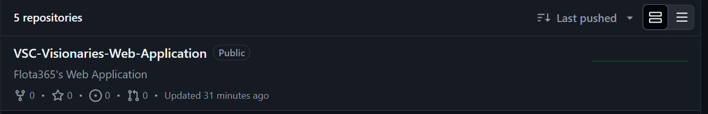
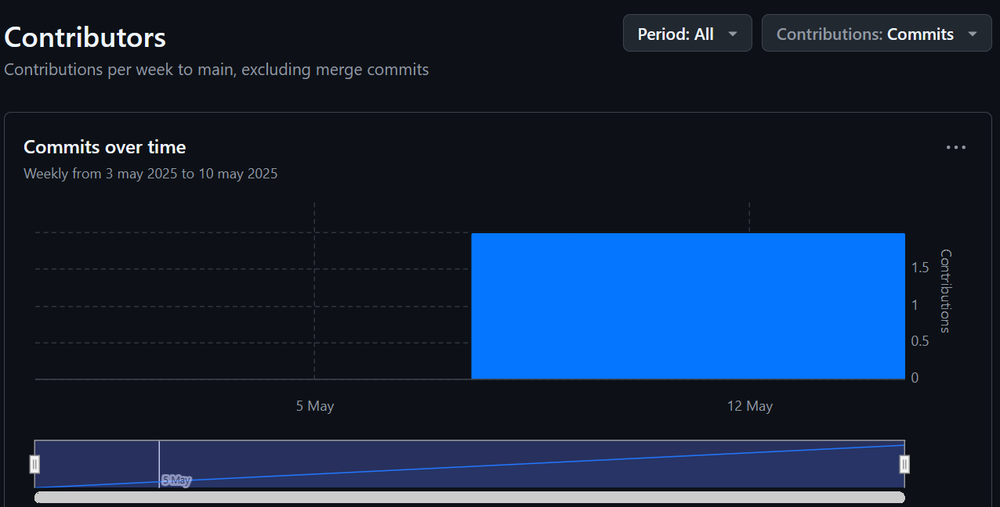
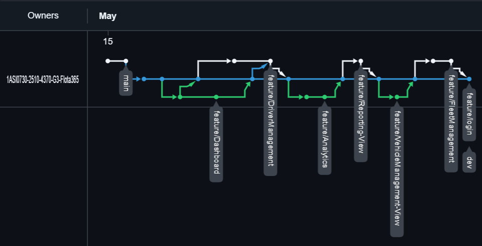
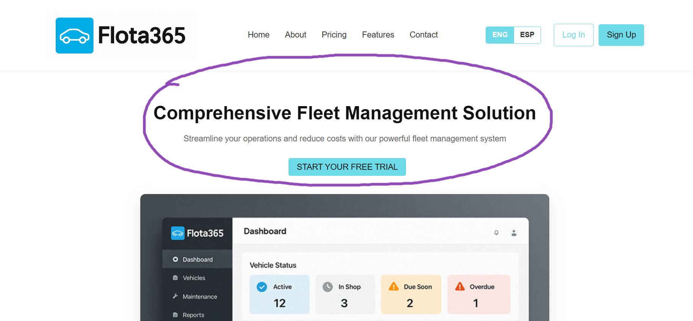
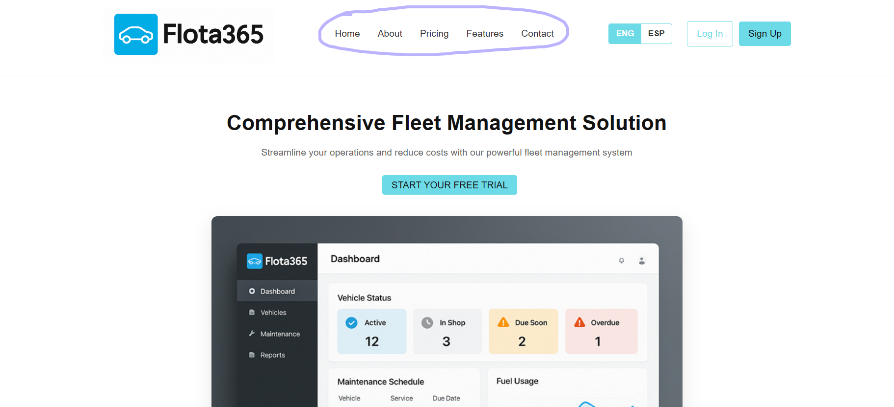
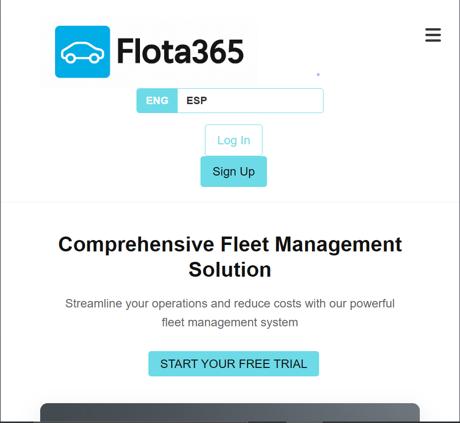
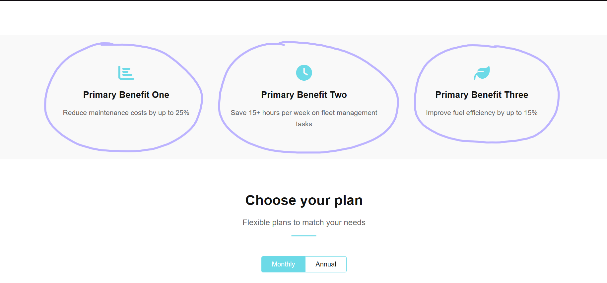
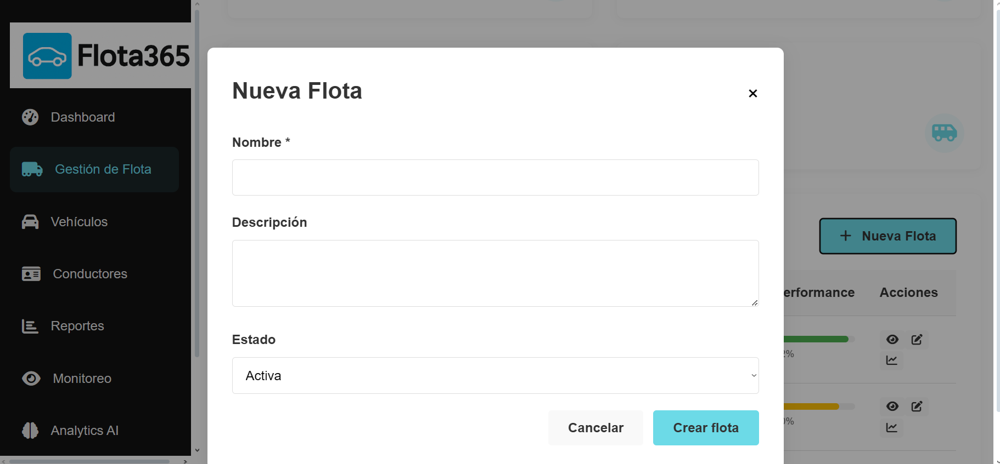
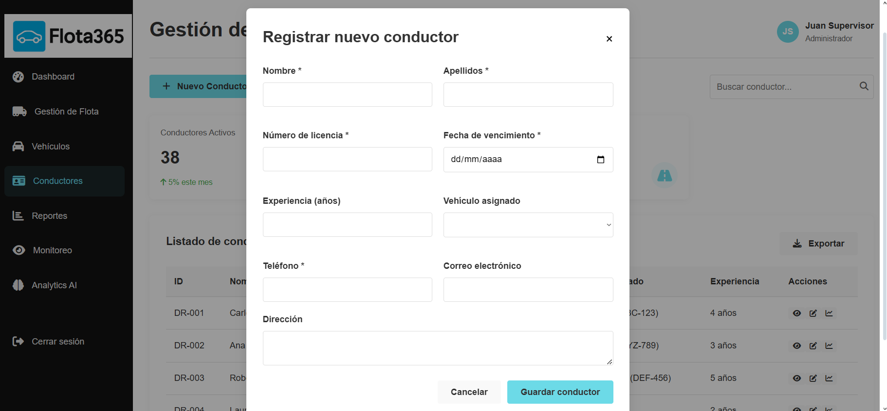
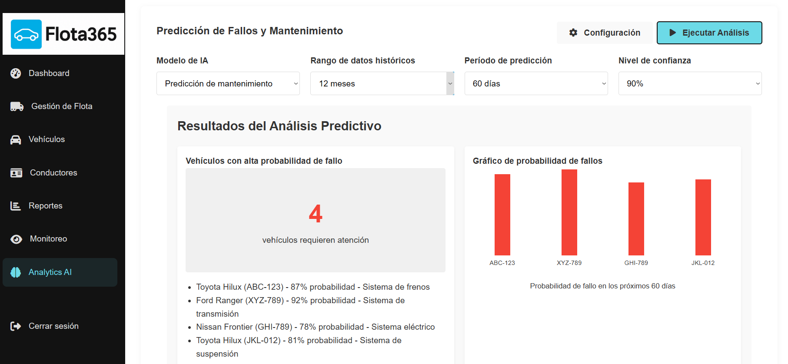

<h2 id="productImplementation">CAPÍTULO 5: PRODUCT IMPLEMENTATION, VALIDATION & DEPLOYMENT</h2>

<h3 id="softwareConfig">5.1. Software Configuration Management</h3>

<h4 id="softwareDevelopment">5.1.1. Software Development Environment Configuration</h4>

En seguida, se preocederá describir cada uno de los productos de software que han sido utilizados en el proyecto. Este apartado servirá de suma utilidad para posibilitar que los actuales y futuros desarrolladores puedan contribuir durante el ciclo de vida del proyecto.

**Project Management**

* <strong>Trello:</strong> <a href="https://trello.com">https://trello.com</a>
<ul style="list-style: none;">
    <li>
        Herramienta utilizada para registrar cada una de las tareas que están por elaborarse, se están elaborando y si ya fueron elaboradas. Asimismo, podemos tener una noción de cómo se está gestionando cada una de las diversas actividades que quedan pendientes como equipo. Principalmente, Miro es una aplicación web compatible con los múltiples navegadores de hoy en día en donde con solo registrarte con un correo existente, ya puedes empezar  a aprovechar de todo lo que tiene preparado para tí.
    </li>
</ul>

<br>

* <strong>Discord:</strong> <a href="https://discord.com">https://discord.com</a>
<ul style="list-style: none;">
    <li>
        Como medio de comunicación, ha mutuo acuerdo, se decidió llevar a cabo las reuniones por medio de la red social de mensajeria en línea <q>Discord</q>, esto nos brinda la facilidad de poder compartir contenido (<em>Screen-shared</em>), audio y videos logrando así una buena comunicación con el equipo acerca de como vamos progresando en el desarrollo del proyecto. Esta es una aplicación multiplataforma, es decir, puede utilizarse tanto en dispositivos móviles, Desktop o Tabletas con tan solo registrandonos o utilizando nuestra cuenta Gmail o Outlook.
    </li>
</ul>

<br>

**Requirements Management**

* <strong>Trello:</strong> (<a href="https://trello.com">https://trello.com</a>)
<ul style="list-style: none;">
    <li>
        Para el manejo de los requisitos, se empleó Trello para segmentar nuestro Product Backlog y coloborar como equipo en cada Sprint Backlog; su visibilidad y fácil usabilidad nos ayuda a poder segmentar las prioridades y el enfoque que como equipo tenemos. Es una aplicación gratuita, pero ante de usarla, tuvimos que crear nuestras cuentas con nuestros correos para así poder acceder.
    </li>
</ul>

<br>

**Product UX/UI Design**

* <strong>UXPressia:</strong> (<a href="https://uxpressia.com">https://uxpressia.com</a>)
<ul style="list-style: none;">
    <li>
        Se utilizó está herramienta para la creación de User Personas, el Customer Journey Map, Empathy Map e Impact Map, ya que cuenta con <em>templates</em> que facilitan el desarrollo de las estrucuturas bases y nos ayuda a poder trabajar en el de manera colaborativa y gratis. Para usar la aplicación, solo hace falta registranos y con ello estamos listos para crear nuestras esquemas gráficos.
    </li>
</ul>

<br>

* <strong>Miro:</strong> (<a href="https://miro.com/es/">https://miro.com/es/</a>)
<ul style="list-style: none;">
    <li>
        Al ser una herramienta dinámica, se decidió usar este software para la creación de nuestros Scenarios Mapping para cada uno de nuestros segmentos objetivos.
    </li>
</ul>

<br>

* <strong>Figma:</strong> (<a href="https://www.figma.com/">https://www.figma.com/</a>)
<ul style="list-style: none;">
    <li>
        Figma ha sido una herramienta fundamental para la creación de los Wireframes, Mockups y Prototypes para las diferentes visualizaciones de nuestra aplicación. Al ser de uso grautito y colaborativo, con solo regitrarte con tu correo es más que suficiente para empezar a utilizarlo.
</ul>

<br>

**Software Development**

* <strong>Landing Page:</strong>
<ul style="list-style: none;">
    <li>
        El desarrollo del Landing Page se llevó a cabo con las tecnologías básicas del desarrollo web, tales como: HTML5, CSS3 y JavaScript. En complemento con ello, para dar una buena comprensión y mantenimiento a los futuros usuarios que interactuarán con la <em>Langin</em>, se procedió a usar las metodología de nomenclaturas <strong>BEM</strong>, para dar un alcance más directo a que parte de nuestro web page representa y sea muchísimo más fácil de poder modificar como optimizar.
    </li>
</ul>

<br>

* <strong>Frontend Web Application:</strong>
<ul style="list-style: none;">
    <li>
        Para el desarrollo de la aplicación Web, se implica tener conocimientos básicos de HTML5, CSS3 y JavaSript.
        Adicionalmente, para que su implementación sea más secilla, utilizaremos una biblioteca de componentes reutilizables y accesibles el cual es PrimeVue (bilbioteca de componentes UI).<br> Para emplear estas herramientas, debemos de tener instalado node para posteriormente instalar cada una de las herramientas con sus respectivas dependencias que utilizaremos en nuesra aplicación.        
    </li>
</ul>

<br>

**Web Services**

A lo que respecta los servicios web, se empleó la arquitectura RESTful API; asimismo, se utilizará como lenguaje de programación C# ya que se estará empleando ASP.NET como framework para la parte Backend.

**IDE`S de desarrollo**

* <strong>WebStorm:</strong> (<a href="https://www.jetbrains.com/webstorm/">https://www.jetbrains.com/webstorm/</a>)
<ul style="list-style: none;">
    <li>
        WebStorm es un IDE netamente enfocado al desarrollo Frontend, de lo cual ofrece una amplia cantidad de herramientas que nos ayudará en el proceso de desarrollo. Para empezar a aprovechar de este IDE, debemos adquirir una licencia de JetBrains.
    </li>
</ul>

<br>

* <strong>Rider:</strong> (<a href="https://www.jetbrains.com/idea/">https://www.jetbrains.com/idea/</a>)
<ul style="list-style: none;">
    <li>
        Este IDE se utilizará para desarrollar la parte del Backend de nuestra aplicación, el cual, al contar con una amplia variedad de herramientas, agilizará la implementación de dicha parte del proyecto. Para empezar a utilizar IntelliJ IDEA, debemos adquirir una licencia de JetBrains.
    </li>
</ul>

<br>

**Software Testing**

Para el caso de prueba del software, se empleo las herramienta de desarrollador de los navegadores tando de Google Chrome (<a href="https://www.google.com/chrome/">https://www.google.com/chrome/</a>), Microsoft Edge (<a href="www.microsoft.com/en-us/edge">www.microsoft.com/en-us/edge</a>) y Mozilla Firefox (<a href="https://www.mozilla.org/en-US/firefox/">https://www.mozilla.org/en-US/firefox/</a>) para validar si el Landing Page y el Web Application no presenta algún problema en el rederizado en cada uno de sus componentes. Estos navegadores mencionados, pueden utilizarse tanto en dispositvos móviles como Desktop, por lo que pueden instalarse desde su página oficial o desde la <em>App Store</em> o <em>Play Store</em>. Por consiguiente, para validar el desarrollo del Landing Page, siendo sugestivo en aspectos técnicos, se utilizará Google LightHouse (<a href="https://chromewebstore.google.com/detail/lighthouse/blipmdconlkpinefehnmjammfjpmpbjk?hl=es">https://chromewebstore.google.com/detail/lighthouse/blipmdconlkpinefehnmjammfjpmpbjk?hl=es</a>) para obtener una visión automatizada y actualizada del producto desarrollado.

<br>

**Project Deployment**

* <strong>Github Pages:</strong> (<a href="https://www.netlify.com">https://pages.github.com</a>)
<ul style="list-style: none;">
    <li>
        Para la implementación del despliegue del Landing Page, se procedió a indexar el repositorio de Github con Github Pages. De esta manera, Netlify se encargará de la gestión del deploy del Landing Page cada vez que se realizen un nuevo cambio en el repositorio, y todo de forma autómatica.
    </li>
</ul>

<br>

**Project Documentation**

* <strong>README.md:</strong>
<ul style="list-style: none;">
    <li>
        Se utilizo el README.md para subir nuestros archivos en base a lo que vayamos documentando de todo el ciclo de vida del proyecto. Utilizando el lenguaje de marcado de hipertexto (HTML) y la guía de texto Markdown, pudimos colocar cada una de las características descriptivas que tiene nuestro proyecto. Principalmente este archivo se generá cuando creas un repositorio en Github.
    </li>
</ul>

<br>

* <strong>Lucidchart:</strong> (<a href="https://www.lucidchart.com/">https://www.lucidchart.com/</a>)
<ul style="list-style: none;">
    <li>
        Aplicación que utilizamos para el desarrollo de Wireflows, User Flows y Diagrama UML. En este aplicación, podemos generar diversos diagramas y procesos secuenciales gracias a los diversos <q>templates</q> y herramientas que la misma ofrece. Con solo registrarse con tu correo es más que suficiente.
    </li>
</ul>

<br>

* <strong>Structurizer:</strong> (<a href="https://structurizr.com">https://structurizr.com</a>)
<ul style="list-style: none;">
    <li>
        Herrramienta web que permite crear diagramas C4 de manera rápida, ya que cuenta con una sintaxis menos verbosa y similar a un lenguaje de programación. Para utilizar este software, solo hace falta crearnos una cuenta.
    </li>
</ul>

<br>

* <strong>Vertabelo:</strong> (<a href="https://vertabelo.com">https://vertabelo.com</a>)
<ul style="list-style: none;">
    <li>
        Es una aplicación web que facilita el diseño e implementación de bases de datos en una amplia variedad de motores.
    </li>
</ul>

<br>

<h4 id="sourceCodeManagement">5.1.2. Source Code Management</h4>

La gestión de todas las actividades que tendrá el startup de Flota365, se llevaran a cabo en dentro de una organización del aplicativo web **Github**.

* **Organization**: <a href="https://github.com/1ASI0730-2510-4370-G3-Flota365">https://github.com/1ASI0730-2510-4370-G3-Flota365</a>

* **Landing Page Repository**: <a href="https://github.com/1ASI0730-2510-4370-G3-Flota365/VSC-Visionaries-Landing-Page">https://github.com/1ASI0730-2510-4370-G3-Flota365/VSC-Visionaries-Landing-Page</a>

Asimismo, para llevar un mejor control de los avances que cada uno de los miembros del equipo vaya ha entregar, se utilizará la convención de *Gitflow* donde procederemos a tener buenas prácticas para crear ramas y realizas cambios manteniendo el código consistente y alcanzar una buena comunicación del avance de los proyectos.

Con esto mencionado, definiremos nuestras 2 ramas principales, de las cuales vendrían a ser *main* y *develop*.

* **Main**.- es la rama donde definiremos las versiones oficiales de nuestro repositorio que ya deben pasar a producción.

* **Develop**.- es la rama que se utilizará como rama de integración para cada uno de los "*features*" branches. Una vez que el *head* alcance un estado estable y el equipo considere que ya esta listo para ser lanzado, se unificará con la rama *release*.

**Ramas complementarias**:

* **feature**: aqui trabajaremos cada uno de los *features* que se unirán a la rama *develop*. Estas mismas segmentarán cada una de las características que piden los usuarios tanto en el landing page como web application.

* **release**: esta rama se utilizará para preparar el lanzamiento de una nueva versión en la rama *main*. Allí mismo, se corregirán pequeños *bugs*; liberando así en la rama *develop* estas preparaciones evitando así el retraso en el desarrollo mientras se prepará un nuevo lanzamiento.

* **hotfix**: se utilizará cuando la útlima versión de la rama *main* necesite actualizarse debido a *bugs* críticos que no puede esperar a un siguiente lanzamiento para resolverse.

**Commit Conventions**:

El formato de nuestros *commits* sigue la estructura de los "*Conventional Commits*" en su versión 1.0.0 (<a href="https://www.conventionalcommits.org/en/v1.0.0/">https://www.conventionalcommits.org/en/v1.0.0/</a>) con el objetivo de proporcionar una lectura simple de los mismo desarrollamos que vayamos indicando. Este seguirá el siguiente formato:

```
<type>[optional scope]: <description>
```

Donde:

* **type**: especifica el tipo de cambio realizado (si es **docs**, **feat**, **fix**, entre otros).

* **scope**: define el alcance que tiene nuestro *commit*.

* **description**: se define una breve descripción de los cambios que sufrió o se implementaron en el código.

**Release Versioning Conventions**:

Para el formato de versiones de aplicará "*Semantic Versioning 2.0.0*", donde cada unas de las versiones siguen el formato (X,Y,Z).

A continuación, se derallarán cada uno de estos formatos:

* **X**: representa una versión mayor. Aquí se ubican todos los cambios relacionados que no son compatibles con las versiones anteriores. Empezando desde 0 para el desarrollo inicial y 1 cuando esté disponible al público para ser usado. Por convención Y y Z, estas se reinician a 0 cuando incrementan.

* **Y**: representa una versión menor. Aquí se encuntran los cambios que sí son compatibles con versiones anteriores. Adicional a ello, se incluirán los *commits* desde la rama *realease* cada vez que se integren nuevas funcionalidades. Por convención, Z se reiniciará a 0 cuando este incremente.

* **Z**: representa los parches y correciones menores. Aquí se incluyen los *commits* realizados desde la rama *hotfix* que se acaban haciendo *merge* a la rama *main*.

<h4 id="sourceCodeStyleGuide">5.1.3. Source Code Style Guide & Conventions</h4>

Para lo que respecta el desarrollo de la parte de HTML y CSS se utilizará Google HTML/CSS Style Guide, ya que estos contienen convenciones que se deben tomar en cuenta al momento de trabajar con dichas tecnologías. Para informanos acerca de las buenas prácticas de uso, accederemos mediante el siguiente el enlace: <a href="https://google.github.io/styleguide/htmlcssguide.html">https://google.github.io/styleguide/htmlcssguide.html</a>. Entre algunas de estas convenciones mencionaremos las siguientes:

* Siempre declarar el tipo de documento con <!DOCTYPE html>

* Usar siempre letras en minúsculas para los nombres de los elementos (como &lt;h1&gt;, &lt;p&gt;, &lt;footer&gt;, etc).

* Cerrar siempre con los elementos de HTML (por ejemplo: &lt;h1&gt;&lt;/h1&gt;).

* Siempre colocar entre comillas los atributos dentro de un elemento HTML (&lt;h1 class="name"&gt;&lt;/h1&gt;).

* Declarar los atributos alt, width and height para imágenes.

* Estandarizar tanto el espaciado y signo de manera igualitaria.

* Evitar líneas de código extensas.

* No olvidar declarar el &lt;title&gt;&lt;title&gt; en apartado del &lt;head&gt;&lt;/head&gt; (ubicado al inicio del documento HTML).

* Utilizar meta tags al inicio del documento.

Para el caso del lenguaje JavaScript, se usará la guía de estilos brindada por nuestros amigos de Google mediante el siguiente repositorio de Github: <a href="https://google.github.io/styleguide/jsguide.html#file-name">https://google.github.io/styleguide/jsguide.html#file-name</a>. Aquí se presentarán las siguientes convenciones:

* Nombrar las variables y funciones con camelcase.

* Usar espaciados después de una coma o dos puntos.

* Utilizar comillas simples para los tipos de datos String.

* Usar el punto y coma al final de cada sentencia.

* Evitar declarar variables var; en su lugar, utilizar **let** o **const** para mitigar errores en variables y valores la momento de acceder a ellos.

Para el lenguaje Gherkin se usará las conveciones Make Your Gherkin Specifications More Readable con el objetivo de utilizar buenas prácticas que nos permitan entender con exactitud lo desarrollado. Los archivos creados tendrán la extensión .feature. Para conocer más acerca de la forma de escribir en el lenguaje Gherkin, utilizaremos el siguiente enlace: <a href="https://specflow.org/gherkin/gherkin-conventions-for-readable-specifications/">https://specflow.org/gherkin/gherkin-conventions-for-readable-specifications/</a>. A continuación, se presentarán las siguientes convenciones:

* Escribir especificaciones en lenguaje simple y fácil de comprender para todos los miembros del equipo.

* Utilizar las palabras reservadas **"Given, When, When y And"** para redactar los pasos del Scenario.

* Usar verbos finitos para las acciones del Scenario.

* Evitar redundancias en el detalle de los pasos en el Scenario.

* Usar un formato consistente en la especificación para todos los Scenarios.

Para el desarrollo, utilizaremos Vue JS del cual tiene tomaremos como referencia las convenciones definidas por el equipo de desarrollo de Vue. El objetivo principal que este tiene, el generar el mantenimiento del sistema. Del mismo modo, se puede visualizar dichas convenciones en el siguiente enlace: <a href="https://vuejs.org">https://vuejs.org</a>. A continuación, presentaremos aglunas convenciones esenciales de Vue JS:

* Los nombres de los componentes siempre deben tener palabras (Vue.component('todo-item', {...})), excepto en los componentes raíz y los componentes integrados de Vue, como &lt;transition&gt; o &lt;component&gt;.

* El componente *data* siempre es una función y retorna valores.

* Definir los detalles de las propiedades como el *status* con sus subdetalles.

* Usar siempre ".key" con "v-for".

* Evitar juntar "v-if" con "v-for" en un mismo *scope*.

Para el uso de C#, Microsoft provee una guía de estilos bastante completa la cual nos permitirá aplicar estándares que sus propios desarrolladores implementan. Se puede conocer más sobre esto en el siguiente link: <a href="https://learn.microsoft.com/en-us/dotnet/csharp/fundamentals/coding-style/coding-conventions">https://learn.microsoft.com/en-us/dotnet/csharp/fundamentals/coding-style/coding-conventions</a>.

Entre algunas convenciones podemos mencionar:

* Al declarar una clase, estructura o record, hay que nombrarlo mediante el estilo de nombre *Pascal Case*.

* Al declarar parámetros, hay que nombrarlos con *Camel Case* y utilzar el prefijo con el guión abajo "_".

* Realizar comentarios en una nueva línea de código, no al final de una linea. Además, evitar el uso excesivo de comentarios.

* Respetar el espaciado después de una coma y operadores.

* Las llaves deben ir en una nueva línea nueva al declarar una nueva clase, estructura, etc.

Finalmente, para lo que respecta **.NET Framework**, también perteneciente a Microsoft, este provee una guía de estilos bastantes completa de las cúales abarcan varias nociones involucradas en el uso de este *framework*. Se puede acceder a la guía desde el siguiente enlace: <a href="https://github.com/dotnet/aspnetcore/wiki/Engineering-guidelines#coding-guidelines">https://github.com/dotnet/aspnetcore/wiki/Engineering-guidelines#coding-guidelines</a>.

A continuación, se mencionará algunas convenciones:

* Todos los archivos *source* deben tener los comentarios de las licencias de **.NET**:

```
// Copyright (c) .NET Foundation. All Rights reserved.
// Licensed under the Apache License, Version 2.0. See License.txt in the project root for license information.
```

* Evitar ".this" a menos que sea un caso excepcional.

* Siempre especificar la visibilidad de los miembros **(private, public)**.

* Las llaves van en una nueva línea separada dek código.

* Emplear espaciado después de comas y operadores.

<h4 id="softwareDeploymentConfig">5.1.4. Software Deployment Configuration</h4>

<h3 id="landingPageImplementation">5.2. Landing Page, Services & Applications Implementation</h3>

<h4 id="sprint1">5.2.1. Sprint 1</h4>

<h4 id="sprintPlanning1">5.2.1.1. Sprint Planning 1</h4>

En esta sección, se presentará el sprint planning 1 donde se describirá de manera detallada cada una de las evidencias planificadas e implementación del *Landing Page*. Asimismo, se evidenciaron los avances del proyeto e *insights* de colaboración en equipo mediante nuestro organización de Github.

<table>
    <thead>
        <tr>
            <th>Sprint #</th>
            <th>Sprint 1</th>
        </tr>
    </thead>
    <tbody>
        <tr>
            <td colspan="2"><b>Sprint Planning Background</b></td>
        </tr>
        <tr>
            <td>Date</td>
            <td>2025/04/07</td>
        </tr>
        <tr>
            <td>Time</td>
            <td>11:36 AM</td>
        </tr>
        <tr>
            <td>Location</td>
            <td>Discord</td>
        </tr>
        <tr>
            <td>Prepared by</td>
            <td>José Diego Huamani Sánchez</td>
        </tr>
        <tr>
            <td>Atendees (to planning meeting)</td>
            <td>
                Todos los miembros del equipo VSC-Visionaries
            </td>
        </tr>
        <tr>
            <td>Sprint 1 Review Summary</td>
            <td>
                Dado que es el primer sprint que se está llevando a cabo, no se está considerando los <em>Review Summary</em> ya que no hemos recibido ninguno en el sprint anterior.
            </td>
        </tr>
        <tr>
            <td>Sprint 1 Retrospective Summary</td>
            <td>
                Al ser el primer Sprint, se planea el desarrollo de nuestra landing page mediante el uso de herramientas web nativas como HTML5, CSS3 y JavaScript. Adicional a ello, se dialogó con todo los miembros del equipo sobre el contenido de los textos que tendrá el landing page así como el diseño que se ha implementando anteriormente a travéz de Figma. Finalizando el desarrollo, se procederá a desplegar el landing page mediante los servicios de <strong>Github Pages</strong> para que cualquier usuario pueda acceder y visualizar la página através del link generado.
            </td>
        </tr>
        <tr>
            <td colspan="2"><b>Sprint Goal & User Stories</b></td>
        </tr>
        <tr>
            <td>Sprint 1 Velocity</td>
            <td>
                17
            </td>
        </tr>
        <tr>
            <td>Sum of story points</td>
            <td>
                17
            </td>
        </tr>
    </tbody>
</table>

<h4 id="sprintBacklog1">5.2.1.2. Sprint Backlog 1</h4>

En esta sección, se evidencia cada uno de los *taks* que se realizaron en el presente Sprint. Por tal motivo, se adjunta la captura de nuestros **Scrum Board** con su respectivo enlace al **Trello**.

**Link al Scrum Board - Trello**: <a href="https://trello.com/invite/b/68259d1a08942cd86db4be0d/ATTIef5ecb7105d09d77b4ea8488b765dd52040FD3F5/sprint-1-vsc-visionaries">https://trello.com/invite/b/68259d1a08942cd86db4be0d/ATTIef5ecb7105d09d77b4ea8488b765dd52040FD3F5/sprint-1-vsc-visionaries</a>

<table border="1" cellpadding="5" cellspacing="0">
  <tr>
    <td><strong>Sprint #</strong></td>
    <td colspan="7"><strong>Sprint 1</strong></td>
  </tr>
  <tr>
    <td colspan="2"><strong>User Story</strong></td>
    <td colspan="6"><strong>Work-item/Task</strong></td>
  </tr>
  <tr>
    <td><strong>ID</strong></td>
    <td><strong>Title</strong></td>
    <td><strong>ID</strong></td>
    <td><strong>Title</strong></td>
    <td><strong>Description</strong></td>
    <td><strong>Estimation (Hours)</strong></td>
    <td><strong>Assigned To</strong></td>
    <td><strong>Status (To-do/In-Process/To-Review/Done)</strong></td>
  </tr>
  <tr>
    <td rowspan="2">US-01</td>
    <td rowspan="2">Landing Page informativa</td>
    <td>UT-01</td>
    <td>Hero Section</td>
    <td>Implementar el slogan y el boton de redireccionamiento de la aplicación; así como la colocación la captura representativa del vistazo de la apliación web</td>
    <td>2</td>
    <td>José Diego Huamani Sánchez</td>
    <td>Done</td>
  </tr>
  <tr>
    <td>UT-02</td>
    <td>About Section</td>
    <td>Agregar la descripción detallada e historica de la aplicación de Flota365</td>
    <td>1</td>
    <td>José Diego Huamani Sánchez</td>
    <td>Done</td>
  </tr>
  <tr>
    <td rowspan="1">US-02</td>
    <td rowspan="1">Responsive Design</td>
    <td>UT-03</td>
    <td>Responsive Web Design adaptive in different devices</td>
    <td>Añadir los media queries necesarios para hacer que el landing page sea adaptativo a dispostivos de cualquier tamaño de resolución de pantalla</td>
    <td>2</td>
    <td>José Diego Huamani Sánchez</td>
    <td>Done</td>
  </tr>
  <tr>
    <td rowspan="1">US-03</td>
    <td rowspan="1">Comparador de Planes</td>
    <td>UT-04</td>
    <td>Choose Plan Section</td>
    <td>Implementar las cards que definan los diferentes planes que tien la aplicación con los beneficios que ofrece</td>
    <td>2</td>
    <td>Renato Guillermo Calvo Yalan</td>
    <td>Done</td>
  </tr>
  <tr>
    <td rowspan="1">US-04</td>
    <td rowspan="1">Switcher de idiomas</td>
    <td>UT-05</td>
    <td>Botón de cambio de idiomas</td>
    <td>Implementar el botón para realizar el cambio de idioma entre español e Inglés</td>
    <td>2</td>
    <td>Raul Roberto Sánchez Cruz</td>
    <td>Done</td>
  </tr>
  <tr>
    <td rowspan="2">US-05</td>
    <td rowspan="2">Tema de Colores</td>
    <td>UT-06</td>
    <td>Selecion de colores representativos de Flota 365 en la</td>
    <td>Colocar colores al Landing Page</td>
    <td>1</td>
    <td>Arianna Lizeth, Ramirez Carrasco</td>
    <td>Done</td>
  </tr>
  <tr>
    <td>UT-07</td>
    <td></td>
    <td>Colocar los colores al Footer Section</td>
    <td>1</td>
    <td>Angelo Stephano Moscoso Bejar</td>
    <td>Done</td>
  </tr>
  <tr>
    <td rowspan="2">US-06</td>
    <td rowspan="2">Vista de Developers</td>
    <td>UT-08</td>
    <td>Development Section</td>
    <td>Agregar los diferentes roles que el Team de VSC-Visionaries cumplió dentro de la aplicación</td>
    <td>2</td>
    <td>Raul Roberto Sánchez Cruz</td>
    <td>Done</td>
  </tr>
  <tr>
    <td>UT-09</td>
    <td>Developers Images Section</td>
    <td>Colocar las imagenes de cada uno de los miembros del equipo</td>
    <td>1</td>
    <td>Arianna Lizeth, Ramirez Carrasco</td>
    <td>Done</td>
  </tr>
  <tr>
    <td rowspan="2">US-11</td>
    <td rowspan="2">Footer informativo</td>
    <td>UT-10</td>
    <td>Footer Section</td>
    <td>Implementar Footer Section con sus respectivos links</td>
    <td>2</td>
    <td>Raul Roberto Sánchez Cruz</td>
    <td>Done</td>
  </tr>
  <tr>
    <td>UT-11</td>
    <td>Responsive Design Footer Section</td>
    <td>Agregar diseño responsive para las secciones</td>
    <td>2</td>
    <td>Angelo Stephano Moscoso Bejar</td>
    <td>Done</td>
  </tr>
</table>

<h4 id="developmentEvidenceSprint1">5.2.1.3. Development Evidence for Sprint Review</h4>

A continuación, se presentarán los cada uno de los *commits* desarrollados dentro del repositorio de *Landing Page* que tiene destinado el producto de **Flota365**.

**Link del repositorio - Landing Page**: <a href="https://github.com/1ASI0730-2510-4370-G3-Flota365/VSC-Visionaries-Landing-Page">https://github.com/1ASI0730-2510-4370-G3-Flota365/VSC-Visionaries-Landing-Page</a>

| Repository           | Branch             | Commit Id | Commit Message                                               | Commit Message Body                   | Committed on (Date)    |
|----------------------|-----------|----------|--------------------------------------------------|-------------------------------------------------------------|------------------------|
| VSC-Visionaries-Landing-Page      | develop   | 0118821835d59608e83301c2342a48c1beb3c4c4  | Initial commit    |  | 05/04/2025  |
| VSC-Visionaries-Landing-Page     | develop   | f5c255d370c14eb0f1daea11b0a7f07d73885fc2  | chore(init): initialize project with Vite and base structure for landing page   |   | 06/04/2025  |
| VSC-Visionaries-Landing-Page      | feature/documentation   | 567053f243a1fd279bc709f6831cb07fbbbb6adf  | docs: add the specification and details about Flota365 Landing Page |  | 09/05/2025 |
| VSC-Visionaries-Landing-Page      | feature/documentation   | d819c65710096cc5fedaeeba55538c743edf1f61  | chore: modify the description of **About the proyect** & **Main Components** |  | 09/05/2025 |
| VSC-Visionaries-Landing-Page      | feature/header   | e33a641381c8b1f172814ab53c37e121ed1f5a09  | feat(header): add the structure and style of Hero section of Flota365 Landing Page |  | 09/05/2025 |
| VSC-Visionaries-Landing-Page      | feature/hero-Section   | 2d11bcc13c571a4c0aa7d3c0d1367b0f146240b5  | feat(hero): add structure and style of Hero section |  | 09/05/2025 |
| VSC-Visionaries-Landing-Page      | feature/about-Section   | 91ff46c0e0ad63d9a8d426232846aa6493fa117c  | feat(about): add about-Section of the Flota365 Landing Page |  | 09/05/2025 |
| VSC-Visionaries-Landing-Page      | feature/Develop-Team-Section   | f5b39f0ec6b32ba678b004cc3c21abc243dde985  | feat(about): add Develop Team-Section of the Flota365 Landing Page |  | 09/05/2025 |
| VSC-Visionaries-Landing-Page         | feature/Benefits-Section   | f53aff39b723a8d91da17cadfaca370550c4a00b  | feed: Benefits Section | | 10/05/2025 |
| VSC-Visionaries-Landing-Page         | feature/stats-Section   | 2fe14150ef1aef7ed57540fd282a2c6da62b6163  | feat(state): add stast section into the Landing Page |  | 12/05/2025 |
| VSC-Visionaries-Landing-Page         | feature/benefits-Section   | f9f164a87bd192e11a09ad1b771cfdc01a9e8f3c  | feat(benefits): add Benefits Section into the Landing Page |  | 12/05/2025 |
| VSC-Visionaries-Landing-Page    | feature/features-Section   | 540101e8efe3e0d905727f133f73c09fd90e7190  | feat(features): add Features Sections into the Landing Page |  | 12/05/2025 |
| VSC-Visionaries-Landing-Page    | feature/pricing-Section   | 907cdee94db9281aed979a92fab21b9eca95353d  | feat(pricing): add Pricing Section into the Landing Page |  | 12/05/2025 |
| VSC-Visionaries-Landing-Page    | feature/benefits-Section   | 96a3abcf3d9ff91fd0a19f50169444fe0100297a  | feat(benefits): add Contact Section |  | 15/05/2025 |
| VSC-Visionaries-Landing-Page    | main   | 43cb41bbc77eb385f6383420879f600c6a7d89fb  | feat(footer): add footer into the Landing Page |  | 15/05/2025 |
| VSC-Visionaries-Landing-Page    | main   | 58b3c88b2005756212eebc2c02688df15b80e22a  | feat(scripts): add scripts into the Landing Page |  | 15/05/2025 |
| VSC-Visionaries-Landing-Page    | main   | 1cefb4269df81d5130e5925908a572441bb9779d  | fix(scripts): fix scripts |  | 15/05/2025 |
| VSC-Visionaries-Landing-Page    | main   | 2b47255732ebebc278e2d0837a218fdc1a1dc51a  | Added translations, reordered the directory and made corrections |  | 15/05/2025 |
| VSC-Visionaries-Landing-Page    | main   | a71a98e1173b86934feeb8f2f918666eecfc5b69  | Update README.md |  | 15/05/2025 |

<h4 id="testSuiteEvidenceSprint1">5.2.1.4. Testing Suite Evidence for Sprint Review</h4>

En el Sprint 1, no se llevó a cabo el proceso de testing para el landing page, ya que la finalidad en este sprint, estaba centralizada en implementar cada una de los features programados para la construcción del mismo - teniendo como enfoque adicional el hecho que sea adaptativo a las diferentes dimensiones de los dispositivos en los que cada uno de los usuarios vaya a interactuar -.

<h4 id="executionEvidenceSprint1">5.2.1.5. Execution Evidence for Sprint Review</h4>

Para lo que respecta esta entrega, VSC-Visionaries logró implementar el *Landing Page*, el cual se presentan las diferentes secciones informativas para que los usuarios conozcan un poco más de la organización, detalles lo que ofrecemos en nuestra aplicación, las opiniones y valoraciones de los usuarios, y los diferentes planes de suscripción de pago.

<div align="center">
     
</div>

<div align="center">
     
</div>

<div align="center">
     
</div>

<div align="center">
     
</div>

<div align="center">
     
</div>

<div align="center">
     
</div>

<h4 id="servicesDocumentationSprint1">5.2.1.6. Services Documentation Evidence for Sprint Review</h4>

Al ser este nuestro Sprint 1, como primer entregable, se ha desarrollado el landing page de nuestro producto; por lo que, no se evidencia el empleo de **Web Services**.

<h4 id="softwareDeploymentEvidenceSprint1">5.2.1.7. Software Deployment Evidence for Sprint Review</h4>

Para poder llevar acabo el despliegue de nuestro *Landing Page*, en este Sprint 1, se utilizó las siguientes herramientas:

* **Git**: Sistema de control de versiones que nos ayudó a trabajar de manera colaborativa el *Landing Page*.

* **Gitflow**: Flujo de trabajo que nos ayudó a controlar el progreso de cada uno de los miembros del equipo en el desarrollo del *Landing Page*.

* **Github**: Plataforma que nos brindó el apoyo para almacenar nuestras versiones del proyecto.

* **Github Pages**: Servicio de hosting gratutio que nos permitó desplegar nuestro *Landing Page* desde nuestro repositorio de **Github** donde el proyecto se encuentra ubicado.

De esta manera, se decidió por emplear este servicio por su simpleza y fácil integración diversas tecnologías webs, lo cual lo vuelve un gran candidato cuando se trata de desplegar y no quieres invertir mucho tiempo en su configuración.

Para un vistazo más general de lo desarrollado, se compartirá el *link* del despliegue para que puedan interactuar lo desarrollado: 

<h4 id="teamCollaborationInsights">5.2.1.8. Team Collaboration Insights during Sprint</h4>

El equipo de VSC-Visionaries desarrolló el *landing page* segmentado por ramas para construir cada una de la secciones, mejorarlo e inclusive actualizarlo en base a las necesidades de nuestros clientes. La principal ventaja de usar esta metodología de documentación o distribución de ramas, permite actualizar y realizar cambios más legibles, con la capacidad de presentar y corroborar que no haya algún error al unirlo a la rama **main**. A continuación, se presenta el *insight* del progreso que tuvo equipo a través de las siguientes métricas extraidas de la plataforma Github.

<div align="center">
     
</div>

<br>

<div align="center">
    
</div>


<h4 id="sprint2">5.2.2. Sprint 2</h4>

<h4 id="sprintPlanning2">5.2.2.1. Sprint Planning 2</h4>

<table>
    <thead>
        <tr>
            <th>Sprint #</th>
            <th>Sprint 2</th>
        </tr>
    </thead>
    <tbody>
        <tr>
            <td colspan="2"><b>Sprint Planning Background</b></td>
        </tr>
        <tr>
            <td>Date</td>
            <td>2025/05/04</td>
        </tr>
        <tr>
            <td>Time</td>
            <td>2:44 PM</td>
        </tr>
        <tr>
            <td>Location</td>
            <td>Remoto - Discord</td>
        </tr>
        <tr>
            <td>Prepared by</td>
            <td>José Diego Huamani Sánchez</td>
        </tr>
        <tr>
            <td>Attendees (to planning meeting)</td>
            <td>
                Todos los miembros del equipo VSC-Visionaries
            </td>
        </tr>
        <tr>
            <td>Sprint 2 Review Summary</td>
            <td>
                Se implementó el desarrolló del <em>Landing Page</em> y se logró desplegar en <strong>Github Pages</strong>. Sin embargo, faltó incluir funcionalidades tales como el cambio de idioma y la sección de todos los desarrolladores que hicieron este proyecto realidad. Por lo tanto, se tiene que desarrollar esos puntos para este Sprint.
            </td>
        </tr>
        <tr>
            <td>Sprint 2 Retrospective Summary</td>
            <td>
                Se planea desarrollar para este sprint las vistas para el Front-end de nuestra aplicación web <strong>Flota365</strong>, donde e incluiran las vistas para la autenticación del usuario, vistas del usuario que accede así como a del gestor de vehículos. Adicional, se planea implementar la configuración del idioma en el Landing Page mediante uso del <em>Attribute</em> i18n para que sea adaptativo a cualquier tipo de idioma. Asimimo, hemos organizado cada una de las tareas a elaborar para la segmentación de las vistas de nuestras aplicación en un Trello. Al finalizar este Sprint, el Lading Page debe tener un versión mejorada que el Sprint anteiror y una demo funcional de la aplicaicón Front-End, lo cual esta última va estar siendo desplegada en <strong>Firebase</strong>.
            </td>
        </tr>
        <tr>
            <td colspan="2"><b>Sprint Goal & User Stories</b></td>
        </tr>
        <tr>
            <td>Sprint 2 Velocity</td>
            <td>
                43
            </td>
        </tr>
        <tr>
            <td>Sum of story points</td>
            <td>
                43
            </td>
        </tr>
    </tbody>
</table>

<h4 id="sprintBacklog2">5.2.2.2. Sprint Backlog 1</h4>
<table border="1">
  <caption>Sprint #1 </caption>
  <thead>
    <tr>
      <th colspan="2">User Story</th>
      <th colspan="6">Work-Item / Task</th>
    </tr>
    <tr>
      <th>Id</th>
      <th>Title</th>
      <th>Id</th>
      <th>Title</th>
      <th>Description</th>
      <th>Estimation (Hours)</th>
      <th>Assigned To</th>
      <th>Status (To-do / In-Process / To-Review / Done)</th>
    </tr>
  </thead>
  <tbody>
    <tr>
      <td>US01</td>
      <td>Visualizar información de la empresa</td>
      <td>UT01</td>
      <td>Redactar contenido institucional</td>
      <td>Redactar misión, visión y propuesta de valor de InteLLi Idea.</td>
      <td>2h</td>
      <td>Gabriel Rivera</td>
      <td>Done</td>
    </tr>
    <tr>
      <td>US01</td>
      <td>Visualizar información de la empresa</td>
      <td>UT02</td>
      <td>Implementar sección "Sobre Nosotros"</td>
      <td>Diseñar e integrar el contenido informativo en el landing page.</td>
      <td>2h</td>
      <td>Gabriel Rivera</td>
      <td>Done</td>
    </tr>
    <tr>
      <td>US02</td>
      <td>Mostrar imagen representativa</td>
      <td>UT03</td>
      <td>Seleccionar imagen representativa</td>
      <td>Buscar y optimizar una imagen simbólica de la empresa.</td>
      <td>1h</td>
      <td>Camila</td>
      <td>Done</td>
    </tr>
    <tr>
      <td>US02</td>
      <td>Mostrar imagen representativa</td>
      <td>UT04</td>
      <td>Integrar imagen en la landing page</td>
      <td>Ubicar la imagen en una sección destacada respetando el estilo visual.</td>
      <td>1h</td>
      <td>Camila</td>
      <td>Done</td>
    </tr>
    <tr>
      <td>US03</td>
      <td>Mostrar ideas destacadas</td>
      <td>UT05</td>
      <td>Redactar descripciones de ideas destacadas</td>
      <td>Preparar ejemplos de ideas subidas por usuarios, con texto atractivo.</td>
      <td>2h</td>
      <td>Camila</td>
      <td>Done</td>
    </tr>
    <tr>
      <td>US03</td>
      <td>Mostrar ideas destacadas</td>
      <td>UT06</td>
      <td>Implementar componente de ideas destacadas</td>
      <td>Sección tipo "card grid" para mostrar ideas con métricas.</td>
      <td>3h</td>
      <td>Camila</td>
      <td>Done</td>
    </tr>
    <tr>
      <td>US04</td>
      <td>Registro de ideas</td>
      <td>UT07</td>
      <td>Crear formulario para subir ideas</td>
      <td>Formulario con campos para título, descripción, categoría, adjuntos.</td>
      <td>3h</td>
      <td>Stephano</td>
      <td>Done</td>
    </tr>
    <tr>
      <td>US04</td>
      <td>Registro de ideas</td>
      <td>UT08</td>
      <td>Conectar backend para guardar ideas</td>
      <td>Integrar el formulario con una base de datos simulada.</td>
      <td>3h</td>
      <td>Stephano</td>
      <td>Done</td>
    </tr>
    <tr>
      <td>US05</td>
      <td>Comparar categorías</td>
      <td>UT09</td>
      <td>Diseñar comparador de categorías</td>
      <td>Mostrar popularidad, ideas y actividad por categoría.</td>
      <td>2h</td>
      <td>Romina</td>
      <td>Done</td>
    </tr>
    <tr>
      <td>US05</td>
      <td>Comparar categorías</td>
      <td>UT10</td>
      <td>Implementar lógica de comparación</td>
      <td>Visualización con gráficos o tabla interactiva.</td>
      <td>3h</td>
      <td>Romina</td>
      <td>Done</td>
    </tr>
    <tr>
      <td>US06</td>
      <td>Preguntas frecuentes (FAQs)</td>
      <td>UT11</td>
      <td>Redactar preguntas y respuestas frecuentes</td>
      <td>Preguntas comunes sobre InteLLi Idea y su funcionamiento.</td>
      <td>2h</td>
      <td>Gabriel Mamani</td>
      <td>Done</td>
    </tr>
    <tr>
      <td>US06</td>
      <td>Preguntas frecuentes (FAQs)</td>
      <td>UT12</td>
      <td>Implementar sección de FAQs con acordeón</td>
      <td>Diseño colapsable para mejor experiencia del usuario.</td>
      <td>2h</td>
      <td>Gabriel Mamani</td>
      <td>Done</td>
    </tr>
  </tbody>
</table>


<h4 id="developmentEvidenceSprint2">5.2.2.3. Development Evidence for Sprint Review</h4>
<table border="1">
  <thead>
    <tr>
      <th>Repository</th>
      <th>Branch</th>
      <th>Commit Id</th>
      <th>Commit Message</th>
      <th>Commit Message Body</th>
      <th>Commited on (Date)</th>
    </tr>
  </thead>
  <tbody>
    <tr>
      <td>user/repositoryname</td>
      <td>feature/loremipsum</td>
      <td>14ca4e3</td>
      <td>feat: consectetur adipiscing elit</td>
      <td>
        Curabitur quis placerat nulla.<br>
        Fusce malesuada faucibus quam, ut condimentum velit rutrum ut.
      </td>
      <td>04/09/2021</td>
    </tr>
  </tbody>
</table>


<h4 id="testSuiteEvidenceSprint2">5.2.2.4. Testing Suite Evidence for Sprint Review</h4>
<table border="1">
  <thead>
    <tr>
      <th>Repository</th>
      <th>Branch</th>
      <th>Commit Id</th>
      <th>Commit Message</th>
      <th>Commit Message Body</th>
      <th>Commited on (Date)</th>
    </tr>
  </thead>
  <tbody>
    <tr>
      <td>user/repositoryname</td>
      <td>feature/loremipsum</td>
      <td>14ca4e3</td>
      <td>feat: consectetur adipiscing elit</td>
      <td>
        Curabitur quis placerat nulla.<br>
        Fusce malesuada faucibus quam, ut condimentum velit rutrum ut.
      </td>
      <td>04/09/2021</td>
    </tr>
  </tbody>
</table>


<h4 id="executionEvidenceSprint2">5.2.2.5. Execution Evidence for Sprint Review</h4>

A continuación, se presentarán las capturas de cada una de las vistas más relevantes que se llevaron a cabo dentro de este Sprint 2. La finalidad, está en que se muestre todo el progreso que el team **VSC-Visionaries** ofrecerá al momento de que el usuario interactue con la UI y como sería ese primer vistazo de las necesidades hechas proyecto para este entregable.

Estas vendrías a ser las siguientes:

* **Login**:

<div align="center">
    
</div>

<br>

* **Pantalla Principal**:

<div align="center">
    
</div>

<br>

* **Pantalla de Gestión de Vehículos**:

<div align="center">
    
</div>

<br>

* **Pantalla de Gestión de Flotas**:

<div align="center">
    
</div>

<br>

* **Dashboard**:

<div align="center">
    
</div>

<br>

* **Reports**:

<div align="center">
    
</div>

<br>

* **Pantalla de Monitoreo de Vehículos**:

<div align="center">
    
</div>

<br>

* **Pantalla de Analytics & AI**:

<div align="center">
    
</div>

<h4 id="servicesDocumentationSprint2">5.2.2.6. Services Documentation Evidence for Sprint Review</h4>

En esta sección, se presentará el detalle de la documentación de los servicios utilizados dentro de la aplicación web de **Flota365**. Únicamente se ha utilizado un *fake-api* donde estaremos extrayendo cada uno de los datos recopilados para las diferentes vistas que se mostrarán al usuario dentro de la aplicación.

**Fake API - Flota 365**

* Ruta base para poder acceder a los servicios dentro del JSON del Web Application

<div align="center">
    
</div>

<br>

* En esta parte, se crearon objetos donde cada uno actua como un servicio donde bien retornará un valor acorde a la vista e interacción que tenga el usuario dentro del Web Application.

<br>

<div align="center">
    
</div>

<br>

<div align="center">
    
</div>

<br>

<div align="center">
    
</div>

<h4 id="softwareDeploymentEvidenceSprint2">5.2.2.7. Software Deployment Evidence for Sprint Review</h4>

Al igual del enfoque llevado a cabo en el Sprint 1, se describirá el proceso de despliegue llevado acabo para nuestro *deploy* de nuestra aplicación web. En este caso, si varía un poco, ya que utilizamos el servicio de *hosting* de Google llamado **Firebase**. 

De acuerdo a coordinaciones internas dentro del team **VSC-Visionaries**, esta solución se desarrolló por su simpleza en el despliegue y carencia de mucha configuración, lo cual es una solucion ágil para proyectos que cuentan con tiempo muy ajustado para los entregables.

* **Pasos para desplegar el Web App en Firebase**:

1. Creamos un proyecto en **Firebase** en su plataforma web, sección de *Hosting*.

<div align="center">
    
</div>

2. En la terminal del proyecto, utilizamos el comando ```ng build``` para crear la carpeta **dist**, la cual sirve para realizar el *deployment* en Firebase.

<div align="center">
    
</div>

3. Adicionalmente, instalamos **firebase-tools** dentro del proyecto con ```npm install -g firebase-tools```, y luego se iniciareos sesión con **firebase login**.

<div align="center">
    
</div>

4. Luego de autenticarnos y seleccioanr el proyecto creado, ejecutaremos el comando de ```firebase init``` y seleccionaremos la opción del servicio de *Hosting*.

<div align="center">
    
</div>

<div align="center">
    
</div>

5. Una vez completado este paso, nos generará un archivo **firebase.json** donde se agregará ```/browser``` a la ruta pública de nuestra colección de directorios.

<div align="center">
    
</div>

6. Como paso final, ejecutaremos el comando ```firebase deploy``` para verificar el despliegue de nuestro aplicación.

<div align="center">
    
</div>

**Enlace del Front-End desplegado**: <a href="https://flota365-app.web.app/">https://flota365-app.web.app/</a>

<br>

<div align="center">
    
</div>

<br>

Gracias a este enfoque de despliegue mediante muy pocas lineas de comandos en **Firebase CLI**, podemos reflejar actualizaciones muchos más rápidos con la capacidad de invertir el menor tiempo posible y con la posibilidad de volverlo automatizado para el siguiente Sprint.

<h4 id="teamCollaborationInsights2">5.2.2.8. Team Collaboration Insights during Sprint</h4>

Nuestro proceso de trabajo se desarrolló mediante *features* donde cada una de ellas se asociaba a una *task* en particular asignada para este Sprint; por lo que, en esta oportunidad, se han incluido las vistas de conductores, gestores de flota, vehículos y algunas vistas core para realizar procesos de analytics.

A continuación, se presentará una imagen donde se aprecia, como evidencia de este Sprint, el avance que todos los integrantes del team **VSC-Visionaries** aportaron mediante sus *commits* para desarrollar la aplicación web.

<div align="center">
    
</div>

<br>

Adicional a la información presentada, se compartirá el resumen de nuestro progresos mediante la estructura de *Conventional Commits*, **gitflow** dentro de nuestro respositorio de **Github**.

<div align="center">
    
</div>

<h4 id="sprint3">5.2.3. Sprint 3</h4>

<h4 id="sprintPlanning3">5.2.3.1. Sprint Planning 3</h4>

<table>
    <thead>
        <tr>
            <th>Sprint #</th>
            <th>Sprint 3</th>
        </tr>
    </thead>
    <tbody>
        <tr>
            <td colspan="2"><b>Sprint Planning Background</b></td>
        </tr>
        <tr>
            <td>Date</td>
            <td>2025/05/26</td>
        </tr>
        <tr>
            <td>Time</td>
            <td>11:31 pm</td>
        </tr>
        <tr>
            <td>Location</td>
            <td>Remoto - Discord</td>
        </tr>
        <tr>
            <td>Prepared by</td>
            <td>José Diego Huamani Sánchez</td>
        </tr>
        <tr>
            <td>Attendees (to planning meeting)</td>
            <td>
                Todos los miembros del equipo VSC-Visionaries
            </td>
        </tr>
        <tr>
            <td>Sprint 2 Review Summary</td>
            <td>
                -
            </td>
        </tr>
        <tr>
            <td>Sprint 2 Retrospective Summary</td>
            <td>
                -
            </td>
        </tr>
        <tr>
            <td colspan="2"><b>Sprint Goal & User Stories</b></td>
        </tr>
        <tr>
            <td>Sprint 2 Velocity</td>
            <td>
                -
            </td>
        </tr>
        <tr>
            <td>Sum of story points</td>
            <td>
                -
            </td>
        </tr>
    </tbody>
</table>

<h4 id="sprintBacklog3">5.2.3.2. Sprint Backlog 1</h4>

<h4 id="developmentEvidenceSprint3">5.2.3.3. Development Evidence for Sprint Review</h4>

<h4 id="testSuiteEvidenceSprint3">5.2.3.4. Testing Suite Evidence for Sprint Review</h4>

<h4 id="executionEvidenceSprint3">5.2.3.5. Execution Evidence for Sprint Review</h4>

<h4 id="servicesDocumentationSprint3">5.2.3.6. Services Documentation Evidence for Sprint Review</h4>

<h4 id="softwareDeploymentEvidenceSprint3">5.2.3.7. Software Deployment Evidence for Sprint Review</h4>

<h4 id="teamCollaborationInsights3">5.2.3.8. Team Collaboration Insights during Sprint</h4>

<h3 id="validationInterviews">5.3. Validation Interviews</h3>

Para validar nuestros entregables (Landing Page y aplicación web), realizaremos entrevistas con nuestros segmentos objetivos, los cuales vienen a ser: *Gestores de Flota* y *Conductores de vehículos pesados*. El propósito es recopilar su opinión sobre la utilidad, claridad y facilidad de uso de solución propuesta por el team **VSC Visionaries**.

Las preguntas se plantearán de forma cercana pero estructurada, buscando obtener un *feedback* honesto sobre aspectos como la navegación, el diseño, la funcionalidad y el valor percibido en su trabajo diario.

Es por ello que, a continuación, se detallarán las preguntas y los principales hallazgos obtenidos a partir de sus respuestas.

<h4 id="interviewsDesingValidation">5.3.1. Diseño de Entrevistas</h4>

**Preguntas generales**:

1. ¿Qué fue lo primero que pensaste al ver la página/aplicación?

2. ¿Sientes que está claro de qué trata la herramienta? ¿Qué entendiste que hace?

3. ¿Encontraste algo confuso o que te hizo dudar? ¿Cuál parte?

4. ¿Te parece fácil de navegar? ¿Por qué sí o por qué no?

5. Si tuvieras que explicarle esta plataforma a un compañero, ¿cómo lo harías?

6. ¿Sientes que esta herramienta realmente te ayudaría en tu día a día? ¿Por qué?

7. ¿Qué te pareció el diseño visual? ¿Muy cargado, muy vacío o bien balanceado?

8. ¿Notas algo que falte o que crees que sería útil agregar?


**Preguntas para el segmento #1 - Gestores de Flota**:

1. ¿Cómo te fue registrando tus recorridos o actividades en la app? ¿Te pareció sencillo o algo complicado?

2. ¿Te sentiste cómodo tomando y subiendo una foto del kilometraje? ¿Te pareció rápido?

3. ¿Hay algo que te gustaría que la app hiciera automáticamente por ti (por ejemplo, registrar el kilometraje sin tener que escribir)?

4. ¿Cuánto tiempo te tomaría usar la app al terminar un recorrido? ¿Crees que ese tiempo está bien o debería ser menor?

5. ¿Te parece clara la forma en que se guardan o muestran tus registros?

**Preguntas para el segmento #2 - Conductores de vehículos Pesados**:

1. ¿Pudiste encontrar fácilmente los datos que buscabas (por placa, fecha, etc.)?

2. ¿Qué tan útil te parece el sistema de reportes en PDF o Excel? ¿Lo usarías frecuentemente?

3. ¿Te gustaría que los reportes fueran más visuales (gráficos, alertas, etc.)?

4. ¿Cómo compararías esta herramienta con lo que usas actualmente para llevar el control de tu flota?

5. ¿Sientes que tienes el control y visibilidad necesarios desde esta aplicación?

6. ¿Agregarías algún tipo de alerta o recordatorio automático? ¿De qué tipo?

7. ¿El flujo de filtros y búsqueda se siente natural o hubo pasos innecesarios?

**Cierre - Opinión Final**:

- ¿Te gustaría participar en futuras mejoras como tester o dando sugerencias?

<h4 id="registryInterviews">5.3.2. Registro de Entrevistas</h4>

<table border="1" cellpadding="8" cellspacing="0">
    <tr><th colspan="2">Entrevista 1</th></tr>
    <tr><td>Segmento Objetivo</td><td>...	</td></tr>
    <tr><td>Fecha Entrevista</td><td>00/06/2025</td></tr>
    <tr><td>Entrevistador</td><td>...</td></tr>
    <tr><td>Entrevistado</td><td>...</td></tr>
    <tr><td>Edad</td><td>... años</td></tr>
    <tr><td>Distrito</td><td>....</td></tr>
    <tr><td>Link del Video</td><td><a href="link">Ver Video</a></td></tr>
    <tr><td>Minuto de Inicio</td><td>00:01</td></tr>
    <tr><td>Duración</td><td>08:52 minutos</td></tr>
    <tr><td>Imagen</td><td></td></tr>
    <tr><td>Resumen</td><td>El entrevistado .....</td></tr>
</table><br>


<table border="1" cellpadding="8" cellspacing="0">
    <tr><th colspan="2">Entrevista 2</th></tr>
    <tr><td>Segmento Objetivo</td><td>...	</td></tr>
    <tr><td>Fecha Entrevista</td><td>00/06/2025</td></tr>
    <tr><td>Entrevistador</td><td>...</td></tr>
    <tr><td>Entrevistado</td><td>...</td></tr>
    <tr><td>Edad</td><td>... años</td></tr>
    <tr><td>Distrito</td><td>....</td></tr>
    <tr><td>Link del Video</td><td><a href="link">Ver Video</a></td></tr>
    <tr><td>Minuto de Inicio</td><td>00:01</td></tr>
    <tr><td>Duración</td><td>08:52 minutos</td></tr>
    <tr><td>Imagen</td><td></td></tr>
    <tr><td>Resumen</td><td>El entrevistado .....</td></tr>
</table><br>


<table border="1" cellpadding="8" cellspacing="0">
    <tr><th colspan="2">Entrevista 3</th></tr>
    <tr><td>Segmento Objetivo</td><td>...	</td></tr>
    <tr><td>Fecha Entrevista</td><td>00/06/2025</td></tr>
    <tr><td>Entrevistador</td><td>...</td></tr>
    <tr><td>Entrevistado</td><td>...</td></tr>
    <tr><td>Edad</td><td>... años</td></tr>
    <tr><td>Distrito</td><td>....</td></tr>
    <tr><td>Link del Video</td><td><a href="link">Ver Video</a></td></tr>
    <tr><td>Minuto de Inicio</td><td>00:01</td></tr>
    <tr><td>Duración</td><td>08:52 minutos</td></tr>
    <tr><td>Imagen</td><td></td></tr>
    <tr><td>Resumen</td><td>El entrevistado .....</td></tr>
</table><br>


<table border="1" cellpadding="8" cellspacing="0">
    <tr><th colspan="2">Entrevista 4</th></tr>
    <tr><td>Segmento Objetivo</td><td>...	</td></tr>
    <tr><td>Fecha Entrevista</td><td>00/06/2025</td></tr>
    <tr><td>Entrevistador</td><td>...</td></tr>
    <tr><td>Entrevistado</td><td>...</td></tr>
    <tr><td>Edad</td><td>... años</td></tr>
    <tr><td>Distrito</td><td>....</td></tr>
    <tr><td>Link del Video</td><td><a href="link">Ver Video</a></td></tr>
    <tr><td>Minuto de Inicio</td><td>00:01</td></tr>
    <tr><td>Duración</td><td>08:52 minutos</td></tr>
    <tr><td>Imagen</td><td></td></tr>
    <tr><td>Resumen</td><td>El entrevistado .....</td></tr>
</table><br>


<table border="1" cellpadding="8" cellspacing="0">
    <tr><th colspan="2">Entrevista 5</th></tr>
    <tr><td>Segmento Objetivo</td><td>...	</td></tr>
    <tr><td>Fecha Entrevista</td><td>00/06/2025</td></tr>
    <tr><td>Entrevistador</td><td>...</td></tr>
    <tr><td>Entrevistado</td><td>...</td></tr>
    <tr><td>Edad</td><td>... años</td></tr>
    <tr><td>Distrito</td><td>....</td></tr>
    <tr><td>Link del Video</td><td><a href="link">Ver Video</a></td></tr>
    <tr><td>Minuto de Inicio</td><td>00:01</td></tr>
    <tr><td>Duración</td><td>08:52 minutos</td></tr>
    <tr><td>Imagen</td><td></td></tr>
    <tr><td>Resumen</td><td>El entrevistado .....</td></tr>
</table><br>


<h4 id="heuristicEvaluation">5.3.3. Evaluaciones según heurísticas</h4>

<div align='center'>
    <h2>UX Heuristics & Principles Evaluation</h2>
    <h3>Usability – Inclusive Design – Information Architecture</h3>
</div>

<p><strong>CARRERA:</strong> Ingeniería de Software</p>
<p><strong>CURSO:</strong> Aplicaciones Web</p>
<p><strong>SECCIÓN:</strong> 2510</p>
<p><strong>PROFESORES:</strong> Alberto Wilmer Sanchez Seña</p>
<p><strong>AUDITOR:</strong> VSC Visionaries</p>
<p><strong>CLIENTE(S):</strong> Calvo Yalan, Renato Guillermo - Huamani Sánchez, José Diego - Moscoso Bejar, Angelo Stephano - Ramirez Carrasco, Ariana Lizeth - Sanchez Cruz, Raul Roberto.</p>

<hr>

<br>

<strong>SITE O APP A EVALUAR:</strong>
<P>Landing Page & Web Application of Flota 365</p>

<br>

<strong>TAREAS A EVALUAR:</strong>
<p>El alcance de esta evaluación incluye la revisión de las siguientes tareas:</p>

<ol>
    <li>Evaluar si el propósito de <strong>Flota365</strong> se entiende claramente con solo ver la página</li>
    <li>Revisar la claridad de los mensajes, secciones y <em>Call-to-Actions</em></li>
    <li>Comprobar si el diseño transmite confianza y profesionalismo</li>
    <li>Validar si la información presentada resulta atractiva y relevante para posibles usuarios</li>
    <li>Registrar nuevas flotas de vehículos</li>
    <li>Registrar nuevos vehículos para destinarlos a los conductores</li>
    <li>Registrar nuevos conductores para las entregas</li>
    <li>Realizar análisis predictivos con Inteligencia Artificial</li>
</ol>

<br>

<p>No están incluidas en esta versión de la evaluación las siguientes tareas:</p>
<ol>
    <li>Iniciar sesión en la plataforma</li>
    <li>Registrar una nueva cuenta</li>
    <li>Monitoreo de vehículos</li>
    <li>Silenciar o recibir Alertas</li>
    <li>Exportar en archivos PDF, Excel o CSV los detalles de conductores, Reportes de seguimiento y Gestión de Vehículos por flota</li>
    <li>Descargar reportes en base al análisis realizado con la inteligencia Articial</li>

</ol>

<br>

<strong>ESCALA DE SEVERIDAD:</strong>
<p>Los errores serán puntuados tomando en cuenta la siguiente escala de severidad</p>

<table>
    <tr>
        <th style="border: 1px solid #dddddd; padding: 8px; text-align: center;">Nivel</th>
        <th style="border: 1px solid #dddddd; padding: 8px; text-align: center;">Descripción</th>
    </tr>
    <tr>
        <td style="border: 1px solid #dddddd; padding: 8px; text-align: center;">1</td>
        <td style="border: 1px solid #dddddd; padding: 8px; text-align: justify;">Problema superficial: puede ser fácilmente superador por el usuario ó ocurre con muy poco frecuencia. No necesita ser arreglado a no ser que exista disponibilidad de tiempo.</td>
    </tr>
    <tr>
        <td style="border: 1px solid #dddddd; padding: 8px; text-align: center;">2</td>
        <td style="border: 1px solid #dddddd; padding: 8px; text-align: justify;">Problema menor: puede ocurrir un poco más frecuentemente o es un poco más difícil de superar para el usuario. Se le debería asignar una prioridad baja resolverlo de cara al siguiente reléase</td>
    </tr>
    <tr>
        <td style="border: 1px solid #dddddd; padding: 8px; text-align: center;">3</td>
        <td style="border: 1px solid #dddddd; padding: 8px; text-align: justify;">Problema mayor: ocurre frecuentemente o los usuarios no son capaces de resolverlos. Es importante que sean corregidos y se les debe asignar una prioridad alta.</td>
    </tr>
    <tr>
        <td style="border: 1px solid #dddddd; padding: 8px; text-align: center;">4</td>
        <td style="border: 1px solid #dddddd; padding: 8px; text-align: justify;">Problema muy grave: un error de gran impacto que impide al usuario continuar con el uso dela herramienta. Es imperativo que sea corregido antes del lanzamiento.</td>
    </tr>
</table>

<br>

<strong>TABLA RESUMEN:</strong>

<br>

<table>
    <tr>
        <th style="border: 1px solid #dddddd; padding: 8px; text-align: center;">#</th>
        <th style="border: 1px solid #dddddd; padding: 8px; text-align: center;">Problema</th>
        <th style="border: 1px solid #dddddd; padding: 8px; text-align: center;">Escala de severidad</th>
        <th style="border: 1px solid #dddddd; padding: 8px; text-align: center;">Heurística/Principio violada(o)</th>
    </tr>
    <tr>
        <td style="border: 1px solid #dddddd; padding: 8px; text-align: center;">1</td>
        <td style="border: 1px solid #dddddd; padding: 8px; text-align: justify;">El mensaje principal, ubicado en nuestro <stron>Hero Section</strong> denota confusión y/o algún detalle de caracter genérico.</td>
        <td style="border: 1px solid #dddddd; padding: 8px; text-align: center;">1</td>
        <td style="border: 1px solid #dddddd; padding: 8px; text-align: justify;">Information Architecture: <strong>Is it clear?</strong></td>
    </tr>
    <tr>
        <td style="border: 1px solid #dddddd; padding: 8px; text-align: center;">2</td>
        <td style="border: 1px solid #dddddd; padding: 8px; text-align: justify;">Falta de estructura lógica al momento de redireccionar a las secciones dentro de Landing Page (orden no fluido).</td>
        <td style="border: 1px solid #dddddd; padding: 8px; text-align: center;">2</td>
        <td style="border: 1px solid #dddddd; padding: 8px; text-align: justify;">Usability: User Satisfaction - <strong>Do users like to use your website and recommend it to others?</strong></td>
    </tr>
    <tr>
        <td style="border: 1px solid #dddddd; padding: 8px; text-align: center;">3</td>
        <td style="border: 1px solid #dddddd; padding: 8px; text-align: justify;">El Landing Page presenta un diseño mal adaptado para los dispositivos móviles.</td>
        <td style="border: 1px solid #dddddd; padding: 8px; text-align: center;">2</td>
        <td style="border: 1px solid #dddddd; padding: 8px; text-align: justify;">Usability: Effectiveness - <strong>Can users achieve the desired objectives on your website?</strong></td>
    </tr>
    <tr>
        <td style="border: 1px solid #dddddd; padding: 8px; text-align: center;">4</td>
        <td style="border: 1px solid #dddddd; padding: 8px; text-align: justify;">Se desconoce como se destacará dicha solución en casos de uso reales o problemas que resuelve.</td>
        <td style="border: 1px solid #dddddd; padding: 8px; text-align: center;">2</td>
        <td style="border: 1px solid #dddddd; padding: 8px; text-align: justify;">Information Architecture: <strong>Is it communicative?</strong></td>
    </tr>
    <tr>
        <td style="border: 1px solid #dddddd; padding: 8px; text-align: center;">5</td>
        <td style="border: 1px solid #dddddd; padding: 8px; text-align: justify;">Falta de claridad sobre qué representa una <q>flota</q> en el sistema.</td>
        <td style="border: 1px solid #dddddd; padding: 8px; text-align: center;">1</td>
        <td style="border: 1px solid #dddddd; padding: 8px; text-align: justify;">Information Architecture: <strong>Is it communicative?</strong></td>
    </tr>
    <tr>
        <td style="border: 1px solid #dddddd; padding: 8px; text-align: center;">6</td>
        <td style="border: 1px solid #dddddd; padding: 8px; text-align: justify;">Posibilidad de ingresar datos (como placas repetidas o formatos inválidos) no gestionados correctamente.</td>
        <td style="border: 1px solid #dddddd; padding: 8px; text-align: center;">2</td>
        <td style="border: 1px solid #dddddd; padding: 8px; text-align: justify;">Usability: Error Handling - <strong>How does the website help users recover from errors?</strong></td>
    </tr>
    <tr>
        <td style="border: 1px solid #dddddd; padding: 8px; text-align: center;">7</td>
        <td style="border: 1px solid #dddddd; padding: 8px; text-align: justify;">Falta de claridad al momento de registrar los campos obligatorios para agregar a un nuevo conductor.</td>
        <td style="border: 1px solid #dddddd; padding: 8px; text-align: center;">1</td>
        <td style="border: 1px solid #dddddd; padding: 8px; text-align: justify;">Information Architecture: <strong>Is it clear?</strong></td>
    </tr>
    <tr>
        <td style="border: 1px solid #dddddd; padding: 8px; text-align: center;">8</td>
        <td style="border: 1px solid #dddddd; padding: 8px; text-align: justify;">Dudas sobre la confiabilidad o fuente de los datos utilizados para el análisis predictivo con la Inteligencia Artificial.</td>
        <td style="border: 1px solid #dddddd; padding: 8px; text-align: center;">2</td>
        <td style="border: 1px solid #dddddd; padding: 8px; text-align: justify;">Architecture Information: <strong>Is it valuable?</strong></td>
    </tr>
</table>

<br>

<strong>DESCRIPCIÓN DE PROBLEMAS:</strong>

<p><strong>Problema #1:</strong> El mensaje principal, ubicado en nuestro <stron>Hero Section</strong> denota confusión y/o algún detalle de caracter genérico</p>

<p><strong>Severidad:</strong> 1</p>

<p><strong>Heurística/Principio violada(o):</strong> Information Architecture: <strong>Is it clear?</strong></p>

<strong>Problema:</strong>

<p>	El mensaje principal en el Hero Section (<q>Gestiona la operatividad de tus flotas</q>) es vago y no comunica con claridad qué hace Flota365 ni para quién está dirigido. Un visitante nuevo no puede identificar si es un software para monitoreo, para logística, o para mantenimiento.</p>

<div align='center'>
    
</div>

<br>

<strong>Recomendación:</strong>

<p>Redactar un mensaje más específico y centrado en el beneficio. Ejemplo: <q>Monitorea rutas, conductores y kilometraje en un solo lugar</q> + subtítulo como <q>Optimiza la gestión diaria de tu flota con reportes y análisis predictivo.</q> Añadir también una imagen o animación que represente la interfaz del sistema en acción.</p>

<hr>

<br>

<p><strong>Problema #2:</strong> Falta de estructura lógica al momento de redireccionar a las secciones dentro de Landing Page (orden no fluido)</p>

<p><strong>Severidad:</strong> 2</p>

<p><strong>Heurística/Principio violada(o):</strong> Usability: User Satisfaction - <strong>Do users like to use your website and recommend it to others?</strong></p>

<strong>Problema:</strong>

<p>La navegación dentro de la Landing no es fluida ni intuitiva. El menú no lleva directamente a secciones específicas de forma suave (scrolling abrupto) y no hay un recorrido natural que guíe al usuario desde el problema hasta la solución.</p>

<div align='center'>
    
</div>

<br>

<strong>Recomendación:</strong>

<p>Implementar navegación tipo scroll-ancla con efecto suave. Rediseñar el orden de las secciones para que sigan una secuencia lógica: problema → solución → beneficios → testimonios → contacto. Incluir íconos o numeración visual para guiar al usuario.</p>

<hr>

<br>

<p><strong>Problema #3:</strong> El Landing Page presenta un diseño mal adaptado para los dispositivos móviles</p>

<p><strong>Severidad:</strong> 2</p>

<p><strong>Heurística/Principio violada(o):</strong> Usability: Effectiveness - <strong>Can users achieve the desired objectives on your website?</strong></p>

<strong>Problema:</strong>

<p>Al acceder desde un móvil, el diseño presenta desajustes: botones que se salen del margen, textos que no se adaptan correctamente y sliders que se ven cortados. Esto perjudica la experiencia de usuarios que probablemente usarán sus celulares para consultar la plataforma.</p>

<div align='center'>
    
</div>

<br>

<strong>Recomendación:</strong>

<p>Aplicar diseño responsive revisando los breakpoints. Asegurarse de que todos los elementos se adapten fluidamente con flex, grid y media queries. Priorizar la visualización vertical y optimizar la disposición de botones CTA para pantallas pequeñas.</p>

<hr>

<br>

<p><strong>Problema #4:</strong> Se desconoce como se destacará dicha solución en casos de uso reales o problemas que resuelve.</p>

<p><strong>Severidad:</strong> 2</p>

<p><strong>Heurística/Principio violada(o):</strong> Information Architecture: <strong>Is it communicative?</strong></p>

<strong>Problema:</strong>

<p>No se muestran casos de uso reales ni ejemplos prácticos que ilustren los beneficios del sistema. Esto genera dudas en el usuario sobre la aplicabilidad de la solución en su contexto (por ejemplo, un gestor de flota no visualiza claramente cómo le ahorrará tiempo o dinero).</p>

<div align='center'>
    
</div>

<br>

<strong>Recomendación:</strong>

<p>Agregar una sección llamada <q>¿Cómo te ayuda Flota365?</q> o <q>Casos de uso reales</q> con 2-3 escenarios gráficos: Ej. <q>Registrar recorridos diarios sin papeleo</q>, <q>Generar reportes mensuales en un clic</q>, <q>Detectar retrasos con análisis predictivo</q>.</p>

<hr>

<br>

<p><strong>Problema #5:</strong> Falta de claridad sobre qué representa una <q>flota</q> en el sistema.</p>

<p><strong>Severidad:</strong> 1</p>

<p><strong>Heurística/Principio violada(o):</strong> Information Architecture: <strong>Is it communicative?</strong></p>

<strong>Problema:</strong>

<p>Al registrar una nueva flota, no hay una definición clara de qué se considera una flota dentro del sistema: ¿es un grupo de vehículos? ¿Una empresa? ¿Una categoría? Esto puede generar confusión en usuarios nuevos al momento de usar esta funcionalidad.</p>

<div align='center'>
    
</div>

<br>

<strong>Recomendación:</strong>

<p>Incluir una breve descripción contextual dentro del formulario (por ejemplo, debajo del título <q>Registrar flota</q>), además de un tooltip o ícono de ayuda con un texto tipo: <q>Una flota es un conjunto de vehículos gestionados por una misma unidad operativa.</q></p>

<hr>

<br>

<p><strong>Problema #6:</strong> Posibilidad de ingresar datos (como placas repetidas o formatos inválidos) no gestionados correctamente.</p>

<p><strong>Severidad:</strong> 2</p>

<p><strong>Heurística/Principio violada(o):</strong> Usability: Error Handling - <strong>How does the website help users recover from errors?</strong></p>

<strong>Problema:</strong>

<p>	El sistema actualmente no gestiona correctamente errores comunes como el ingreso de placas duplicadas o con formatos incorrectos. El usuario puede guardar registros inválidos sin recibir una alerta clara o indicaciones para corregirlos.</p>

<div align='center'>
    
</div>

<br>

<strong>Recomendación:</strong>

<p>Implementar validaciones específicas para campos sensibles (como placas o DNI), tanto en frontend como backend. Mostrar mensajes de error personalizados y destacar visualmente los campos con errores. Ejemplo: <q>Esta placa ya ha sido registrada</q> o <q>Formato de DNI no válido (deben ser 8 dígitos)</q>.</p>

<hr>

<br>

<p><strong>Problema #7:</strong> Falta de claridad al momento de registrar los campos obligatorios para agregar a un nuevo conductor.</p>

<p><strong>Severidad:</strong> 1</p>

<p><strong>Heurística/Principio violada(o):</strong> Information Architecture: <strong>Is it clear?</strong></p>

<strong>Problema:</strong>

<p>	En el formulario de registro de conductores, no queda claro cuáles campos son obligatorios, ni hay retroalimentación inmediata si falta completar algún dato clave. Esto puede generar frustración al intentar guardar sin saber qué falta.</p>

<div align='center'>
    
</div>

<br>

<strong>Recomendación:</strong>

<p>Añadir asteriscos (*) a todos los campos obligatorios. Implementar validación en tiempo real (onBlur) y mensajes contextualizados debajo del campo. Por ejemplo: <q>El número de celular es obligatorio</q> o <q>Este correo no tiene un formato válido</q>.</p>

<hr>

<br>

<p><strong>Problema #8:</strong> Dudas sobre la confiabilidad o fuente de los datos utilizados para el análisis predictivo con la Inteligencia Artificial.</p>

<p><strong>Severidad:</strong> 2</p>

<p><strong>Heurística/Principio violada(o):</strong> Architecture Information: <strong>Is it valuable?</strong></p>

<strong>Problema:</strong>

<p>La funcionalidad de análisis predictivo con IA aparece sin suficiente explicación de qué datos se utilizan, cómo se generan los resultados ni qué acciones se espera que tome el usuario en base a ellos. Esto afecta la confianza del usuario.</p>

<div align='center'>
    
</div>

<br>

<strong>Recomendación:</strong>

<p>Incluir un botón tipo <q>¿Cómo funciona esto?</q> en la vista de analytics, que abra un modal explicativo. Ahí se puede describir qué datos analiza el sistema (recorridos, tiempos, kilometraje), qué tipo de predicciones realiza y con qué frecuencia se actualiza la información.</p>

<h3 id="aboutProductVideo">5.4. Video About-the-Product</h3>
